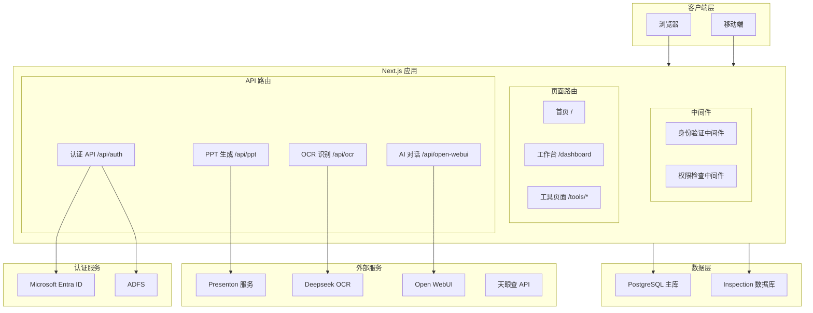
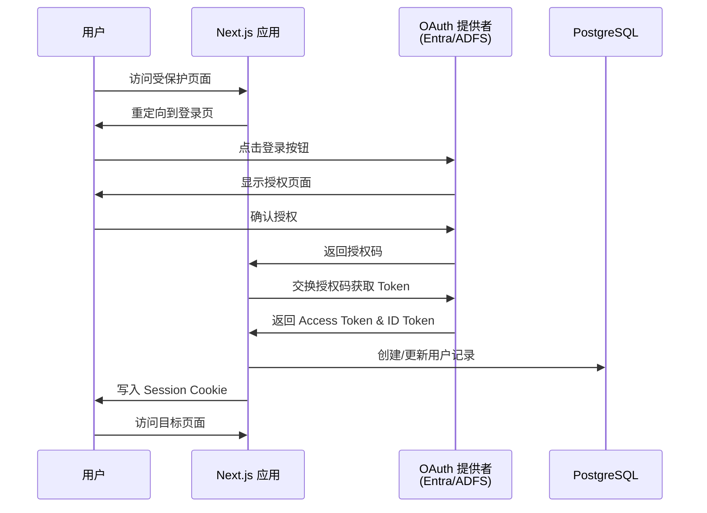

欢迎使用工作台系统！本文档为初级开发者提供项目的整体介绍，帮助您快速理解系统的功能定位、技术架构和核心模块。

## 什么是工作台系统

工作台系统是一个**集成多种实用工具的一站式工作平台**，旨在为用户提供便捷的办公辅助功能。系统采用现代 Web 技术构建，支持 AI 智能辅助，能够满足企业用户在文档处理、信息查询、质量检查等多种场景下的需求。

该平台基于 **Next.js 15** 和 **React 19** 构建，前端界面采用 **Tailwind CSS 4** 和 **shadcn/ui** 组件库，提供流畅的用户体验和响应式设计。后端服务通过 **PostgreSQL** 数据库和 **Better Auth** 认证系统实现数据持久化和安全访问控制。

Sources: [README.md](README.md#L1-L15), [package.json](package.json#L1-L30)

## 核心功能模块

工作台系统集成了以下主要功能模块，每个模块都可以独立使用，同时支持按权限访问控制。

| 模块名称 | 功能描述 | 底层服务 |
|---------|---------|---------|
| **PPT 生成器** | 智能生成专业演示文稿，支持多种模板和自定义设置 | Presenton |
| **OCR 文字识别** | 高精度图片文字识别，支持多种文档类型和输出格式 | Deepseek OCR |
| **企业信息查询** | 快速查询企业工商信息，生成专业尽调报告 | 天眼查 API |
| **AI 智能助手** | 基于大语言模型的对话助手，支持流式响应 | Open WebUI |
| **质量检查** | 对文本内容进行智能质检和评分 | Inspection DB |
| **文件对比** | 文本文件差异对比和可视化展示 | 本地服务 |
| **Z-Image 生成** | 智能图片生成功能 | 自定义服务 |

每个功能模块都对应特定的 API 路由和数据模型，您可以在后续的详细文档中深入了解各模块的实现细节。

Sources: [env.example](env.example#L40-L70), [src/app/api](src/app/api)

## 系统架构总览

工作台系统采用经典的 **BFF（Backend for Frontend）架构模式**，Next.js 应用同时承担前端展示层和后端 API 聚合层的职责。



从架构图中可以看出，系统的核心数据流动如下：用户请求首先经过中间件进行身份验证，然后路由到对应的页面或 API 路由。API 路由根据业务逻辑调用外部服务或数据库，最终返回处理结果。

Sources: [src/middleware.ts](src/middleware.ts#L1-L36), [src/lib/auth.ts](src/lib/auth.ts#L1-L30)

## 技术栈详解

### 前端技术

系统前端基于 **Next.js 15** 框架构建，充分利用了 React 19 的新特性和 App Router 的服务端组件能力。主要依赖包括：

**UI 组件库**：系统使用 **shadcn/ui** 组件库，这是一套基于 Radix UI 和 Tailwind CSS 构建的可访问组件集合。您可以在 `src/components/ui` 目录下找到所有预置的 UI 组件，如按钮、对话框、下拉菜单等。

**状态管理**：采用 **Zustand** 进行客户端状态管理，以及 **TanStack Query** 进行服务端状态缓存和数据获取。这种组合既保证了状态管理的简洁性，又提供了强大的数据同步能力。

**样式方案**：使用 **Tailwind CSS 4** 进行原子化样式编写，配合 **CSS 变量**实现主题切换功能。系统内置了暗色模式支持。

Sources: [package.json](package.json#L1-L88), [src/components](src/components)

### 后端技术

**数据库**：系统使用 **PostgreSQL 18** 作为主数据库，配合 **Drizzle ORM** 进行类型安全的数据操作。Drizzle 提供了直观的 Schema 定义和查询构建器，使得数据库操作既高效又类型安全。

**认证系统**：采用 **Better Auth** 作为认证解决方案，这是一个轻量级但功能完整的认证框架。系统支持多种 OAuth 提供者配置，包括 Microsoft Entra ID 和 ADFS（Active Directory Federation Services）。

**权限控制**：基于 **RBAC（Role-Based Access Control）** 模型实现细粒度的权限管理。每个用户可以分配多个角色，每个角色包含特定的权限集合，支持按租户和按用户两种维度的访问控制。

Sources: [docker-compose.yml](docker-compose.yml#L1-L10), [drizzle.config.ts](drizzle.config.ts#L1-L11), [src/lib/auth.ts](src/lib/auth.ts#L1-L30)

## 目录结构

```
src/
├── app/                          # Next.js App Router 目录
│   ├── api/                     # API 路由（服务端点）
│   │   ├── auth/               # 认证相关端点
│   │   ├── ppt/               # PPT 生成相关端点
│   │   ├── ocr/               # OCR 识别端点
│   │   ├── open-webui/        # AI 对话代理端点
│   │   └── tianyancha/        # 天眼查查询端点
│   ├── dashboard/             # 工作台页面
│   ├── tools/                 # 工具页面目录
│   └── page.tsx               # 首页
├── components/                  # React 组件
│   ├── auth/                  # 认证相关组件
│   ├── dashboard/             # 工作台组件
│   │   ├── todo-list.tsx     # 待办事项列表
│   │   ├── calendar-view.tsx # 日历视图
│   │   └── tool-cards.tsx    # 工具卡片
│   ├── tools/                 # 工具页面组件
│   └── ui/                    # shadcn/ui 基础组件
├── lib/                        # 核心库文件
│   ├── auth.ts               # Better Auth 配置
│   ├── auth-utils.ts         # 认证工具函数
│   ├── db.ts                 # 数据库连接
│   ├── schema.ts             # Drizzle 数据模型
│   ├── rbac.ts               # 权限检查函数
│   └── services/             # 外部服务客户端
├── middleware.ts             # Next.js 中间件
└── types/                    # TypeScript 类型定义
```

理解目录结构是进行开发的基础。`src/app` 目录遵循 Next.js App Router 规范，每个子目录代表一个路由。`src/components` 目录集中管理所有可复用组件。`src/lib` 目录包含核心业务逻辑和配置。

Sources: [src](src), [README.md](README.md#L90-L120)

## 数据库设计

系统使用 Drizzle ORM 定义数据模型，主要包含以下核心表结构：

| 表名 | 用途 | 关键字段 |
|------|------|----------|
| `tenants` | 租户配置 | id, name, slug, features |
| `user` | 用户信息 | id, email, name, tenantId |
| `session` | 会话管理 | id, token, userId, expiresAt |
| `account` | OAuth 账户 | providerId, accessToken |
| `roles` | 角色定义 | name, displayName, tenantId |
| `user_roles` | 用户角色关联 | userId, roleId |
| `permissions` | 权限定义 | resource, action |
| `role_permissions` | 角色权限关联 | roleId, permissionId |

数据库采用多租户设计，每个租户（Tenant）可以独立配置功能开关（features），实现不同租户的功能差异化管理。用户通过 `user_roles` 表关联到角色，角色通过 `role_permissions` 表关联到权限，形成完整的 RBAC 体系。

Sources: [src/lib/schema.ts](src/lib/schema.ts#L1-L100), [drizzle/meta/_journal.json](drizzle/meta/_journal.json#L1-L48)

## 认证流程

系统支持两种 OAuth 认证方式：Microsoft Entra ID 和 ADFS。认证流程遵循标准的 OAuth 2.0 授权码流程。



认证配置通过环境变量控制，主要包括 `OIDC_PROVIDER`（选择 `entra` 或 `adfs`）、客户端 ID 和密钥、以及角色映射规则等。

Sources: [src/lib/auth.ts](src/lib/auth.ts#L1-L50), [env.example](env.example#L10-L35)

## 工具访问控制

系统实现了基于功能标识的访问控制机制。您可以在 `src/lib/rbac.ts` 中找到详细的权限检查逻辑：

```typescript
type ToolId = "ppt" | "ocr" | "tianyancha" | "qualityCheck" | "fileCompare" | "zimage";
```

每个工具对应一个功能标识符，用户能否访问该工具取决于三个条件：用户账户是否激活、租户是否启用了该功能、以及用户是否拥有相应角色权限。这种三层检查机制既保证了灵活性，又确保了安全性。

Sources: [src/lib/rbac.ts](src/lib/rbac.ts#L1-L50)

## 快速上手路径

对于初次接触本项目的开发者，建议按以下顺序学习：

1. **[快速开始](2-kuai-su-kai-shi)** - 了解如何本地运行项目，包括环境配置、依赖安装和开发服务器启动
2. **[技术栈与目录结构](3-ji-zhu-zhan-yu-mu-lu-jie-gou)** - 深入理解项目的技术选型和目录组织方式
3. **[Better Auth 配置](7-better-auth-pei-zhi)** - 掌握认证系统的配置方法
4. **[数据库模式设计](10-shu-ju-ku-mo-shi-she-ji)** - 理解数据模型和表关系
5. **[RBAC 权限模型](12-rbac-quan-xian-mo-xing)** - 学习权限控制的实现原理

通过这个学习路径，您可以系统地掌握项目的各个方面，为后续的功能开发和定制打下坚实基础。

## 下一步

准备好开始探索了吗？推荐您继续阅读 [快速开始](2-kuai-su-kai-shi) 文档，了解如何在本地环境中启动和运行项目。