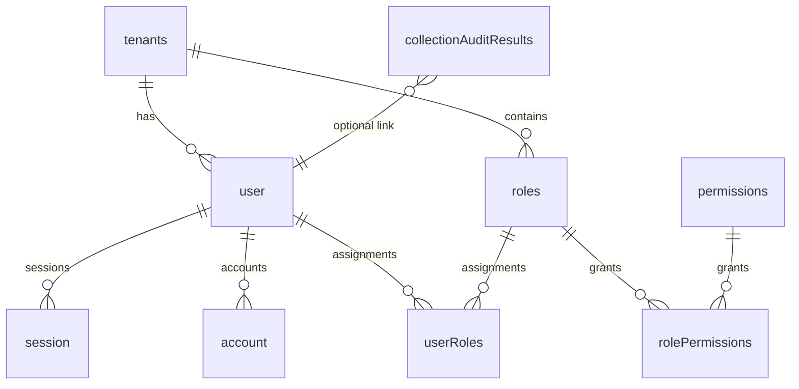
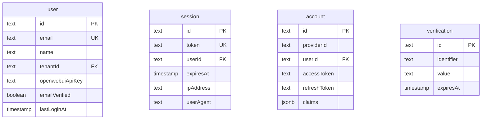
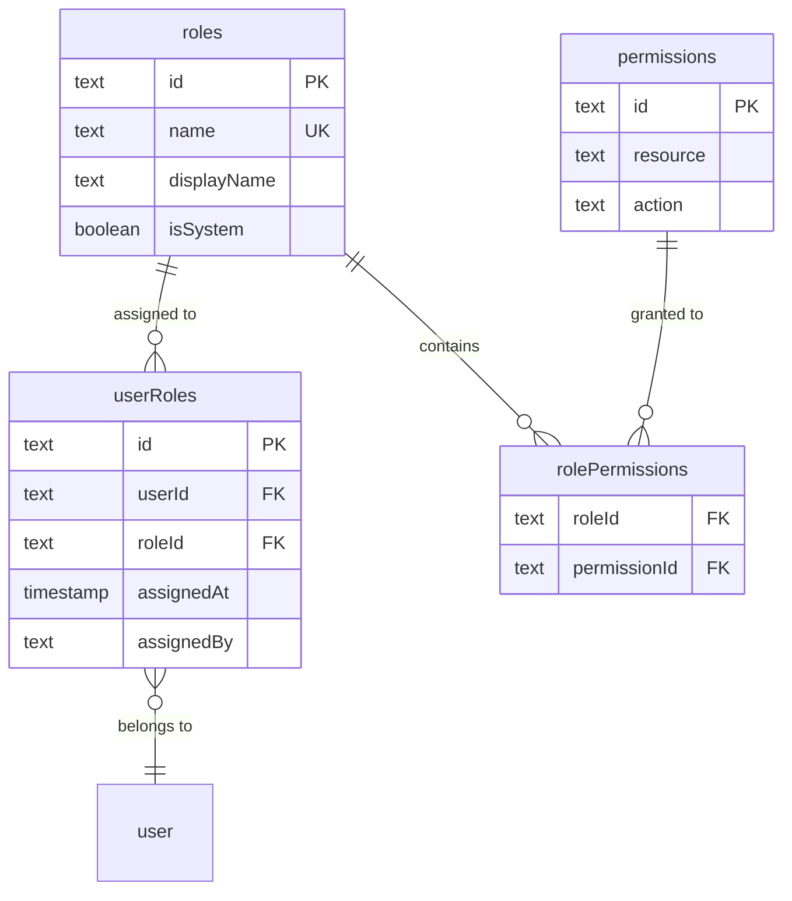
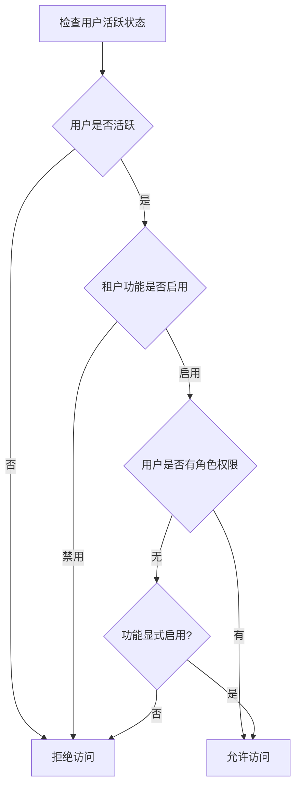
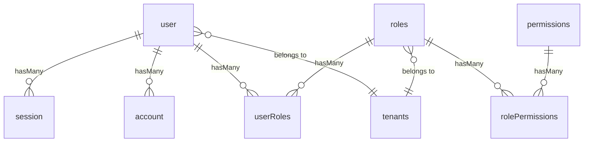

本文档详细介绍 Homepage 2.0 项目的数据库模式设计，涵盖 PostgreSQL 数据库架构、核心数据表定义、RBAC 权限模型以及 Drizzle ORM 的版本迁移管理。

## 技术选型概述

项目采用 PostgreSQL 作为主数据库，通过 Drizzle ORM 实现类型安全的数据库操作。配置文件中指定了 `postgresql` 方言和连接池参数，确保在高并发场景下的稳定连接管理。



数据库连接配置通过环境变量 `POSTGRES_URL` 提供，支持 Neon 等云 PostgreSQL 服务。连接池默认最大连接数为 50，可通过 `POSTGRES_MAX_CONNECTIONS` 环境变量调整。

Sources: [drizzle.config.ts](drizzle.config.ts#L1-L11)
Sources: [src/lib/db.ts](src/lib/db.ts#L1-L43)
Sources: [env.example](env.example#L1-L5)

## 核心数据表定义

### 多租户支持表 (tenants)

`tenants` 表实现了多租户架构的基础支持，允许不同租户配置独立的身份认证和功能开关。

| 字段 | 类型 | 说明 |
|------|------|------|
| id | text (UUID) | 主键，自动生成 |
| name | text | 租户名称 |
| slug | text | URL 友好标识，唯一索引 |
| description | text | 租户描述 |
| isActive | boolean | 是否启用，默认 true |
| oidcConfig | jsonb | OIDC 提供商配置 |
| features | jsonb | 功能开关配置 |

`features` 字段默认启用所有工具：PPT 生成、OCR 识别、天眼查企业查询、质量检查、文件对比和 Zimage 图像处理。

Sources: [src/lib/schema.ts](src/lib/schema.ts#L20-L46)

### 用户与会话表 (user, session, account, verification)

用户认证相关表遵循 Better Auth 库的推荐模式，完整支持 OAuth/OIDC 社会化登录和本地凭证登录。



`account` 表存储 OAuth 提供商令牌和声明信息，支持多提供商绑定同一用户。`openwebuiApiKey` 字段允许用户配置个人 Open WebUI API 密钥，实现 AI 对话功能的个性化集成。

Sources: [src/lib/schema.ts](src/lib/schema.ts#L51-L109)

### 质量检查结果表 (collectionAuditResults)

该表存储催收通话质量审查结果，是业务核心数据表。

| 字段 | 类型 | 说明 |
|------|------|------|
| id | serial | 自增主键 |
| collId | varchar(255) | 催收员 ID |
| dateFolder | varchar(50) | 日期文件夹 |
| score | integer | 得分 |
| deductions | text | 扣分详情 |
| txtFilename | varchar(255) | 文本文件名 |
| processedAt | timestamp | 处理时间 |

表上创建了多个索引以优化常见查询场景，包括 `collId`、`dateFolder`、`score` 单字段索引以及 `collId + dateFolder` 组合索引。

Sources: [src/lib/schema.ts](src/lib/schema.ts#L245-L272)

## RBAC 权限模型

### 权限表结构

RBAC (基于角色的访问控制) 模型通过四张表实现：角色表、用户角色关联表、权限表和角色权限关联表。



系统预定义了四个基础角色：admin（管理员）、user（普通用户）、ppt_admin（PPT 管理员）和 viewer（只读用户）。

Sources: [src/lib/schema.ts](src/lib/schema.ts#L114-L187)
Sources: [src/lib/rbac-init.ts](src/lib/rbac-init.ts#L17-L50)

### 权限控制流程

工具访问控制采用两层检查机制：首先检查租户级别的功能开关，然后验证用户角色是否具备所需权限。



权限检查通过 `loadAuthorizationSnapshot` 函数加载用户的完整权限快照，包括用户状态、租户功能配置和角色权限集合。该函数在单次查询中完成多表关联，确保高效的权限验证。

Sources: [src/lib/rbac.ts](src/lib/rbac.ts#L80-L182)

### 支持的工具权限

系统定义了六种工具的访问权限，映射关系如下：

| 工具 ID | 资源 | 操作 | 说明 |
|---------|------|------|------|
| ppt | ppt | read | PPT 生成工具 |
| ocr | ocr | read | OCR 识别工具 |
| tianyancha | tianyancha | read | 天眼查企业查询 |
| qualityCheck | qualityCheck | read | 质量检查工具 |
| fileCompare | fileCompare | read | 文件对比工具 |
| zimage | zimage | read | Zimage 图像处理 |

Sources: [src/lib/rbac.ts](src/lib/rbac.ts#L5-L17)

## Drizzle ORM 版本迁移

### 迁移文件结构

项目使用 Drizzle Kit 管理数据库迁移，迁移文件存储在 `drizzle/` 目录下。

```plaintext
drizzle/
├── 0000_chilly_the_phantom.sql
├── 0001_narrow_wolfpack.sql
├── 0002_lowly_rictor.sql
├── 0003_motionless_night_thrasher.sql
├── 0004_brief_nehzno.sql
├── 0005_naive_lady_bullseye.sql
└── meta/
    ├── _journal.json
    ├── 0000_snapshot.json
    └── ...
```

迁移快照记录了数据库模式的完整状态，`_journal.json` 跟踪迁移版本历史。最新版本为 0005_naive_lady_bullseye，主要更新了 tenants 表的 features 字段默认值。

Sources: [drizzle/meta/_journal.json](drizzle/meta/_journal.json#L1-L48)
Sources: [drizzle/0005_naive_lady_bullseye.sql](drizzle/0005_naive_lady_bullseye.sql#L1-L1)

### 模式快照结构

每个迁移快照记录表、列、索引和外键的完整定义。快照采用 JSON 格式存储，便于版本对比和问题排查。

| 快照字段 | 说明 |
|----------|------|
| version | Drizzle 版本 |
| dialect | 数据库方言 (postgresql) |
| tables | 所有表定义 |
| columns | 列定义包括类型、主键、可空性 |
| indexes | 索引定义 |
| foreignKeys | 外键约束 |

Sources: [drizzle/meta/0005_snapshot.json](drizzle/meta/0005_snapshot.json#L1-L10)

## 关系定义

Drizzle ORM 的 relations API 建立了表之间的关联关系，支持链式查询和嵌套数据加载。



例如，`userRelations` 定义了用户与租户的一对一关系，以及用户与会话、账户、角色的多对一关系。

Sources: [src/lib/schema.ts](src/lib/schema.ts#L192-L240)

## 数据库初始化

应用启动时通过 `db-seed.ts` 脚本确保核心数据的初始化，包括默认租户、系统角色、权限配置和本地管理员账户。

初始化流程：
1. 创建 ID 为 "default" 的默认租户
2. 插入系统角色（admin、user、ppt_admin、viewer）
3. 创建基础权限定义并关联到角色
4. 根据环境变量配置本地管理员账户

Sources: [src/lib/db-seed.ts](src/lib/db-seed.ts#L1-L19)
Sources: [src/lib/rbac-init.ts](src/lib/rbac-init.ts#L1-L212)

## 下一步

完成数据库模式设计后，建议继续阅读 [数据库操作指南](11-shu-ju-ku-cao-zuo-zhi-nan) 了解 Drizzle ORM 的查询操作方法，以及 [RBAC 权限模型](12-rbac-quan-xian-mo-xing) 获取更详细的权限控制实现细节。