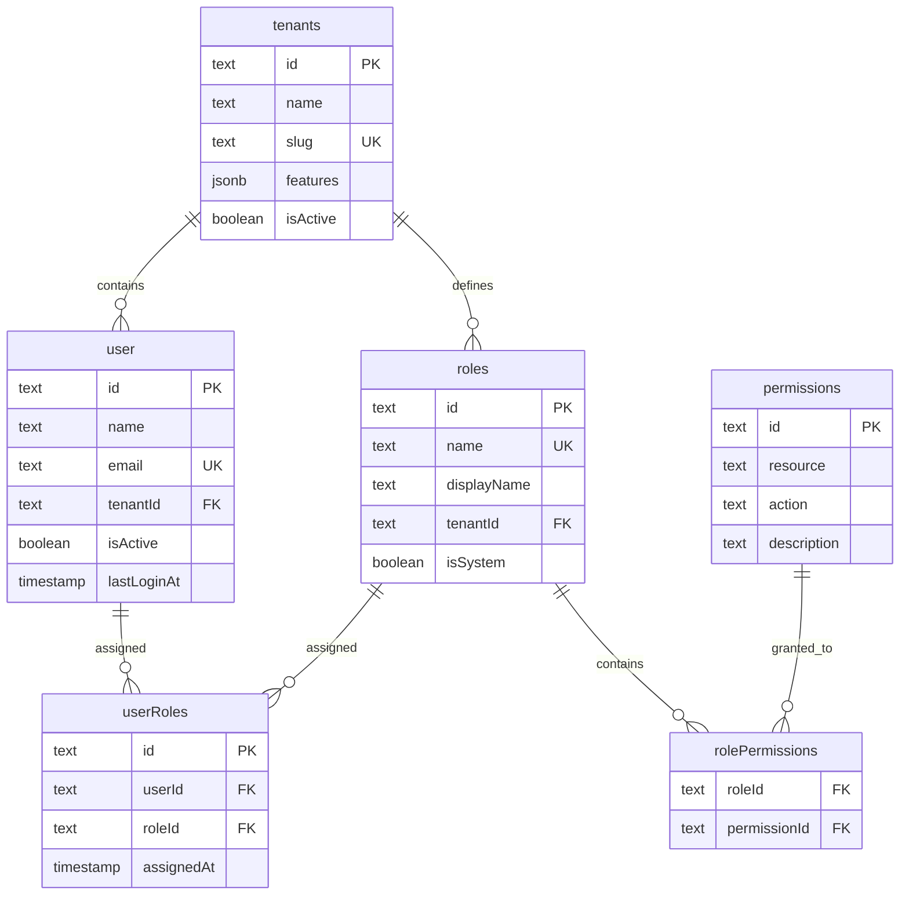
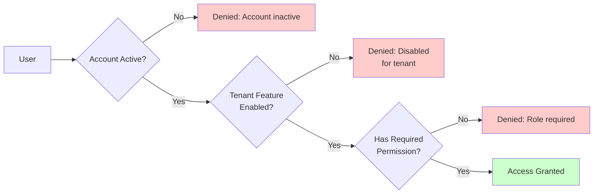
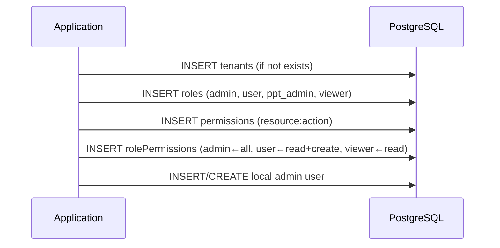
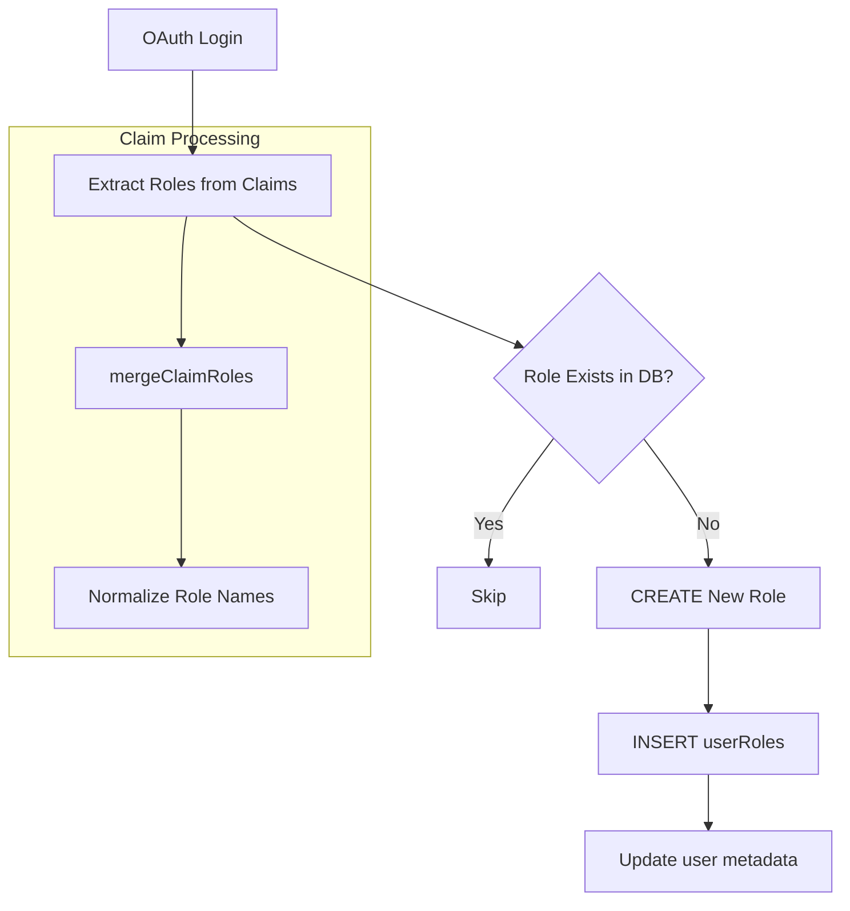

本项目实现了一个基于 **RBAC（Role-Based Access Control，基于角色的访问控制）** 的多层次权限管理系统。该模型通过角色作为用户与权限之间的中介层，实现了灵活的权限配置与高效的安全管控。

## 系统架构概览



如上图所示，系统采用经典的多对多关系设计：用户通过 `user_roles` 表关联角色，角色通过 `role_permissions` 表关联权限。租户（tenant）作为隔离边界，允许多租户场景下的独立权限配置。

Sources: [schema.ts](src/lib/schema.ts#L114-L187)

## 核心数据模型

### 租户（Tenants）

租户模型是权限系统的顶层容器，支持功能开关配置：

| 字段 | 类型 | 说明 |
|------|------|------|
| `id` | text | 主键 |
| `name` | text | 租户名称 |
| `slug` | text | URL 友好标识（唯一） |
| `features` | jsonb | 工具功能开关映射 |
| `isActive` | boolean | 租户启用状态 |

`features` 字段定义了各工具的启用状态，其类型结构如下：

```typescript
{
  ppt: boolean;
  ocr: boolean;
  tianyancha: boolean;
  qualityCheck: boolean;
  fileCompare: boolean;
  zimage: boolean;
}
```

默认值启用全部工具，但管理员可通过 [Tenant Feature API](13-gong-ju-fang-wen-kong-zhi) 动态调整。

Sources: [schema.ts](src/lib/schema.ts#L20-L46)

### 角色（Roles）

系统预置了四类基础角色，定义在初始化脚本中：

| 角色标识 | 显示名称 | 描述 | 权限范围 |
|----------|----------|------|----------|
| `admin` | Administrator | 系统管理员 | 全部权限 |
| `user` | Regular User | 普通用户 | 读取 + 创建 |
| `ppt_admin` | PPT Administrator | PPT 工具管理员 | PPT 相关全部 |
| `viewer` | Viewer | 只读用户 | 仅读取 |

角色分为系统角色（`isSystem: true`）和租户自定义角色两类。系统角色在数据库初始化时自动创建，租户自定义角色则由管理员按需创建。

Sources: [rbac-init.ts](src/lib/rbac-init.ts#L17-L50)

### 权限（Permissions）

权限采用 **资源:操作** 的二元组定义方式，支持细粒度的访问控制：

| 资源 | 操作 | 描述 |
|------|------|------|
| `dashboard` | `read` | 访问仪表板 |
| `ppt` | `read` | 查看 PPT |
| `ppt` | `create` | 创建 PPT |
| `ppt` | `delete` | 删除 PPT |
| `ocr` | `read` | 使用 OCR 识别 |
| `tianyancha` | `read` | 查询企业信息 |
| `qualityCheck` | `read` | 查询质检结果 |

权限设计遵循最小权限原则，每个权限仅赋予其所需的最小操作集。

Sources: [rbac-init.ts](src/lib/rbac-init.ts#L52-L60)

## 工具访问控制模型

针对工具级别的访问控制，系统实现了独立的 `ToolId` 类型和权限映射：



工具权限映射定义了六种工具及其对应的资源/操作：

```typescript
type ToolId = "ppt" | "ocr" | "tianyancha" | "qualityCheck" | "fileCompare" | "zimage";

const TOOL_PERMISSION_MAP: Record<ToolId, { resource: string; action: string }> = {
  ppt: { resource: "ppt", action: "read" },
  ocr: { resource: "ocr", action: "read" },
  tianyancha: { resource: "tianyancha", action: "read" },
  qualityCheck: { resource: "qualityCheck", action: "read" },
  fileCompare: { resource: "fileCompare", action: "read" },
  zimage: { resource: "zimage", action: "read" },
};
```

访问决策采用**双重验证机制**：即使租户启用了某工具，仍需用户具备相应角色权限才能访问。

Sources: [rbac.ts](src/lib/rbac.ts#L5-L17)
Sources: [rbac.ts](src/lib/rbac.ts#L141-L170)

## 核心 API 函数

### 角色查询

系统提供三类角色查询函数：

```typescript
// 获取用户全部角色
async function getUserRoles(userId: string): Promise<string[]>

// 检查用户是否拥有特定角色
async function hasRole(userId: string, roleName: string): Promise<boolean>

// 检查用户是否拥有任一指定角色
async function hasAnyRole(userId: string, roleNames: string[]): Promise<boolean>
```

这些函数通过 Drizzle ORM 的关联查询实现，自动处理用户-角色-权限的完整链路。

Sources: [rbac.ts](src/lib/rbac.ts#L34-L65)

### 权限检查

```typescript
// 检查用户是否拥有特定资源操作权限
async function hasPermission(
  userId: string, 
  resource: string, 
  action: string
): Promise<boolean>
```

### 工具访问检查

```typescript
// 检查用户对指定工具的访问权限
async function checkToolAccess(
  userId: string, 
  toolId: ToolId
): Promise<AccessResult>

interface AccessResult {
  allowed: boolean;
  reason?: string;  // 拒绝原因："Account inactive" | "Disabled for tenant" | "Role required"
}
```

```typescript
// 获取用户全部工具的访问摘要
async function getToolAccessSummary(
  userId: string
): Promise<Array<{ tool: ToolId; access: AccessResult }>>
```

`checkToolAccess` 函数首先加载用户的授权快照（包括账户状态、租户功能、权限集合），然后按照账户有效性 → 租户功能开关 → 角色权限的优先级顺序进行评估。

Sources: [rbac.ts](src/lib/rbac.ts#L67-L182)

## 授权快照机制

为减少数据库查询次数，`loadAuthorizationSnapshot` 函数一次性加载用户完整的授权上下文：

```typescript
async function loadAuthorizationSnapshot(userId: string): Promise<AuthorizationSnapshot | null>
```

该函数通过 Drizzle ORM 的嵌套关联查询，在单次数据库往返中获取：
- 用户账户状态（`isActive`）
- 租户功能开关（`tenantFeatures`）
- 用户角色及关联权限（`permissions`）

返回的快照结构如下：

```typescript
interface AuthorizationSnapshot {
  isActive: boolean;
  tenantFeatures: Record<string, boolean>;
  permissions: Set<string>;  // 格式: "resource:action"
}
```

Sources: [rbac.ts](src/lib/rbac.ts#L80-L139)

## 中间件与路由守卫

### BFF 认证中间件

系统通过 `withAuth` 高阶函数实现 API 路由级别的权限控制：

```typescript
export function withAuth(
  handler: BffRouteHandler,
  options: AuthOptions = {}
): BffRouteHandler

interface AuthOptions {
  requiredRoles?: string[];        // 必需的角色列表
  unauthorizedMessage?: string;   // 未认证错误消息
  forbiddenMessage?: string;      // 无权限错误消息
}
```

使用示例：

```typescript
// 仅需登录
export const GET = withAuth(handler);

// 需要 admin 角色
export const PUT = withAuth(
  async (req, { tenant, traceId }) => { /* ... */ },
  { requiredRoles: ["admin"] }
);
```

当 `requiredRoles` 数组包含多个角色时，用户只需拥有其中任意一个角色即可通过检查（OR 逻辑）。

Sources: [bff-auth.ts](src/lib/core/bff-auth.ts#L119-L165)

### 角色检查辅助函数

```typescript
export function hasRequiredRoles(user: User, requiredRoles: string[]): boolean {
  if (!requiredRoles || requiredRoles.length === 0) {
    return true;
  }
  const userRoles = user.roles || [];
  return requiredRoles.some((role) => userRoles.includes(role));
}
```

Sources: [bff-auth.ts](src/lib/core/bff-auth.ts#L99-L106)

## 用户角色管理 API

### 获取当前用户角色

```
GET /api/users/me/roles
```

返回当前登录用户的角色列表。

Sources: [users/me/roles/route.ts](src/app/api/users/me/roles/route.ts#L1-L13)

### 更新用户角色（管理员）

```
PUT /api/users/{userId}/roles
Body: { "roles": ["admin", "user"] }
```

此接口要求调用者具备 `admin` 角色，用于在 [User Access Management](13-gong-ju-fang-wen-kong-zhi) 页面进行用户角色分配。

Sources: [users/[id]/roles/route.ts](src/app/api/users/[id]/roles/route.ts#L1-L76)

## 运维工具脚本

### 授予管理员角色

```bash
tsx scripts/grant-admin-role.ts <user_email>
```

该脚本用于命令行方式为指定用户分配管理员角色，常用于紧急权限恢复或初始管理员配置。

Sources: [grant-admin-role.ts](scripts/grant-admin-role.ts#L1-L58)

### 查看用户工具访问权限

```bash
tsx scripts/show-tool-access.ts <user_email>
```

输出用户对全部六种工具的访问状态，便于调试权限配置问题。

Sources: [show-tool-access.ts](scripts/show-tool-access.ts#L1-L33)

## 数据库初始化

系统在应用启动时通过 `ensureCoreAuthData` 函数自动执行初始化：



初始化确保了系统核心权限数据的一致性，支持通过环境变量 `LOCAL_ADMIN_EMAIL` 和 `LOCAL_ADMIN_PASSWORD` 配置本地管理员账户。

Sources: [rbac-init.ts](src/lib/rbac-init.ts#L206-L211)
Sources: [auth.ts](src/lib/auth.ts#L16-L18)

## 认证与角色同步

当用户通过 OAuth（Microsoft Entra ID 或 ADFS）登录时，系统会自动从 ID Token claims 中提取角色信息并同步到本地数据库：



`syncRolesFromClaims` 函数负责处理动态角色创建与分配，确保 OAuth 身份提供商声明的角色能够自动映射到本地 RBAC 系统。

Sources: [auth.ts](src/lib/auth.ts#L111-L166)

## 响应状态码规范

权限验证失败时，系统返回标准化的错误响应：

| HTTP 状态码 | 错误代码 | 触发场景 |
|-------------|----------|----------|
| 401 | `UNAUTHORIZED` | 未提供会话 Token |
| 403 | `FORBIDDEN` | 缺少必需角色 |
| 503 | `SERVICE_UNAVAILABLE` | 外部服务不可用 |

Sources: [api-response.ts](src/lib/core/api-response.ts#L68-L124)

## 下一步

- 深入了解工具访问控制的具体实现，请参阅 [工具访问控制](13-gong-ju-fang-wen-kong-zhi)
- 查看数据库模式设计细节，请参阅 [数据库模式设计](10-shu-ju-ku-mo-shi-she-ji)
- 了解认证系统集成，请参阅 [Better Auth 配置](7-better-auth-pei-zhi)