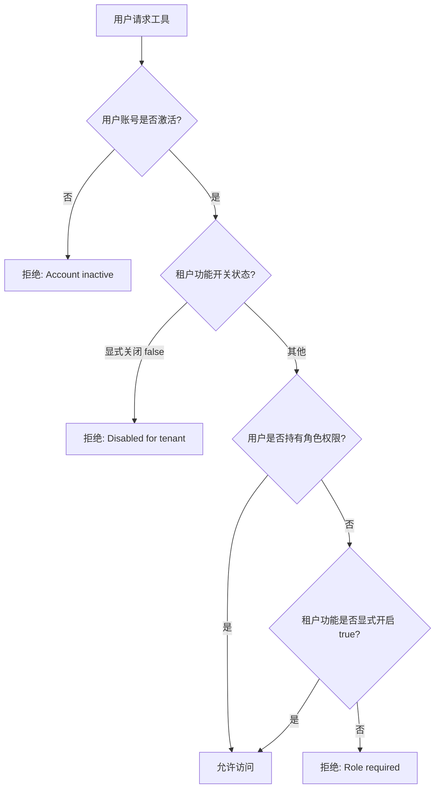
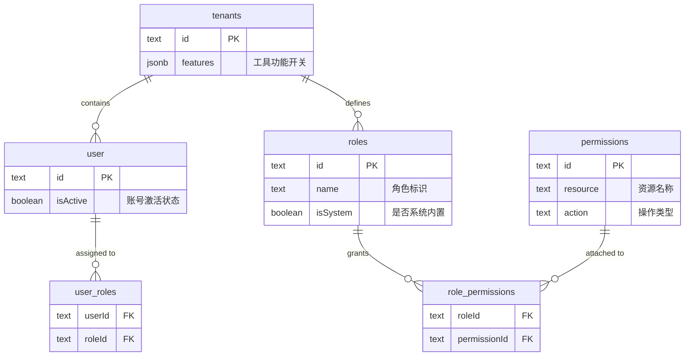

工具访问控制（Tool Access Control）是本平台权限管理体系的核心组成部分，实现了对七个业务工具（PPT 生成、OCR 识别、天眼查企业查询、质量检查、文档对比、AI 图像生成、声纹比对）的细粒度访问管理。该系统采用**双层验证架构**——租户级功能开关与用户角色权限的组合判断——在保证安全性的同时兼顾了灵活的企业级配置需求。

## 核心类型定义

工具访问控制系统的类型定义集中在 `src/lib/rbac.ts` 文件顶部，通过 `ToolId` 联合类型枚举了所有受控工具：

```typescript
export type ToolId = "ppt" | "ocr" | "tianyancha" | "qualityCheck" | "fileCompare" | "zimage" | "voiceprintCompare";
```

每个工具 ID 均与数据库中的 `permissions` 表资源字段一一对应。`TOOL_PERMISSION_MAP` 常量建立了工具 ID 到权限键（`resource:action` 格式）的映射关系，确保所有工具的访问检查使用统一的权限格式。

访问结果结构体 `AccessResult` 包含两个字段：`allowed` 布尔值表示是否允许访问，`reason` 字符串可选字段则携带具体的拒绝原因（如 "Account inactive"、"Disabled for tenant"、"Role required"），该原因会传递到未授权页面作为用户的友好提示。

Sources: [rbac.ts#L1-L17](src/lib/rbac.ts#L1-L17)

## 双重验证架构

### 访问评估流程

工具访问采用两阶段决策模型，其逻辑通过 `evaluateAccess` 函数实现：



这一流程的关键设计在于**租户功能开关的豁免机制**：当 `featureEnabled === true` 时，即使用户未被分配对应角色，系统仍授予访问权限——这意味着管理员可以通过开启租户级开关为整个团队批量开放工具。

Sources: [rbac.ts#L131-L168](src/lib/rbac.ts#L131-L168)

### 授权快照机制

`loadAuthorizationSnapshot` 函数负责一次性加载用户访问决策所需的全部数据，避免了 N+1 查询问题。该函数通过 Drizzle ORM 的嵌套 `with` 语法在单次数据库查询中获取用户信息、租户功能配置以及通过角色间接关联的所有权限：

```typescript
const userRecord = await db.query.user.findFirst({
  where: eq(schema.user.id, userId),
  columns: { id: true, isActive: true },
  with: {
    tenant: { columns: { features: true } },
    userRoles: {
      columns: {},
      with: {
        role: {
          columns: { id: true },
          with: {
            permissions: {
              columns: { permissionId: true },
              with: { permission: true }
            }
          }
        }
      }
    }
  }
});
```

最终将所有权限合并为 `Set<string>` 存储于 `AuthorizationSnapshot` 对象中，供后续评估函数使用。

Sources: [rbac.ts#L78-L129](src/lib/rbac.ts#L78-L129)

## 数据模型与关系

### 数据库模式

工具访问控制涉及四张核心数据库表，其关系定义如下：



**tenants 表**的 `features` 字段是实现租户级功能开关的关键，采用 `jsonb` 类型存储，默认值为全部工具启用：

```json
{
  "ppt": true,
  "ocr": true,
  "tianyancha": true,
  "qualityCheck": true,
  "fileCompare": true,
  "zimage": true,
  "voiceprintCompare": true
}
```

Sources: [schema.ts#L20-L43](src/lib/schema.ts#L20-L43)

### 关系定义

Drizzle ORM 通过 `relations` 函数定义了表之间的关联关系，使得上述嵌套查询成为可能。关键关系包括：`user` 通过 `userRoles` 多对多关联 `roles`，`roles` 通过 `rolePermissions` 多对多关联 `permissions`。

Sources: [schema.ts#L200-L273](src/lib/schema.ts#L200-L273)

## 服务器端访问检查

### 页面级保护

每个工具页面（位于 `src/app/tools/<tool-name>/page.tsx`）均采用相同的保护模式。以 PPT 生成器为例：

```typescript
export default async function PPTGeneratorPage() {
  const headerList = await headers();
  const session = await auth.api.getSession({
    headers: Object.fromEntries(headerList.entries()),
  });

  if (!session) {
    redirect("/login");
  }

  const access = await checkToolAccess(session.user.id, "ppt");

  if (!access.allowed) {
    const reason = access.reason
      ? `?reason=${encodeURIComponent(access.reason)}`
      : "";
    redirect(`/unauthorized${reason}`);
  }

  return <PPTGeneratorClient />;
}
```

该模式在 Next.js App Router 的 Server Component 中以服务端身份执行，确保在页面组件渲染之前完成访问检查，未授权用户会被重定向至 `/unauthorized` 页面。所有七个工具页面（`ppt-generator`、`ocr`、`tianyancha`、`quality-check`、`file-compare`、`zimage`、`voiceprint-compare`）均遵循此模式。

Sources: [src/app/tools/ppt-generator/page.tsx#L1-L28](src/app/tools/ppt-generator/page.tsx#L1-L28)

### API 路由级保护

对于直接暴露的 API 端点，系统同样实现了访问控制检查。以 Z-Image 图像生成接口为例：

```typescript
const handler: BffRouteHandler = async (request: NextRequest, context) => {
  const { user, traceId } = context;

  if (user?.id) {
    const access = await checkToolAccess(user.id, "zimage");
    if (!access.allowed) {
      return badRequest(
        access.reason || "Access denied to Z-Image tool",
        undefined,
        traceId
      );
    }
  }
  // ... 业务逻辑
};

export const POST = withAuth(handler);
```

这确保了即使前端绕过页面直接调用 API，也无法访问未授权的工具。

Sources: [src/app/api/zimage/generate/route.ts#L71-L79](src/app/api/zimage/generate/route.ts#L71-L79)

## 前端工具状态展示

### 全局应用按钮

`GlobalAppsButton` 组件负责在界面顶部展示用户有权访问的工具入口。该组件通过 `useEffect` 钩子在组件挂载时从 `/api/users/me` 接口获取当前用户的完整工具访问状态：

```typescript
const ALL_TOOLS: Omit<ToolStatus, "access">[] = [
  { id: "ppt", name: "PPT 生成器", href: "/tools/ppt-generator" },
  { id: "ocr", name: "OCR 识别", href: "/tools/ocr" },
  { id: "tianyancha", name: "天眼查", href: "/tools/tianyancha" },
  { id: "fileCompare", name: "文档对比工具", href: "/tools/file-compare" },
  { id: "zimage", name: "AI 图像生成", href: "/tools/zimage" },
  { id: "voiceprintCompare", name: "声纹比对", href: "/tools/voiceprint-compare" },
];
```

组件使用 `AppsDrawer` 组合组件渲染可搜索、可分类的工具列表，并根据 `access.allowed` 字段决定工具是否可点击。未授权工具在界面上以灰色或禁用状态显示，但用户仍可看到其存在。

Sources: [src/components/open-webui/global-apps-button.tsx#L15-L40](src/components/open-webui/global-apps-button.tsx#L15-L40)

### API 数据端点

`GET /api/users/me` 路由通过 `withAuth` 中间件认证后，调用 `getToolAccessSummary` 返回用户所有工具的访问状态摘要：

```typescript
export const GET = withAuth(async (_req, { user, tenant, traceId }) => {
  if (!user) return unauthorized("Authentication required", traceId);

  const toolAccess = await getToolAccessSummary(user.id);
  return ok({ user, tenant, toolAccess }, traceId);
});
```

`getToolAccessSummary` 函数遍历 `TOOL_PERMISSION_MAP` 中的所有工具 ID，对每个工具调用 `evaluateAccess` 返回结构化的访问结果。

Sources: [src/app/api/users/me/route.ts#L1-L20](src/app/api/users/me/route.ts#L1-L20)
Sources: [src/lib/rbac.ts#L184-L205](src/lib/rbac.ts#L184-L205)

## 初始化与角色配置

### 数据库初始化

`rbac-init.ts` 负责在应用启动时初始化核心 RBAC 数据，包括创建默认租户、基础角色和权限映射：

| 角色名称 | 显示名称 | 描述 | 权限范围 |
|---------|---------|------|---------|
| `admin` | Administrator | 系统管理员 | 所有权限（dashboard、ppt、ocr、tianyancha、qualityCheck 的 read/create/delete） |
| `user` | Regular User | 普通用户 | dashboard、ppt、ocr、tianyancha、qualityCheck 的 read/create |
| `ppt_admin` | PPT Administrator | PPT 管理 | 仅 PPT 相关 |
| `viewer` | Viewer | 只读访问 | 仅 dashboard 和各工具的 read 权限 |

默认权限中 **不包含 `fileCompare`、`zimage` 和 `voiceprintCompare`** 的权限条目，这意味着这三个工具的访问完全依赖租户级功能开关（默认开启）。

Sources: [src/lib/rbac-init.ts#L18-L38](src/lib/rbac-init.ts#L18-L38)
Sources: [src/lib/rbac-init.ts#L40-L62](src/lib/rbac-init.ts#L40-L62)

### 管理脚本

平台提供两个辅助脚本用于权限管理：

- **`scripts/grant-admin-role.ts`**：通过邮箱查找用户并分配 `admin` 角色。使用方式为 `tsx scripts/grant-admin-role.ts <用户邮箱>`。
- **`scripts/show-tool-access.ts`**：查询指定用户的所有工具访问状态并以 JSON 格式输出，用于调试和权限验证。使用方式为 `tsx scripts/show-tool-access.ts <用户邮箱>`。

Sources: [scripts/grant-admin-role.ts#L1-L58](scripts/grant-admin-role.ts#L1-L58)
Sources: [scripts/show-tool-access.ts#L1-L33](scripts/show-tool-access.ts#L1-L33)

## 访问决策矩阵

下表总结了不同组合条件下的访问结果：

| 用户状态 | 租户功能开关 | 用户角色权限 | 最终结果 | 拒绝原因 |
|---------|-------------|-------------|---------|---------|
| 激活 | `true`（开启） | 有 | ✅ 允许 | — |
| 激活 | `true`（开启） | 无 | ✅ 允许（豁免） | — |
| 激活 | `undefined`（未设置） | 有 | ✅ 允许 | — |
| 激活 | `undefined`（未设置） | 无 | ❌ 拒绝 | Role required |
| 激活 | `false`（关闭） | 有/无 | ❌ 拒绝 | Disabled for tenant |
| 停用 | 任意 | 任意 | ❌ 拒绝 | Account inactive |

此矩阵反映了系统的核心设计原则：**角色权限是访问的充分条件，租户开关是访问的另一个充分条件**——两者满足其一即可通过验证。

## 扩展新工具的流程

若需添加新的受控工具，需要完成以下步骤：

1. **在 `ToolId` 类型中添加新工具标识**：在 `src/lib/rbac.ts` 的 `ToolId` 联合类型中增加新的工具 ID。
2. **更新 `TOOL_PERMISSION_MAP`**：添加新工具到权限映射表。
3. **更新数据库默认值**：修改 `tenants.features` 字段的默认值或执行迁移 SQL。
4. **在工具页面添加访问检查**：参考现有工具页面模式，在新的工具路由页面中添加 `checkToolAccess` 调用。
5. **更新前端工具定义**：在 `GlobalAppsButton` 的 `ALL_TOOLS` 数组中添加新工具的配置项。
6. **在 `rbac-init.ts` 中添加权限种子数据**（可选）。

本章节完整覆盖了工具访问控制的数据模型、决策逻辑、服务器端实现、前端展示以及运维管理方法。如需了解权限模型的更多背景，请参阅 [RBAC 权限模型](12-rbac-quan-xian-mo-xing) 章节；如需了解数据库模式的完整设计，请参阅 [数据库模式设计](10-shu-ju-ku-mo-shi-she-ji)。