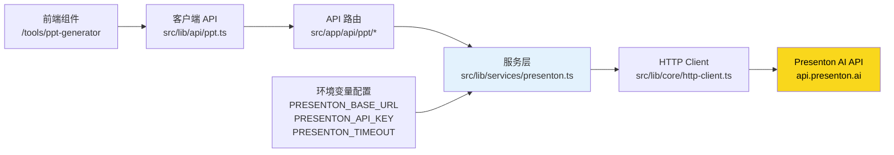
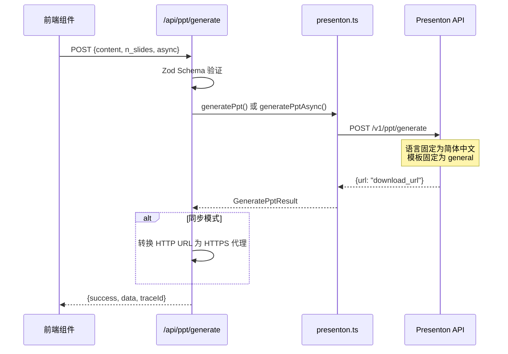
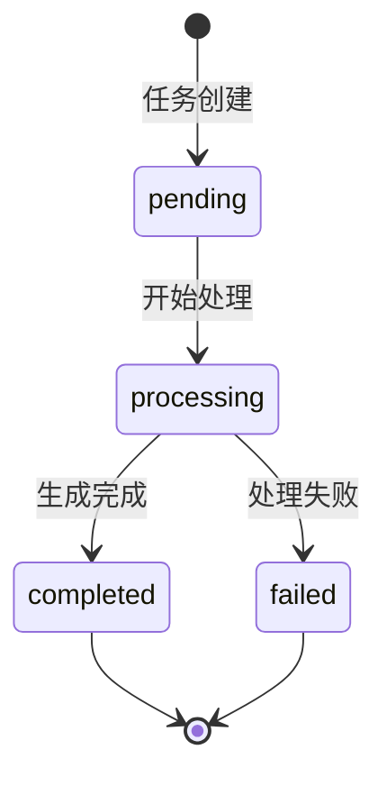
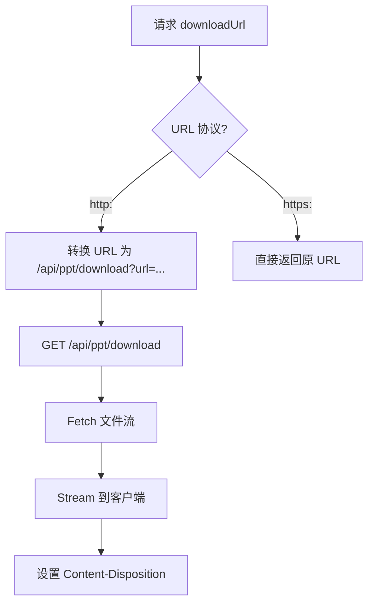
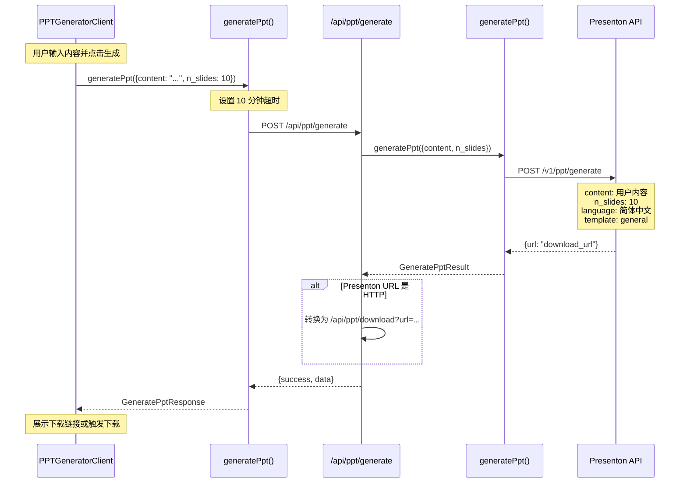
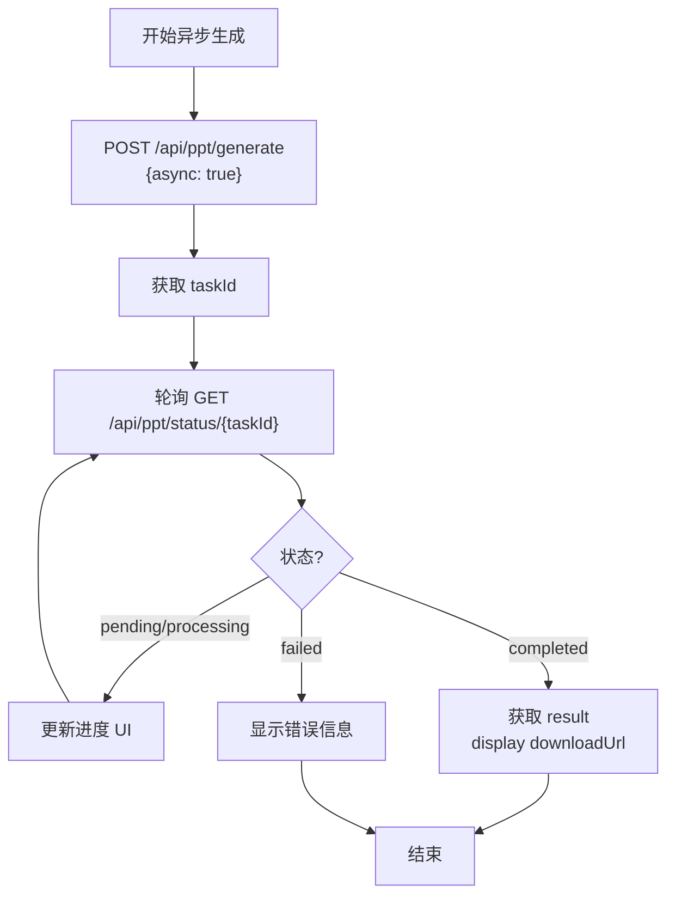

本文档详细介绍项目中 PPT 生成功能的 BFF（Backend-For-Frontend）层 API 设计，涵盖从路由层到服务层再到客户端 API 的完整调用链路，以及与外部 Presenton 服务的集成架构。

## 1. 架构概览

PPT 生成功能采用三层 BFF 架构模式：Next.js App Router API 路由 → 服务层（Service Layer） → 外部 Presenton AI API。这种设计将外部服务调用封装在独立的服务模块中，API 路由仅负责请求验证、响应格式化和错误处理，保持职责单一性。



Sources: [src/lib/services/presenton.ts](src/lib/services/presenton.ts#L1-L60), [src/app/api/ppt/generate/route.ts](src/app/api/ppt/generate/route.ts#L1-L50)

### 1.1 目录结构

PPT 生成相关的核心文件分布在以下目录中：

| 层级 | 目录路径 | 职责 |
|------|----------|------|
| API 路由 | `src/app/api/ppt/` | 处理 HTTP 请求响应 |
| 服务层 | `src/lib/services/presenton.ts` | 封装 Presenton API 调用 |
| 客户端 API | `src/lib/api/ppt.ts` | 前端调用接口封装 |
| 类型定义 | `src/lib/api/ppt.ts` (内联) | 请求响应类型 |
| 页面组件 | `src/app/tools/ppt-generator/` | PPT 生成页面 |

Sources: [src/app/api/ppt](src/app/api/ppt), [src/lib/services/presenton.ts](src/lib/services/presenton.ts#L1)

## 2. 环境配置

PPT 生成功能依赖以下环境变量，需在 `.env` 文件中配置：

```bash
# Presenton 服务地址（支持 HTTP/HTTPS）
PRESENTON_BASE_URL=http://localhost:5000

# PPT 生成超时时间（毫秒），默认 10 分钟
PRESENTON_TIMEOUT=600000

# Presenton API 认证密钥（可选）
PRESENTON_API_KEY=
```

**重要说明**：如果前端使用 HTTPS 而 Presenton 服务使用 HTTP，下载链接会触发混合内容（Mixed Content）错误。系统通过 `/api/ppt/download` 代理端点自动处理此问题，将 HTTP 下载链接转换为 HTTPS 代理路径。

Sources: [env.example](env.example#L1-L5)

## 3. API 路由详解

系统共实现 6 个 API 路由端点，覆盖 PPT 生成、状态查询、模板获取、文件上传、导出和历史管理的完整生命周期。

### 3.1 PPT 生成接口

**端点**：`POST /api/ppt/generate`

这是核心的 PPT 生成接口，支持同步和异步两种模式。同步模式适用于小规模演示文稿生成，异步模式适用于大文件或需要长时间处理的场景。



**请求参数**：

| 参数 | 类型 | 必填 | 默认值 | 说明 |
|------|------|------|--------|------|
| `content` | string | ✅ | - | PPT 内容/主题，10-50000 字符 |
| `n_slides` | number | ❌ | 8 | 幻灯片数量，1-50 |
| `async` | boolean | ❌ | false | 异步生成模式 |

**请求示例**：

```typescript
// 同步生成
const response = await fetch('/api/ppt/generate', {
  method: 'POST',
  headers: { 'Content-Type': 'application/json' },
  body: JSON.stringify({
    content: '项目汇报：2024年度工作总结与2025年规划',
    n_slides: 10
  })
});

// 异步生成
const response = await fetch('/api/ppt/generate', {
  method: 'POST',
  headers: { 'Content-Type': 'application/json' },
  body: JSON.stringify({
    content: '技术架构演进报告',
    n_slides: 20,
    async: true
  })
});
```

**同步响应**：

```typescript
{
  success: true,
  data: {
    presentation: {
      id: "ppt-1735689600000",
      download_url: "http://localhost:5000/static/user_data/xxx.pptx"
    },
    downloadUrl: "http://localhost:5000/static/user_data/xxx.pptx"
  },
  traceId: "abc123"
}
```

**异步响应**：

```typescript
{
  success: true,
  data: {
    taskId: "task-xxxxxxxxxx",
    message: "Generation started"
  },
  traceId: "abc123"
}
```

**路由特性**：

1. **长运行时间配置**：由于 PPT 生成可能需要较长时间（含图片生成），路由配置了 10 分钟的最大执行时间：`export const maxDuration = 600`
2. **强制动态渲染**：`export const dynamic = "force-dynamic"` 确保路由不参与静态优化
3. **可选认证**：`withOptionalAuth` 允许未登录用户访问（需根据业务需求调整）

Sources: [src/app/api/ppt/generate/route.ts](src/app/api/ppt/generate/route.ts#L1-L213)

### 3.2 异步任务状态查询

**端点**：`GET /api/ppt/status/[taskId]`

用于查询异步 PPT 生成任务的状态，支持轮询机制获取生成进度。

**状态流转**：



**响应结构**：

```typescript
{
  success: true,
  data: {
    taskId: "task-xxxxxxxxxx",
    status: "processing", // pending | processing | completed | failed
    progress: 65,         // 进度百分比（可选）
    result: {             // 完成后返回
      id: "ppt-xxx",
      download_url: "..."
    },
    error: "错误信息"       // 失败时返回
  },
  traceId: "abc123"
}
```

Sources: [src/app/api/ppt/status/[taskId]/route.ts](src/app/api/ppt/status/[taskId]/route.ts#L1-L83)

### 3.3 模板列表接口

**端点**：`GET /api/ppt/templates`

获取所有可用的 PPT 模板信息。

**响应示例**：

```typescript
{
  success: true,
  data: [
    {
      id: "general",
      name: "通用模板",
      description: "适用于一般商务演示",
      thumbnail: "https://...",
      category: "business"
    }
  ],
  traceId: "abc123"
}
```

Sources: [src/app/api/ppt/templates/route.ts](src/app/api/ppt/templates/route.ts#L1-L72)

### 3.4 文件上传接口

**端点**：`POST /api/ppt/files/upload`

上传文件（PDF、图片、TXT）供 PPT 生成时引用。

**限制**：

| 限制类型 | 值 |
|----------|-----|
| 最大文件大小 | 10MB |
| 支持格式 | PDF, PNG, JPG, TXT |

**请求格式**：`multipart/form-data`，字段名为 `file`

Sources: [src/app/api/ppt/files/upload/route.ts](src/app/api/ppt/files/upload/route.ts#L1-L117)

### 3.5 历史演示文稿管理

| 端点 | 方法 | 说明 |
|------|------|------|
| `/api/ppt/presentations` | GET | 获取用户所有 PPT |
| `/api/ppt/presentations/[id]` | GET | 获取单个 PPT 详情 |
| `/api/ppt/presentations/[id]/export` | POST | 导出 PPT（PPTX/PDF） |

**导出格式**：

```typescript
// 请求
{
  format: "pptx"  // 或 "pdf"
}

// 响应
{
  success: true,
  data: {
    downloadUrl: "http://...",
    format: "pptx"
  }
}
```

Sources: [src/app/api/ppt/presentations/route.ts](src/app/api/ppt/presentations/route.ts#L1-L81), [src/app/api/ppt/presentations/[id]/route.ts](src/app/api/ppt/presentations/[id]/route.ts#L1-L96)

### 3.6 下载代理接口

**端点**：`GET /api/ppt/download?url=<encoded-url>`

此接口用于解决混合内容问题。当前端是 HTTPS 而 Presenton 返回的下载链接是 HTTP 时，通过此代理将请求透传到 Presenton 并以流式响应返回文件。

**核心逻辑**：



Sources: [src/app/api/ppt/download/route.ts](src/app/api/ppt/download/route.ts#L1-L141)

## 4. 服务层设计

`src/lib/services/presenton.ts` 是整个 PPT 生成功能的核心服务模块，封装了与 Presenton API 的所有通信逻辑。

### 4.1 HTTP 客户端配置

```typescript
const presentonClient = createHttpClient({
  baseUrl: PRESENTON_BASE_URL,
  timeout: PRESENTON_TIMEOUT,  // 默认 600000ms (10分钟)
  headers: PRESENTON_API_KEY
    ? { Authorization: `Bearer ${PRESENTON_API_KEY}` }
    : {},
});
```

服务层使用统一的 HTTP 客户端，具备以下特性：

- **自动 Trace ID 传播**：所有请求自动携带 `X-Trace-Id` 头
- **统一超时控制**：默认 10 分钟超时，适应 PPT 生成的长耗时
- **请求/响应日志**：完整记录请求参数和响应结果
- **错误标准化**：将各种错误类型统一转换为 `PresentonServiceError`

Sources: [src/lib/services/presenton.ts](src/lib/services/presenton.ts#L10-L22)

### 4.2 核心函数映射

| 函数 | 调用 API 端点 | 用途 |
|------|---------------|------|
| `generatePpt()` | `POST /v1/ppt/generate` | 同步生成 |
| `generatePptAsync()` | `POST /api/v1/ppt/presentation/generate/async` | 异步生成 |
| `checkGenerationStatus()` | `GET /api/v1/ppt/presentation/status/{taskId}` | 状态查询 |
| `getTemplates()` | `GET /api/v1/ppt/template/all` | 模板列表 |
| `getTemplateById()` | `GET /api/v1/ppt/template/{id}` | 模板详情 |
| `uploadFile()` | `POST /api/v1/ppt/files/upload` | 文件上传 |
| `getAllPresentations()` | `GET /api/v1/ppt/presentation/all` | 历史列表 |
| `getPresentationById()` | `GET /api/v1/ppt/presentation/{id}` | 详情查询 |
| `exportPresentation()` | `POST /api/v1/ppt/presentation/export` | 导出 |
| `checkPresentonHealth()` | `GET /health` | 健康检查 |

Sources: [src/lib/services/presenton.ts](src/lib/services/presenton.ts#L200-L601)

### 4.3 参数硬编码策略

为简化客户端调用，服务层对以下参数进行了硬编码：

| 参数 | 硬编码值 | 说明 |
|------|----------|------|
| `language` | `"Chinese (Simplified - 中文, 汉语)"` | 固定简体中文 |
| `template` | `"general"` | 固定通用模板 |
| `export_as` | `"pptx"` | 固定导出为 PPTX |

这种设计使客户端只需传递 `content` 和 `n_slides` 两个核心参数，降低使用复杂度。

Sources: [src/lib/services/presenton.ts](src/lib/services/presenton.ts#L215-L225)

### 4.4 错误处理机制

服务层定义了统一的错误类型 `PresentonServiceError`：

```typescript
export class PresentonServiceError extends Error {
  public readonly code: string;
  public readonly detail?: unknown;
  public readonly traceId?: string;
}
```

**错误码对照表**：

| 错误码 | 含义 | HTTP 状态映射 |
|--------|------|---------------|
| `INVALID_INPUT` | 输入参数无效 | 400 Bad Request |
| `SERVICE_ERROR` | 外部服务错误 | 503 Service Unavailable |
| `INVALID_RESPONSE` | 响应解析失败 | 500 Internal Server Error |
| `UNKNOWN_ERROR` | 未知错误 | 500 Internal Server Error |

Sources: [src/lib/services/presenton.ts](src/lib/services/presenton.ts#L95-L107), [src/lib/services/presenton.ts](src/lib/services/presenton.ts#L550-L598)

## 5. 客户端 API 封装

前端通过 `src/lib/api/ppt.ts` 中的函数调用 BFF 层，这些函数封装了 fetch 调用和错误处理逻辑。

### 5.1 核心函数

```typescript
// 生成 PPT（同步）
export async function generatePpt(params: GeneratePptRequest): Promise<GeneratePptResponse>

// 生成 PPT（异步）
export async function generatePptAsync(params: GeneratePptRequest): Promise<GeneratePptAsyncResponse>

// 轮询任务状态直到完成
export async function pollTaskUntilComplete(
  taskId: string,
  onProgress?: (status: TaskStatusResponse) => void,
  pollInterval?: number,
  maxAttempts?: number
): Promise<PresentationData>

// 其他查询函数...
export async function checkTaskStatus(taskId: string): Promise<TaskStatusResponse>
export async function getTemplates(): Promise<TemplateInfo[]>
export async function getPresentations(): Promise<PresentationListItem[]>
export async function getPresentationById(id: string): Promise<PresentationDetail>
export async function exportPresentation(id: string, format: 'pptx' | 'pdf'): Promise<ExportResult>
```

Sources: [src/lib/api/ppt.ts](src/lib/api/ppt.ts#L1-L399)

### 5.2 超时处理

同步 PPT 生成使用 10 分钟超时，使用 `AbortController` 实现：

```typescript
const controller = new AbortController();
const timeoutId = setTimeout(() => controller.abort(), 600000); // 10 分钟

try {
  const response = await fetch("/api/ppt/generate", {
    method: "POST",
    headers: { "Content-Type": "application/json" },
    body: JSON.stringify(params),
    signal: controller.signal,
  });
} catch (error) {
  if (error instanceof Error && error.name === "AbortError") {
    throw new PPTApiError("TIMEOUT", "PPT 生成超时（超过 10 分钟）");
  }
}
```

Sources: [src/lib/api/ppt.ts](src/lib/api/ppt.ts#L137-L165)

### 5.3 类型定义

客户端 API 定义了完整的 TypeScript 类型：

```typescript
// 生成请求
interface GeneratePptRequest {
  content: string;
  n_slides?: number;
  async?: boolean;
}

// 生成响应（同步）
interface GeneratePptResponse {
  presentation: PresentationData;
  downloadUrl?: string;
  previewUrl?: string;
}

// 任务状态
interface TaskStatusResponse {
  taskId: string;
  status: "pending" | "processing" | "completed" | "failed";
  progress?: number;
  result?: PresentationData;
  error?: string;
}

// PPT 列表项
interface PresentationListItem {
  id: string;
  title: string;
  createdAt: string;
  updatedAt?: string;
  slideCount: number;
  thumbnail?: string;
}

// PPT 详情
interface PresentationDetail {
  id: string;
  title: string;
  slides: SlideContent[];
  template?: string;
  language?: string;
  downloadUrl?: string;
}
```

Sources: [src/lib/api/ppt.ts](src/lib/api/ppt.ts#L20-L90)

## 6. 数据流示例

### 6.1 完整 PPT 生成流程



### 6.2 异步生成与轮询



Sources: [src/lib/api/ppt.ts](src/lib/api/ppt.ts#L248-L285)

## 7. 错误处理与调试

### 7.1 常见错误码

| 错误码 | 错误消息 | 处理建议 |
|--------|----------|----------|
| `INVALID_INPUT` | Content must be at least 10 characters | 检查输入内容长度 |
| `TIMEOUT` | PPT 生成超时（超过 10 分钟） | 减少幻灯片数量或简化内容 |
| `SERVICE_ERROR` | Failed to communicate with Presenton | 检查 Presenton 服务状态 |
| `GENERATION_FAILED` | PPT generation failed | 查看 error 字段获取详情 |

### 7.2 Trace ID 追踪

每个请求都会生成唯一的 `traceId`，可用于在日志中追踪完整请求链路。响应中包含的 `traceId` 应在反馈问题时一并提供。

```typescript
// 响应示例
{
  success: false,
  error: {
    code: "TIMEOUT",
    message: "PPT 生成超时"
  },
  traceId: "7f8a9b2c-xxxx-xxxx-xxxx"
}
```

Sources: [src/lib/core/trace.ts](src/lib/core/trace.ts), [src/lib/core/logger.ts](src/lib/core/logger.ts)

### 7.3 日志配置

服务层自动记录关键操作日志：

- 请求开始/完成/失败
- Presenton API 响应
- URL 转换操作
- 错误详情（含 traceId）

日志使用统一的 `logInfo` 和 `logError` 函数，确保日志格式一致性。

Sources: [src/lib/services/presenton.ts](src/lib/services/presenton.ts#L170-L230)

## 8. 相关文档

- [天眼查企业查询](16-tian-yan-cha-qi-ye-cha-xun) — 同为外部服务集成的 BFF 示例
- [工具访问控制](13-gong-ju-fang-wen-kong-zhi) — PPT 工具的权限管理机制
- [PresentOn 实现计划](specs/PresentOn/implementation-plan.md) — 功能增强规划
- [PresentOn 需求文档](specs/PresentOn/requirement.md) — 完整功能需求说明