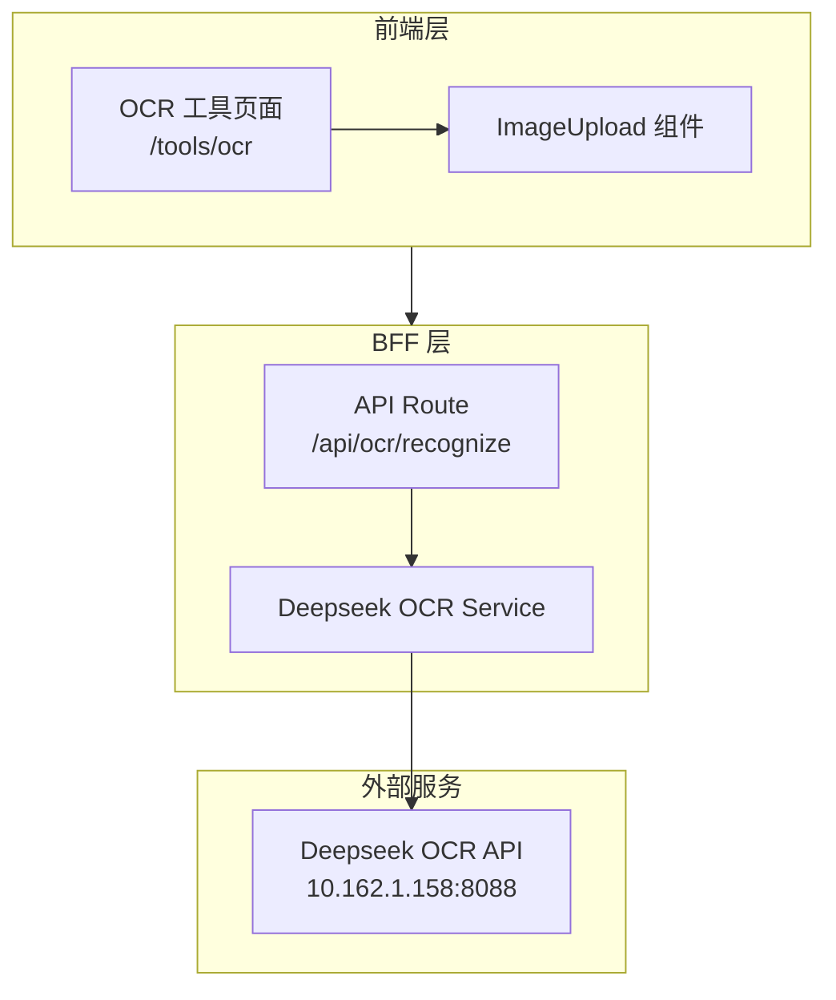
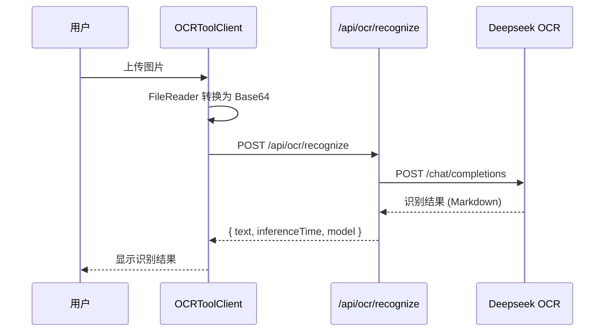

本页面详细说明项目中 OCR（光学字符识别）功能的技术实现、API 接口规范及前端集成方案。该功能基于 Deepseek OCR 服务构建，提供图像到 Markdown 格式的智能文本识别能力。

## 系统架构概览

OCR 识别系统采用典型的 BFF（Backend for Frontend）架构模式，通过统一的服务层封装外部 OCR 能力，为前端提供类型安全的 API 接口。



### 核心组件职责

| 组件 | 路径 | 职责 |
|------|------|------|
| OCR 服务 | `src/lib/services/deepseek-ocr.ts` | 封装 OCR API 调用逻辑 |
| API 路由 | `src/app/api/ocr/recognize/route.ts` | 提供 RESTful 接口 |
| 前端页面 | `src/app/tools/ocr/page.tsx` | 页面访问控制 |
| 前端客户端 | `src/app/tools/ocr/client-page.tsx` | 交互逻辑与状态管理 |
| 图片上传组件 | `src/components/tools/image-upload.tsx` | 图片选择与预览 |

Sources: [deepseek-ocr.ts](src/lib/services/deepseek-ocr.ts#L1-L50), [route.ts](src/app/api/ocr/recognize/route.ts#L1-L50), [page.tsx](src/app/tools/ocr/page.tsx#L1-L28)

## 环境配置

### 必需的环境变量

```bash
# Deepseek OCR 服务地址
DEEPSEEK_OCR_BASE_URL=http://10.162.1.158:8088/v1

# API 认证密钥
DEEPSEEK_OCR_API_KEY=test

# OCR 模型名称
DEEPSEEK_OCR_MODEL=Deepseek-OCR

# 请求超时时间（毫秒，默认 120000 = 2分钟）
DEEPSEEK_OCR_TIMEOUT=120000
```

这些配置项定义了 OCR 服务连接参数，其中超时时间设置为 2 分钟是为了适应大图或复杂文档的识别场景。

Sources: [env.example](env.example#L76-L81)

## API 接口规范

### POST /api/ocr/recognize

识别图片中的文本内容，返回 Markdown 格式的识别结果。

**请求头**
```
Content-Type: application/json
Authorization: Bearer <session_token>
```

**请求体**
```typescript
interface RecognizeRequest {
  /** Base64 编码的图片数据（不含 data:image 前缀） */
  image: string;
  /** 可选的自定义提示词，最大 500 字符 */
  prompt?: string;
}
```

**请求体验证规则**

| 字段 | 类型 | 约束 | 说明 |
|------|------|------|------|
| image | string | 最小 10 字符，最大 ~10MB base64 | 图片数据 |
| prompt | string | 最大 500 字符 | 可选的 OCR 提示词 |

**成功响应**
```typescript
{
  success: true,
  data: {
    text: "# 识别结果\n\n这是 Markdown 格式的文本内容",
    inferenceTime: 1.234,    // 推理耗时（秒）
    model: "Deepseek-OCR"     // 使用的模型
  },
  traceId: "abc123"
}
```

**错误响应**

| HTTP 状态码 | 错误类型 | 说明 |
|-------------|----------|------|
| 400 | VALIDATION_ERROR | 请求参数验证失败 |
| 401 | UNAUTHORIZED | 未认证或会话过期 |
| 403 | FORBIDDEN | 无 OCR 工具访问权限 |
| 503 | SERVICE_UNAVAILABLE | OCR 服务不可用 |

Sources: [route.ts](src/app/api/ocr/recognize/route.ts#L20-L50)

## 服务层实现

### 核心函数

`recognizeImage` 函数负责与 Deepseek OCR API 交互，采用 OpenAI 兼容的 Chat Completions 接口格式：

```typescript
export async function recognizeImage(
  input: RecognizeImageInput,
  traceId?: string
): Promise<RecognizeImageResult>
```

**请求构建逻辑**

该函数将图片数据包装为多模态消息格式，发送给 OCR 服务：

```typescript
const requestBody = {
  model: DEEPSEEK_OCR_MODEL,
  messages: [{
    role: "user",
    content: [
      { type: "image_url", image_url: { url: `data:image/png;base64,${input.image}` } },
      { type: "text", text: input.prompt || "Convert the document to markdown" }
    ]
  }],
  temperature: 0.0,
  extra_body: {
    skip_special_tokens: false,
    vllm_xargs: {
      ngram_size: 30,
      window_size: 90,
      whitelist_token_ids: [128821, 128822]
    }
  }
};
```

**参数说明**

| 参数 | 值 | 作用 |
|------|-----|------|
| temperature | 0.0 | 完全确定性输出，确保识别结果稳定 |
| ngram_size | 30 | N-gram 去重窗口大小 |
| window_size | 90 | 滑动窗口大小 |
| whitelist_token_ids | [128821, 128822] | 白名单 token，保持格式标记 |

Sources: [deepseek-ocr.ts](src/lib/services/deepseek-ocr.ts#L140-L230)

### 错误处理

自定义错误类 `DeepseekOcrServiceError` 提供结构化的错误信息：

```typescript
export class DeepseekOcrServiceError extends Error {
  public readonly code: string;      // 错误码
  public readonly detail?: unknown;   // 详细信息
  public readonly traceId?: string;  // 请求追踪 ID
}
```

**错误码对照表**

| 错误码 | 触发条件 | HTTP 状态码 |
|--------|----------|-------------|
| INVALID_INPUT | 输入参数验证失败 | 400 |
| INVALID_RESPONSE | OCR 响应格式异常 | 500 |
| SERVICE_ERROR | 远程服务调用失败 | 503 |
| UNKNOWN_ERROR | 未知错误 | 500 |

Sources: [deepseek-ocr.ts](src/lib/services/deepseek-ocr.ts#L76-L93)

## 前端集成

### 页面权限控制

OCR 工具页面通过 RBAC 系统控制访问权限：

```typescript
// src/app/tools/ocr/page.tsx
export default async function OCRPage() {
  const session = await auth.api.getSession({ headers });
  
  if (!session) {
    redirect("/login");
  }
  
  const access = await checkToolAccess(session.user.id, "ocr");
  
  if (!access.allowed) {
    redirect(`/unauthorized?reason=${access.reason}`);
  }
  
  return <OCRToolClient />;
}
```

用户需要具备 `ocr:read` 权限才能访问该工具，该权限在系统初始化时自动分配给 `user` 角色。

Sources: [page.tsx](src/app/tools/ocr/page.tsx#L1-L28), [rbac-init.ts](src/lib/rbac-init.ts#L57)

### 客户端处理流程



**关键代码片段**

图片转 Base64 并发送请求：

```typescript
const fileToBase64 = (file: File): Promise<string> => {
  return new Promise((resolve, reject) => {
    const reader = new FileReader();
    reader.onload = () => {
      const base64 = reader.result as string;
      resolve(base64.split(',')[1]); // 去掉 data:image/xxx;base64, 前缀
    };
    reader.onerror = reject;
    reader.readAsDataURL(file);
  });
};

const handleProcess = async () => {
  const imageBase64 = await fileToBase64(imageFile);
  
  const response = await fetch("/api/ocr/recognize", {
    method: "POST",
    headers: { "Content-Type": "application/json" },
    body: JSON.stringify({ image: imageBase64 })
  });
  
  const data = await response.json();
  const ocrResult: OCRResult = {
    text: data.data.text,
    confidence: 0.95,
    processTime: data.data.inferenceTime * 1000
  };
};
```

Sources: [client-page.tsx](src/app/tools/ocr/client-page.tsx#L73-L143)

## 数据类型定义

### OCR 识别结果类型

```typescript
// src/types/index.ts
export interface OCRResult {
  id: string;                    // 唯一标识
  text: string;                   // 识别的 Markdown 文本
  confidence: number;            // 置信度 (0-1)
  processTime: number;           // 处理耗时（毫秒）
  imageUrl?: string;             // 原始图片 URL
  mode: "normal" | "structured" | "custom";  // 识别模式
  modelSize: "mini" | "small" | "base" | "large" | "recommended";
  createdAt: string;              // 创建时间 (ISO 8601)
}
```

当前实现中，置信度固定为 0.95，模式固定为 `structured`，模型尺寸固定为 `base`。

Sources: [types/index.ts](src/types/index.ts#L53-L63)

## 图片上传组件

`ImageUpload` 组件提供拖拽和点击两种上传方式：

```typescript
interface ImageUploadProps {
  file: File | null;
  previewUrl: string | null;
  onChange: (file: File | null, previewUrl: string | null) => void;
  helperText?: string;
  compact?: boolean;
}
```

**支持的格式与限制**

| 属性 | 值 |
|------|-----|
| 支持格式 | JPEG, PNG, JPG, WebP |
| 文件大小上限 | 5MB |

**使用示例**

```tsx
<ImageUpload
  file={imageFile}
  previewUrl={previewUrl}
  onChange={(newFile, newPreview) => {
    setImageFile(newFile);
    setPreviewUrl(newPreview);
  }}
  compact
/>
```

Sources: [image-upload.tsx](src/components/tools/image-upload.tsx#L1-L167)

## 下一步

完成本页面阅读后，你可以继续了解：

- [PPT 生成接口](14-ppt-sheng-cheng-jie-kou) — 另一个重要的文档处理工具
- [工具访问控制](13-gong-ju-fang-wen-kong-zhi) — 了解 RBAC 如何控制工具权限
- [天眼查企业查询](16-tian-yan-cha-qi-ye-cha-xun) — 类似的外部 API 集成模式