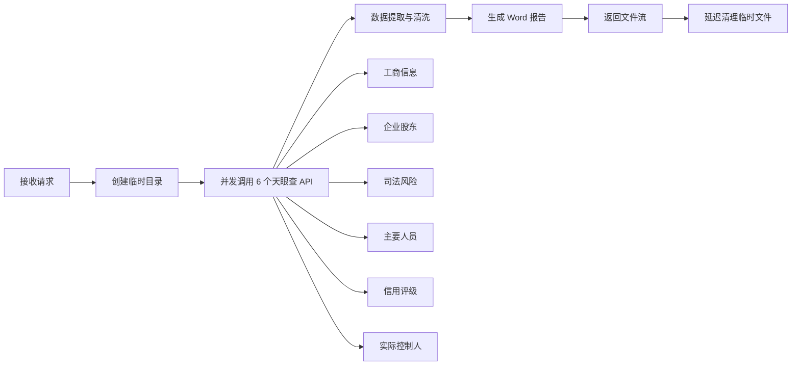
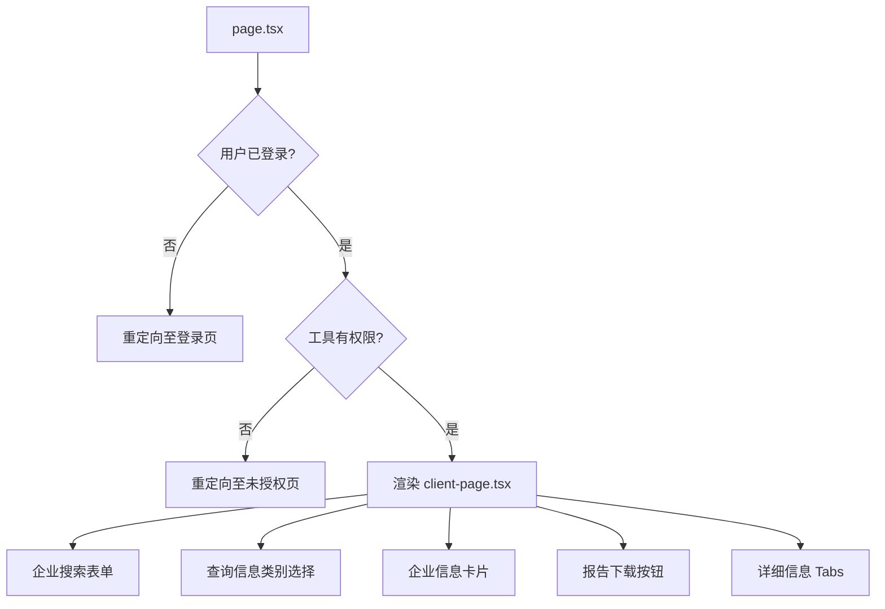

天眼查企业查询模块为企业尽调场景提供完整的查询与报告生成能力。该模块通过独立 Flask 后端服务调用天眼查开放平台 API，将获取的企业工商信息、财务数据、诉讼记录等整合为标准 Word 格式尽调报告。

## 系统架构

天眼查模块采用**前后端分离 + BFF 代理**的典型三层架构。前端 Next.js 应用通过统一的 API 网关（`/api/tianyancha/*`）与独立部署的 Flask 后端通信，后端负责实际调用天眼查开放平台接口并生成报告文件。

```mermaid
graph TB
    subgraph "前端层 (Next.js)"
        A[天眼查工作台页面] --> B[API 路由层]
        B --> C[服务封装层]
    end
    
    subgraph "BFF 层"
        D[/api/tianyancha/search]
        E[/api/tianyancha/generate-report]
    end
    
    subgraph "后端服务层 (Flask)"
        F[/api/search]
        G[/api/generate_report]
        H[/api/health]
    end
    
    subgraph "天眼查开放平台"
        I[工商信息 API]
        J[股东信息 API]
        K[司法风险 API]
        L[人员信息 API]
        M[信用评级 API]
        N[实际控制人 API]
    end
    
    C --> D
    C --> E
    D --> F
    E --> G
    F --> I
    F --> J
    F --> K
    G --> I
    G --> J
    G --> K
    G --> L
    G --> M
    G --> N
    
    style F fill:#e1f5fe
    style G fill:#e1f5fe
    style H fill:#e1f5fe
```

Sources: [src/app/api/tianyancha/search/route.ts](src/app/api/tianyancha/search/route.ts#L1-L103), [src/app/api/tianyancha/generate-report/route.ts](src/app/api/tianyancha/generate-report/route.ts#L1-L89)

## API 接口规范

### 搜索企业接口

**路径**: `POST /api/tianyancha/search`

该接口用于快速验证企业是否存在，并返回基础工商信息。适合在用户输入企业名称后立即展示基本信息，无需等待完整报告生成。

| 参数 | 类型 | 位置 | 必填 | 说明 |
|------|------|------|------|------|
| company_name | string | body | 是 | 企业全称或统一社会信用代码 |

**成功响应**:
```json
{
  "status": "success",
  "data": {
    "name": "深圳市腾讯计算机系统有限公司",
    "legalRepresentative": "马化腾",
    "creditCode": "914403007708914148",
    "registeredCapital": "2000万美元",
    "establishDate": "1998-11-11",
    "status": "存续"
  }
}
```

**错误响应**:
```json
{
  "status": "error",
  "error": {
    "message": "未找到企业「xxx」的相关信息，请检查企业名称是否正确",
    "code": "COMPANY_NOT_FOUND"
  }
}
```

Sources: [src/app/api/tianyancha/search/route.ts](src/app/api/tianyancha/search/route.ts#L60-L75)

### 生成报告接口

**路径**: `POST /api/tianyancha/generate-report`

该接口调用后端 Flask 服务执行完整的数据采集流程，生成包含工商信息、股权结构、变更记录、司法风险等内容的企业尽调 Word 报告。

| 参数 | 类型 | 位置 | 必填 | 说明 |
|------|------|------|------|------|
| company_name | string | body | 是 | 企业全称 |

**响应**: 返回 Word 文档文件流（`.docx` 格式）

Sources: [src/app/api/tianyancha/generate-report/route.ts](src/app/api/tianyancha/generate-report/route.ts#L60-L75)

## 服务端实现

### BFF 路由层

BFF 层承担认证校验、参数验证、错误标准化三项职责。通过 `getUserFromRequest` 提取当前用户上下文，并使用 `TianyanchaServiceError` 统一封装来自后端服务的异常。

核心错误处理逻辑区分两类场景：`404` 状态码映射为"企业不存在"提示，其他非 200 状态码统一返回"服务不可用"。

```typescript
// 搜索路由错误处理模式
if (error instanceof TianyanchaServiceError) {
  if (error.statusCode === 404) {
    return NextResponse.json({
      status: "error",
      error: { message: error.message, code: "COMPANY_NOT_FOUND" }
    }, { status: 404 });
  }
  return serviceUnavailable("天眼查服务", error.message, traceId);
}
```

Sources: [src/app/api/tianyancha/search/route.ts](src/app/api/tianyancha/search/route.ts#L75-L95)

### 服务封装层

`/lib/services/tianyancha.ts` 提供与 Flask 后端通信的客户端封装，包含请求超时控制、响应解析、错误转换等通用逻辑。

**超时配置策略**:

| 操作类型 | 超时时间 | 说明 |
|----------|----------|------|
| 搜索企业 | 30 秒 | 快速验证，短超时避免阻塞 |
| 生成报告 | 120 秒（默认） | 完整数据采集需更长等待 |
| 健康检查 | 5 秒 | 仅探测服务可用性 |

```typescript
const TIANYAN_TIMEOUT = parseInt(
  process.env.TIANYAN_TIMEOUT || "120000", 10
);

// 带超时的 Fetch 封装
function fetchWithTimeout(
  url: string,
  options: RequestInit,
  timeout: number
): Promise<Response> {
  return new Promise((resolve, reject) => {
    const controller = new AbortController();
    const timeoutId = setTimeout(() => {
      controller.abort();
      reject(new TianyanchaServiceError("请求超时，请稍后重试", 408));
    }, timeout);
    // ...
  });
}
```

Sources: [src/lib/services/tianyancha.ts](src/lib/services/tianyancha.ts#L1-L80)

## 后端 Flask 服务

### 服务架构

Flask 服务作为独立进程运行，负责实际的天眼查 API 调用与 Word 报告生成。服务部署在 `tianyan_server/` 目录，采用模块化设计。



Sources: [tianyan_server/api.py](tianyan_server/api.py#L1-L150), [tianyan_server/README.md](tianyan_server/README.md#L1-L50)

### 数据采集流程

```python
# tianyan_server/api.py - 报告生成主流程
def generate_report():
    process_id = str(uuid.uuid4())
    process_dir = os.path.join(TEMP_FOLDER, process_id)
    os.makedirs(process_dir, exist_ok=True)
    
    # 步骤1: 调用天眼查 API 获取数据
    search_company_json(process_dir, company_name)
    
    # 步骤2: 检查工商信息是否成功获取
    ic_file = os.path.join(process_dir, "工商信息.json")
    check_tianyan_api_response(ic_file, "工商信息")
    
    # 步骤3: 提取和处理数据
    extract_data(process_dir)
    
    # 步骤4: 生成 Word 报告
    create_report(process_dir, word_path)
    
    # 启动后台清理线程（30秒后删除临时文件）
    threading.Thread(target=cleanup_folder, args=(process_dir,)).start()
```

Sources: [tianyan_server/api.py](tianyan_server/api.py#L80-L120)

### API 调用模块

`getBaseInfo.py` 封装了天眼查开放平台的 6 个核心接口：

| 接口函数 | API 端点 | 获取数据 |
|----------|----------|----------|
| `get_corporate_information()` | `/services/open/cb/ic/2.0` | 工商信息 |
| `get_company_holder()` | `/services/open/ic/holder/2.0` | 企业股东 |
| `get_main_person()` | `/services/open/ic/staff/2.0` | 主要人员 |
| `get_company_credit()` | `/services/open/m/creditRating/2.0` | 信用评级 |
| `get_legal_risk()` | `/services/open/cb/judicial/2.0` | 司法风险 |
| `get_suspect_actualControl()` | `/services/open/ic/actualControl/3.0` | 实际控制人 |

```python
# Token 配置优先级：环境变量 > 硬编码默认值
token = os.environ.get("TIANYAN_API_TOKEN", "43ed8204-e3a3-4890-ae14-e04c925b28f4")

def get_corporate_information(company_name):
    url = "http://open.api.tianyancha.com/services/open/cb/ic/2.0"
    params = {"keyword": company_name}
    headers = {"Authorization": token}
    response = requests.get(url, params=params, headers=headers)
    return response.json()
```

Sources: [tianyan_server/tianyanprocess/getBaseInfo.py](tianyan_server/tianyanprocess/getBaseInfo.py#L1-L80)

### 数据处理模块

`compressAllStuff.py` 负责数据清洗与结构化，提取 API 返回结果中的关键字段。

```python
# 工商信息字段提取
extracted_data = {
    '工商信息': {
        'result': {
            'name': get_field(result, ['name']),
            'estabishTime': get_field(result, ['estiblishTime']),
            'creditCode': get_field(result, ['creditCode']),
            'regCapital': get_field(result, ['regCapital']),
            'legalPersonName': get_field(result, ['legalPersonName']),
            'businessScope': get_field(result, ['businessScope']),
        },
        'staffList': [...],      # 主要人员列表
        'capital': [...],        # 资本信息
        'changeList': [...]      # 变更记录
    }
}
```

Sources: [tianyan_server/tianyanprocess/compressAllStuff.py](tianyan_server/tianyanprocess/compressAllStuff.py#L1-L60)

### 报告生成模块

`createReport.py` 基于 Word 模板生成最终报告，替换模板中的占位符。

```python
# 加载 Word 模板并替换占位符
doc = Document('template.docx')
replacements = {
    "name": business_info.get("name", ""),
    "creditCode": business_info.get("creditCode", ""),
    "regCapital": business_info.get("regCapital", ""),
}
doc = replace_placeholders(doc, replacements)
doc.save(word_path_file)
```

Sources: [tianyan_server/tianyanprocess/createReport.py](tianyan_server/tianyanprocess/createReport.py#L1-L100)

## 前端实现

### 页面组件结构

页面采用服务端/客户端分离模式：`page.tsx` 负责权限校验，`client-page.tsx` 处理用户交互逻辑。



Sources: [src/app/tools/tianyancha/page.tsx](src/app/tools/tianyancha/page.tsx#L1-L28)

### 交互流程

```typescript
// 核心搜索流程
const runSearch = async (companyName: string) => {
  // 1. 调用搜索 API
  const companyData = await searchCompanyApi(companyName);
  
  // 2. 构建企业信息对象
  const companyInfo: CompanyInfo = {
    name: companyName,
    legalRepresentative: companyData.legalRepresentative,
    status: companyData.status === "存续" ? "active" : "cancelled",
    // ...
  };
  
  // 3. 后台生成报告并缓存
  const cache = await generateReportApi(companyName);
  reportCacheRef.current = cache;
};
```

Sources: [src/app/tools/tianyancha/client-page.tsx](src/app/tools/tianyancha/client-page.tsx#L120-L160)

### 报告缓存机制

报告生成后暂存于浏览器内存（`useRef`），用户点击下载时触发 Blob 下载。该设计避免重复调用后端 API，节省天眼查 API 配额。

```typescript
interface ReportCache {
  blob: Blob;
  filename: string;
  generatedAt: Date;
  companyName: string;
}

const reportCacheRef = useRef<ReportCache | null>(null);

const downloadFromCache = (cache: ReportCache) => {
  const url = window.URL.createObjectURL(cache.blob);
  const a = document.createElement("a");
  a.href = url;
  a.download = cache.filename;
  document.body.appendChild(a);
  a.click();
  window.URL.revokeObjectURL(url);
};
```

Sources: [src/app/tools/tianyancha/client-page.tsx](src/app/tools/tianyancha/client-page.tsx#L40-L55)

## 配置与部署

### 环境变量配置

| 变量名 | 默认值 | 说明 |
|--------|--------|------|
| `TIANYAN_SERVICE_URL` | `http://127.0.0.1:5001` | Flask 后端服务地址 |
| `TIANYAN_TIMEOUT` | `120000` | 报告生成超时（毫秒） |
| `TIANYAN_API_TOKEN` | （需配置） | 天眼查开放平台 Token |

**生产环境部署示例**:
```bash
# .env.production
TIANYAN_SERVICE_URL=https://tianyan-api.yourdomain.com
TIANYAN_TIMEOUT=180000
```

Sources: [tianyan_server/README.md](tianyan_server/README.md#L30-L45)

### Flask 服务部署

```bash
# 开发环境
cd tianyan_server
python api.py  # 运行于 http://127.0.0.1:5001

# 生产环境（使用 gunicorn）
pip install gunicorn
gunicorn -w 4 -b 0.0.0.0:5001 api:app
```

Sources: [tianyan_server/README.md](tianyan_server/README.md#L50-L65)

### 权限控制

天眼查工具作为系统级功能，通过 RBAC 模型控制访问权限：

```typescript
// src/lib/rbac.ts
const TOOL_PERMISSION_MAP = {
  tianyancha: { resource: "tianyancha", action: "read" },
};
```

用户需拥有 `tianyancha` 资源的 `read` 权限方可访问该工具。管理员可通过后台配置角色权限。

Sources: [src/lib/rbac.ts](src/lib/rbac.ts#L1-L25)

## 类型定义

核心类型 `CompanyInfo` 定义了企业查询结果的标准化结构：

```typescript
interface CompanyInfo {
  id: string;
  name: string;
  legalRepresentative: string;  // 法人代表
  registeredCapital: string;    // 注册资本
  establishDate: string;         // 成立日期
  status: "active" | "cancelled" | "revoked";  // 在业/注销/吊销
  creditCode: string;           // 统一社会信用代码
  registeredAddress: string;     // 注册地址
  businessInfo: CompanyBusinessInfo;
  shareholders: Shareholder[];
  changeRecords: ChangeRecord[];
  businessScope: string;         // 经营范围
}
```

Sources: [src/types/index.ts](src/types/index.ts#L85-L100)

## 相关文档

- [BFF 认证模式](4-bff-ren-zheng-mo-shi) — 了解 API 路由的认证校验机制
- [RBAC 权限模型](12-rbac-quan-xian-mo-xing) — 工具访问控制的完整说明
- [工具访问控制](13-gong-ju-fang-wen-kong-zhi) — 管理员如何配置工具权限