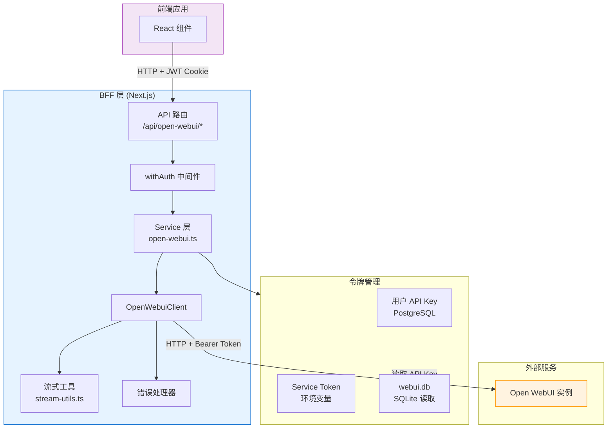
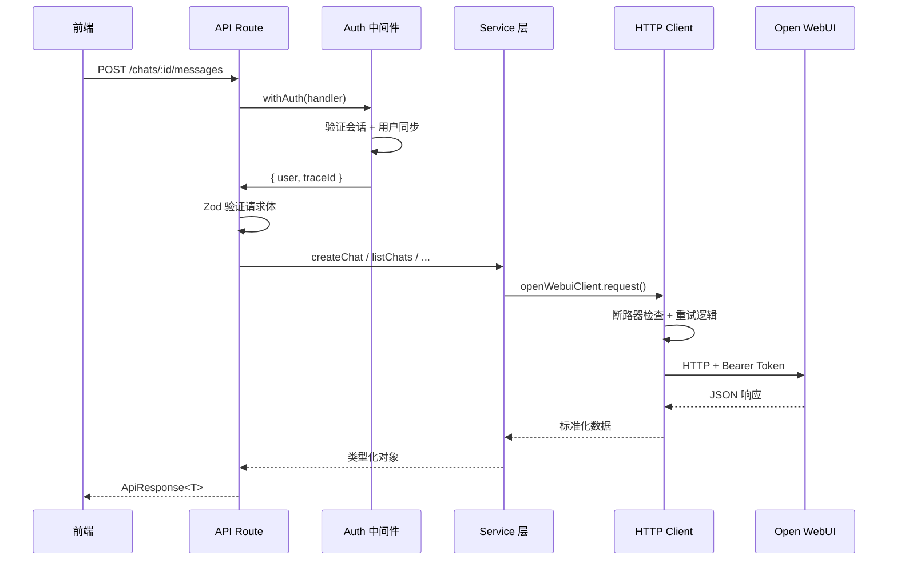
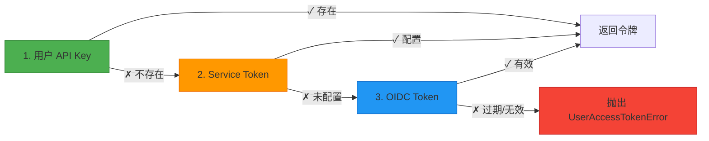
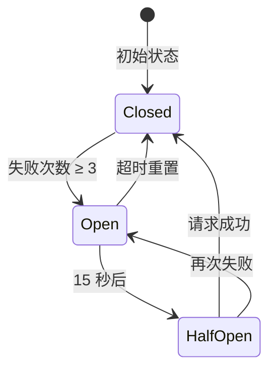
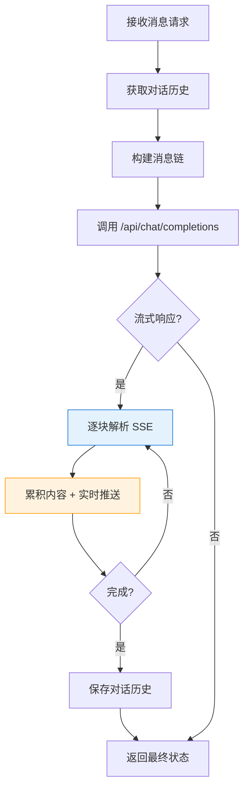
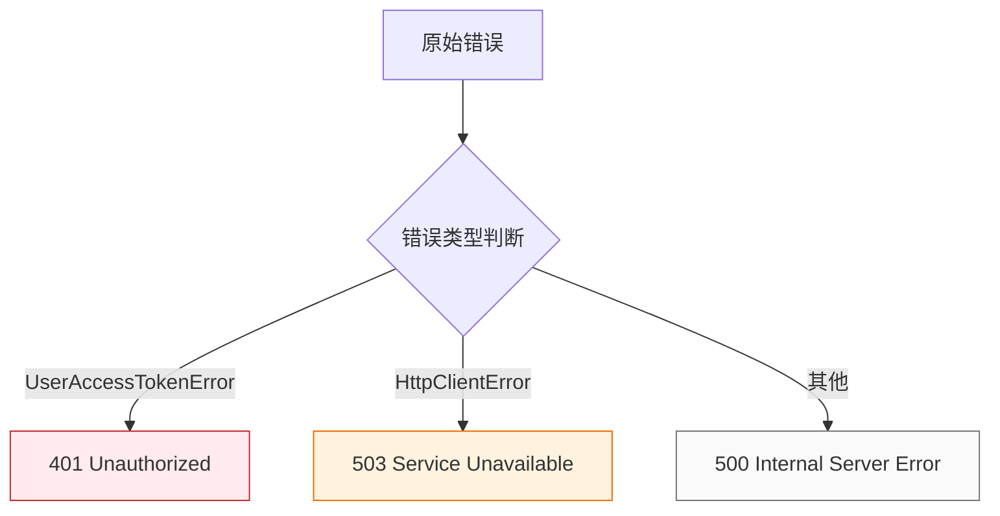

本文档介绍 BFF（Backend-for-Frontend）层如何代理 Open WebUI 服务，实现安全的 AI 聊天功能集成。

## 架构概述

Open WebUI 代理采用分层架构设计，将外部服务请求经过认证、转换、容错处理后传递给 Open WebUI 实例。这种设计确保了多租户环境下的安全隔离，同时提供了统一的数据格式和错误处理。



### 核心设计原则

该代理层遵循三个核心原则：首先，所有请求必须经过 BFF 认证层验证用户身份；其次，令牌获取采用三级降级策略确保可用性；最后，流式响应通过 SSE（Server-Sent Events）实时推送给前端。

Sources: [openWebuiClient.ts](src/lib/openWebuiClient.ts#L1-L50)
Sources: [user-tokens.ts](src/lib/services/user-tokens.ts#L35-L55)
Sources: [bff-auth.ts](src/lib/core/bff-auth.ts#L119-L165)

## API 路由结构

代理层在 `/api/open-webui/` 前缀下暴露一组 RESTful 端点，覆盖模型查询、对话管理和消息发送等核心功能。

| 端点 | 方法 | 功能 | 流式响应 |
|------|------|------|----------|
| `/api/open-webui/models` | GET | 获取可用模型列表 | ❌ |
| `/api/open-webui/chats` | GET | 获取用户对话列表 | ❌ |
| `/api/open-webui/chats` | POST | 创建新对话 | ❌ |
| `/api/open-webui/chats/[chatId]` | GET | 获取对话详情 | ❌ |
| `/api/open-webui/chats/[chatId]` | PATCH | 更新对话（标题/系统提示） | ❌ |
| `/api/open-webui/chats/[chatId]` | DELETE | 删除对话 | ❌ |
| `/api/open-webui/chats/[chatId]/messages` | POST | 发送消息（AI 流式回复） | ✅ |

### 路由实现模式

所有路由遵循统一的实现模式：使用 `withAuth` 包装处理函数，通过 Zod 进行请求体验证，调用 Service 层执行业务逻辑，最后通过 `mapOpenWebuiError` 统一处理异常。



Sources: [chats/route.ts](src/app/api/open-webui/chats/route.ts#L1-L86)
Sources: [chats/[chatId]/route.ts](src/app/api/open-webui/chats/[chatId]/route.ts#L1-L97)
Sources: [models/route.ts](src/app/api/open-webui/models/route.ts#L1-L20)

## 认证与会话管理

### BFF 认证中间件

`withAuth` 中间件是所有 Open WebUI API 的入口点，负责验证用户会话、同步用户数据，并注入认证上下文。

```typescript
export function withAuth(
  handler: BffRouteHandler,
  options: AuthOptions = {}
): (request: NextRequest) => Promise<NextResponse<ApiResponse>>
```

中间件执行流程包括：验证 Better Auth 会话令牌、从 PostgreSQL 加载用户记录、检查并同步缺失的用户属性（如 API Key）、验证角色权限。最终将 `user` 对象注入到请求上下文中。

Sources: [bff-auth.ts](src/lib/core/bff-auth.ts#L119-L165)
Sources: [bff-auth.ts](src/lib/core/bff-auth.ts#L18-L97)

### 自动用户同步

当用户首次访问或缺少必要字段时，系统自动触发 Open WebUI 同步流程，确保用户在 Open WebUI 中的 API Key 能同步到 PostgreSQL。

```typescript
// 独立检查：如果用户没有 OpenWebUI API key，尝试同步
if (!userRecord.openwebuiApiKey && userRecord.email) {
  void trySyncOpenWebuiApiKey(userRecord.id, userRecord.email);
}
```

Sources: [bff-auth.ts](src/lib/core/bff-auth.ts#L72-L75)

## 令牌获取策略

代理层实现了三级降级的令牌获取机制，确保在各种配置场景下都能获取有效的认证凭证。



| 优先级 | 来源 | 说明 |
|--------|------|------|
| 1 | `user.openwebuiApiKey` (PostgreSQL) | 用户在 Open WebUI 的个人 API Key |
| 2 | `OPEN_WEBUI_SERVICE_TOKEN` (环境变量) | 共享的降级方案 |
| 3 | `account.accessToken` (PostgreSQL) | OIDC 联合认证令牌 |

Sources: [user-tokens.ts](src/lib/services/user-tokens.ts#L35-L81)

### Open WebUI 数据库直接访问

系统通过读取 Open WebUI 的 SQLite 数据库（`webui.db`）获取用户的 API Key，这是最高优先级的令牌来源。

```typescript
import { DatabaseSync } from "node:sqlite";

// 数据库路径
const dbPath = join(process.cwd(), "webui.db");

export function getWebuiUserApiKey(email: string): string | null {
  const database = getDatabase();
  const stmt = database.prepare("SELECT api_key FROM user WHERE email = ?");
  const row = stmt.get(email) as { api_key: string | null } | undefined;
  return row?.api_key ?? null;
}
```

Sources: [webui-db.ts](src/lib/webui-db.ts#L1-L102)

## HTTP 客户端与容错

`OpenWebuiClient` 类封装了所有与 Open WebUI 的 HTTP 通信，实现了断路器模式、重试机制和超时控制。

### 断路器模式

当 Open WebUI 服务出现连续故障时，断路器会在 15 秒内快速失败，避免资源耗尽。



| 参数 | 值 | 说明 |
|------|-----|------|
| 故障阈值 | 3 次 | 触发断路器开启的连续失败次数 |
| 恢复时长 | 15 秒 | 断路器保持开启的时间 |
| 最大重试 | 2 次 | 单次请求的最大重试次数 |
| 基础延迟 | 200ms | 指数退避初始延迟 |

Sources: [openWebuiClient.ts](src/lib/openWebuiClient.ts#L58-L92)
Sources: [openWebuiClient.ts](src/lib/openWebuiClient.ts#L95-L120)

### 超时配置

| 环境变量 | 默认值 | 说明 |
|----------|--------|------|
| `OPEN_WEBUI_TIMEOUT` | 30000ms | 普通 API 请求超时 |
| `OPEN_WEBUI_COMPLETION_TIMEOUT` | 120000ms | AI 生成任务超时（流式响应） |

Sources: [openWebuiClient.ts](src/lib/openWebuiClient.ts#L17-L22)

## 流式消息处理

消息发送接口（`POST /api/open-webui/chats/:id/messages`）是代理层最复杂的部分，实现了完整的对话历史管理和 SSE 流式推送。

### 处理流程



### 关键实现细节

**消息历史树遍历**：Open WebUI 使用树形结构存储消息，通过 `parentId` 和 `childrenIds` 维护消息关系。发送新消息前，系统会从 `currentId` 向根节点遍历，构建完整的线性对话上下文。

```typescript
// 从 currentId 向根节点遍历构建对话链
while (nodeId && existingHistoryMessages[nodeId]) {
  const node = historyMessages[nodeId];
  messageChain.unshift(node); // 添加到开头保持顺序
  nodeId = node.parentId;
}
```

Sources: [messages/route.ts](src/app/api/open-webui/chats/[chatId]/messages/route.ts#L60-L90)

### SSE 事件格式

流式响应使用 Server-Sent Events 格式，前端可实时接收 token 和状态更新。

| 事件类型 | 用途 | 示例 |
|----------|------|------|
| `token` | 单个 AI 响应片段 | `{"type":"token","token":"你好"}` |
| `error` | 错误信息 | `{"type":"error","error":"..."}` |
| `chat` | 完整对话状态 | `{"type":"chat","chat":{...}}` |

```typescript
export function toSseChunk(data: unknown) {
  return `data: ${JSON.stringify(data)}\n\n`;
}
```

Sources: [stream-utils.ts](src/lib/open-webui/stream-utils.ts#L1-L8)

### Token 提取

Open WebUI 的响应格式支持多种内容结构，`extractToken` 函数统一处理这些变体。

```typescript
// 支持的格式：
extractToken("plain text")           // 字符串
extractToken([{ text: "foo" }])      // 数组中的 text 字段
extractToken({ content: [...] })     // 嵌套的 content 字段
```

Sources: [stream-utils.ts](src/lib/open-webui/stream-utils.ts#L10-L35)
Sources: [tests/open-webui-stream-utils.test.ts](tests/open-webui-stream-utils.test.ts#L1-L28)

## 数据类型与标准化

### TypeScript 类型定义

```typescript
// 消息类型
export interface OpenWebuiMessage {
  id?: string;
  role: OpenWebuiRole;           // system | user | assistant | tool | observation
  content: string;
  createdAt?: string;            // ISO 8601
  updatedAt?: string;
  metadata?: Record<string, unknown>;
}

// 对话摘要
export interface OpenWebuiChatSummary {
  id: string;
  title: string;
  model?: string;
  createdAt?: string;
  updatedAt?: string;
  lastMessagePreview?: string;
}

// 对话详情
export interface OpenWebuiChatDetail extends OpenWebuiChatSummary {
  messages: OpenWebuiMessage[];
  tags?: string[];
  systemPrompt?: string;
}

// AI 模型
export interface OpenWebuiModel {
  id: string;
  label: string;
  provider?: string;
  description?: string | null;
  capabilities?: string[];
  supportsImages?: boolean;
}
```

Sources: [types/open-webui.ts](src/types/open-webui.ts#L1-L46)

### 时间戳处理

Open WebUI 使用 UNIX 时间戳（秒级），而 JavaScript Date 对象期望毫秒级时间戳。服务层会自动进行单位转换。

```typescript
function coerceTimestamp(value?: string | number | Date | null): string | undefined {
  if (!value) return undefined;

  // 如果数值小于 10^10，假设是秒级时间戳
  if (typeof value === 'number') {
    dateValue = value < 10000000000 ? value * 1000 : value;
  }

  return new Date(dateValue).toISOString();
}
```

Sources: [services/open-webui.ts](src/lib/services/open-webui.ts#L96-L108)

## 错误处理

### 错误映射策略



```typescript
export function mapOpenWebuiError(
  error: unknown,
  traceId?: string
): NextResponse<ApiResponse> {
  if (error instanceof UserAccessTokenError) {
    return unauthorized("Missing or expired OIDC token", traceId);
  }

  if (error instanceof HttpClientError) {
    return serviceUnavailable("OpenWebUI", error.responseBody, traceId);
  }

  return serverError("OpenWebUI request failed", undefined, traceId);
}
```

Sources: [error-handler.ts](src/app/api/open-webui/error-handler.ts#L1-L19)

## 环境配置

### 必需配置

```bash
# Open WebUI 服务地址
OPEN_WEBUI_BASE_URL=https://gpt.luckybruce.com

# 可选：共享认证令牌（降级方案）
OPEN_WEBUI_SERVICE_TOKEN=

# 可选：API Key（用于需要 X-API-KEY 头的部署）
OPEN_WEBUI_API_KEY=
```

### 可选配置

| 变量 | 默认值 | 说明 |
|------|--------|------|
| `OPEN_WEBUI_TIMEOUT` | 30000 | 普通请求超时（毫秒） |
| `OPEN_WEBUI_COMPLETION_TIMEOUT` | 120000 | AI 生成超时（毫秒） |
| `OPEN_WEBUI_MODEL_CACHE_SECONDS` | 30 | 模型列表缓存时间 |

Sources: [env.example](env.example#L85-L97)

## 下一步

完成 Open WebUI 代理配置后，建议继续了解：

- [流式聊天处理](18-liu-shi-liao-tian-chu-li) — 前端如何消费 SSE 流式响应
- [BFF 认证模式](4-bff-ren-zheng-mo-shi) — 深入理解 `withAuth` 中间件实现
- [工具访问控制](13-gong-ju-fang-wen-kong-zhi) — 如何通过代理层控制工具权限