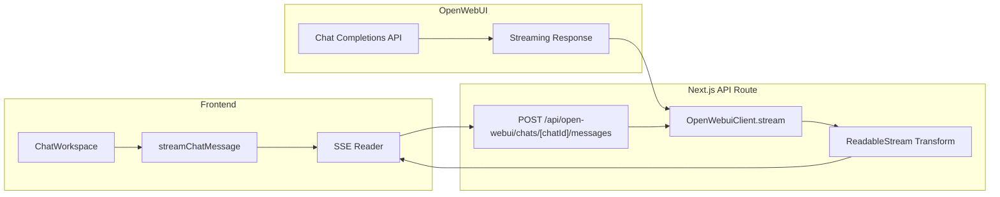

流式聊天处理是本项目与 Open WebUI 集成的核心能力，通过 Server-Sent Events（SSE）协议实现 AI 响应的实时流式传输。本文档详细阐述从后端代理到前端消费的全链路实现。

## 架构概览

流式聊天处理采用经典的 BFF（Backend for Frontend）代理模式，前端永远不会直接调用 Open WebUI 后端服务。所有请求经过 Next.js API 路由层进行认证校验、请求转发和响应转换。



### 核心组件职责

| 组件 | 位置 | 职责 |
|------|------|------|
| `stream-utils.ts` | `src/lib/open-webui/` | SSE 消息格式化与 token 提取 |
| `openWebuiClient.ts` | `src/lib/` | HTTP 客户端，含重试与断路器 |
| `messages/route.ts` | `src/app/api/open-webui/chats/[chatId]/` | 流式消息处理端点 |
| `open-webui.ts` | `src/lib/api/` | 前端流式消费客户端 |
| `chat-workspace.tsx` | `src/components/open-webui/` | 流式 UI 组件 |

Sources: [stream-utils.ts](src/lib/open-webui/stream-utils.ts#L1-L35), [openWebuiClient.ts](src/lib/openWebuiClient.ts#L230-L280), [messages/route.ts](src/app/api/open-webui/chats/[chatId]/messages/route.ts#L1-L100)

## SSE 消息协议

系统采用 SSE（Server-Sent Events）标准协议进行服务端推送，每个事件块由 `data:` 前缀和双换行符结束。

### 消息格式定义

```typescript
type OpenWebuiStreamEvent =
  | { type: "token"; token: string }      // 增量 token
  | { type: "error"; error: string }      // 错误信息
  | { type: "chat"; chat: OpenWebuiChatDetail }  // 完整聊天对象
  | { type: "done" };                      // 流结束标记
```

Sources: [open-webui.ts](src/types/open-webui.ts#L37-L46)

### 消息块格式化

`toSseChunk` 函数将任意数据序列化为符合 SSE 规范的字符串：

```typescript
export function toSseChunk(data: unknown) {
  return `data: ${JSON.stringify(data)}\n\n`;
}
```

Sources: [stream-utils.ts](src/lib/open-webui/stream-utils.ts#L1-L3)

## Token 提取策略

Open WebUI 返回的流式响应具有多种格式，`extractToken` 函数处理所有变体：

```typescript
export function extractToken(delta: unknown): string {
  // 字符串直接返回
  if (typeof delta === "string") {
    return delta;
  }

  // 数组格式：[ { text: "hello" }, { text: "world" } ]
  if (Array.isArray(delta)) {
    return delta
      .map((entry) => {
        if (typeof entry === "string") return entry;
        if (entry && typeof entry === "object" && "text" in entry) {
          return (entry as { text?: string }).text ?? "";
        }
        return "";
      })
      .join("");
  }

  // 嵌套 content 字段
  if (delta && typeof delta === "object" && "content" in delta) {
    return extractToken((delta as { content?: unknown }).content);
  }

  return "";
}
```

Sources: [stream-utils.ts](src/lib/open-webui/stream-utils.ts#L5-L35)

### 提取策略对比

| 响应格式 | 示例 | 提取结果 |
|----------|------|----------|
| 字符串 | `"hello"` | `"hello"` |
| 对象数组 | `[{ text: "foo" }, { text: "bar" }]` | `"foobar"` |
| 嵌套对象 | `{ content: [{ text: "hi" }] }` | `"hi"` |
| 未知格式 | `{}` | `""` |

## 服务端流式处理

消息路由是流式处理的核心，负责上游转发、历史构建和响应聚合。

### 请求验证与上下文构建

```typescript
const SendMessageSchema = z.object({
  message: z.string().min(1, "Message content is required"),
  model: z.string().min(1, "Model is required"),
  messageId: z.string().uuid().optional(),
  files: z.array(z.string()).optional(),
});
```

Sources: [messages/route.ts](src/app/api/open-webui/chats/[chatId]/messages/route.ts#L14-L18)

### 历史消息树遍历

系统从 Open WebUI 获取对话历史树结构，通过 `parentId` 链回溯构建线性对话上下文：

```typescript
// 从 currentId 回溯到根节点
const messageChain: Array<unknown> = [];
let nodeId: string | null | undefined = currentId;

while (nodeId && existingHistoryMessages[nodeId]) {
  const node = existingHistoryMessages[nodeId] as {
    parentId?: string | null;
    role?: string;
    content?: string;
  };
  messageChain.unshift(node);
  nodeId = node.parentId;
}
```

Sources: [messages/route.ts](src/app/api/open-webui/chats/[chatId]/messages/route.ts#L70-L85)

### 流式 ReadableStream 实现

```typescript
const stream = new ReadableStream<Uint8Array>({
  async start(controller) {
    const reader = upstream.body?.getReader();
    let buffer = "";

    while (!upstreamDone) {
      const { value, done } = await reader.read();
      if (done) break;

      const chunk = decoder.decode(value, { stream: true });
      buffer += chunk;

      // 解析 SSE 事件
      let boundary: number;
      while ((boundary = buffer.indexOf("\n\n")) !== -1) {
        const rawEvent = buffer.slice(0, boundary);
        buffer = buffer.slice(boundary + 2);

        const dataLine = rawEvent
          .split(/\n/)
          .find((line) => line.startsWith("data:"));

        if (!dataLine) continue;

        const payload = dataLine.replace(/^data:\s*/, "").trim();
        if (payload === "[DONE]") {
          upstreamDone = true;
          break;
        }

        const json = JSON.parse(payload);
        const token = extractToken(json.choices?.[0]?.delta?.content);
        
        if (token) {
          aggregatedContent += token;
          controller.enqueue(
            encoder.encode(toSseChunk({ type: "token", token }))
          );
        }
      }
    }
    
    controller.enqueue(encoder.encode(toSseChunk({ type: "done" })));
    controller.close();
  },
});
```

Sources: [messages/route.ts](src/app/api/open-webui/chats/[chatId]/messages/route.ts#L130-L200)

### 响应头配置

```typescript
return new Response(stream, {
  headers: {
    "Content-Type": "text/event-stream",
    "Cache-Control": "no-cache",
    Connection: "keep-alive",
    "X-Trace-Id": traceId,
  },
});
```

Sources: [messages/route.ts](src/app/api/open-webui/chats/[chatId]/messages/route.ts#L420-L430)

## 历史持久化

流式传输完成后，系统将完整对话写入 Open WebUI 历史存储，包含消息树结构。

### 消息树结构

```typescript
historyMessages[userMessageId] = {
  id: userMessageId,
  parentId: currentId ?? null,
  childrenIds: [finalAssistantId],
  role: "user",
  content: data.message,
  timestamp,
  models: [data.model],
};

historyMessages[finalAssistantId] = {
  id: finalAssistantId,
  parentId: userMessageId,
  childrenIds: [],
  role: "assistant",
  content: aggregatedContent,
  timestamp,
  models: [data.model],
  model: data.model,
  done: true,
};
```

Sources: [messages/route.ts](src/app/api/open-webui/chats/[chatId]/messages/route.ts#L260-L300)

## 客户端流式消费

前端通过 Fetch API 的 `ReadableStream` 消费 SSE 事件。

### 事件处理回调

```typescript
await streamChatMessage({
  chatId: activeChatId,
  message: userMessage,
  model: resolvedModel,
  messageId,
  signal: controller.signal,
  onEvent: (event) => {
    if (event.type === "token") {
      setStreamedResponse((prev) => prev + event.token);
    } else if (event.type === "chat") {
      updateChatCache(activeChatId, () => event.chat);
    } else if (event.type === "error") {
      toast.error(event.error);
    }
  },
});
```

Sources: [chat-workspace.tsx](src/components/open-webui/chat-workspace.tsx#L120-L160)

### SSE 解析实现

```typescript
const reader = response.body.getReader();
const decoder = new TextDecoder();
let buffer = "";

while (true) {
  const { value, done } = await reader.read();
  if (done) break;
  
  buffer += decoder.decode(value, { stream: true });
  let boundary: number;
  
  while ((boundary = buffer.indexOf("\n\n")) !== -1) {
    const raw = buffer.slice(0, boundary);
    buffer = buffer.slice(boundary + 2);
    
    const line = raw.split(/\n/).find((s) => s.startsWith("data:"));
    if (!line) continue;
    
    const payload = line.replace(/^data:\s*/, "");
    const event = JSON.parse(payload) as OpenWebuiStreamEvent;
    onEvent(event);
  }
}
```

Sources: [open-webui.ts](src/lib/api/open-webui.ts#L90-L125)

## 弹性机制

`OpenWebuiClient` 实现了完整的弹性机制，确保流式请求的可靠性。

### 断路器模式

```typescript
private circuitStates = new Map<
  string,
  { failureCount: number; openUntil?: number }
>();
private circuitBreakerThreshold = 3;
private circuitBreakerDurationMs = 15_000;

private recordFailure(path: string, traceId: string, meta: Record<string, unknown>) {
  const state = this.circuitStates.get(path) ?? { failureCount: 0 };
  state.failureCount += 1;

  if (state.failureCount >= this.circuitBreakerThreshold) {
    state.openUntil = Date.now() + this.circuitBreakerDurationMs;
    logWarn(traceId, "OpenWebUI circuit breaker tripped", meta);
  }
}
```

Sources: [openWebuiClient.ts](src/lib/openWebuiClient.ts#L60-L80)

### 超时控制

```typescript
const COMPLETION_TIMEOUT = parseInt(
  process.env.OPEN_WEBUI_COMPLETION_TIMEOUT || "120000",
  10
);

async stream(path: string, options: StreamRequestOptions): Promise<Response> {
  const controller = new AbortController();
  const timer = setTimeout(() => controller.abort(), effectiveTimeout);
  // ...
}
```

Sources: [openWebuiClient.ts](src/lib/openWebuiClient.ts#L24-L25), [openWebuiClient.ts](src/lib/openWebuiClient.ts#L234-L237)

### 重试机制

```typescript
async request<T>(path: string, ...): Promise<T> {
  let attempt = 0;
  while (attempt <= this.maxRetries) {
    try {
      return await this.httpClient.request<T>(path, options);
    } catch (error) {
      if (!isServerError || attempt === this.maxRetries) {
        throw error;
      }
      const delay = 200 * Math.pow(2, attempt);
      await new Promise((resolve) => setTimeout(resolve, delay));
      attempt++;
    }
  }
}
```

Sources: [openWebuiClient.ts](src/lib/openWebuiClient.ts#L120-L160)

## 状态管理

流式状态通过 Zustand 和 React Query 协同管理。

### Chat Store 配置

```typescript
interface ChatStore {
  activeChatId?: string;
  setActiveChatId: (chatId?: string) => void;
  composerValue: string;
  setComposerValue: (value: string) => void;
  isStreaming: boolean;
  setStreaming: (value: boolean) => void;
  pendingMessageId?: string;
  setPendingMessageId: (id?: string) => void;
  selectedModels: Record<string, string>;
  setSelectedModel: (chatId: string, modelId: string) => void;
}
```

Sources: [useChatStore.ts](src/hooks/useChatStore.ts#L1-L20)

### 乐观更新

发送消息时立即更新缓存，提供即时反馈：

```typescript
updateChatCache(activeChatId, (current) => {
  return {
    ...current,
    messages: [
      ...base.messages,
      { id: `user-${messageId}`, role: "user", content: userMessage },
      { id: messageId, role: "assistant", content: "", createdAt: new Date().toISOString() },
    ],
  };
});
```

Sources: [chat-workspace.tsx](src/components/open-webui/chat-workspace.tsx#L80-L100)

## 错误处理

错误通过统一映射函数转换为标准 API 响应格式：

```typescript
export function mapOpenWebuiError(
  error: unknown,
  traceId?: string
): ReturnType<typeof serverError> | ReturnType<typeof serviceUnavailable> {
  if (error instanceof UserAccessTokenError) {
    return unauthorized("Missing or expired OIDC token", traceId);
  }

  if (error instanceof HttpClientError) {
    return serviceUnavailable("OpenWebUI", error.responseBody, traceId);
  }

  return serverError("OpenWebUI request failed", undefined, traceId);
}
```

Sources: [error-handler.ts](src/app/api/open-webui/error-handler.ts#L1-L19)

## 单元测试

`stream-utils` 模块包含完整的单元测试覆盖：

```typescript
describe("OpenWebUI stream helpers", () => {
  it("generates valid SSE chunks", () => {
    const chunk = toSseChunk({ type: "token", token: "hello" });
    expect(chunk.trim()).toBe('data: {"type":"token","token":"hello"}');
  });

  it("extracts plain string content", () => {
    expect(extractToken("hello")).toBe("hello");
  });

  it("extracts nested array tokens", () => {
    const token = extractToken([{ text: "foo" }, { text: "bar" }]);
    expect(token).toBe("foobar");
  });
});
```

Sources: [open-webui-stream-utils.test.ts](tests/open-webui-stream-utils.test.ts#L1-L28)

## 环境配置

| 环境变量 | 默认值 | 说明 |
|----------|--------|------|
| `OPEN_WEBUI_BASE_URL` | 必需 | Open WebUI 服务地址 |
| `OPEN_WEBUI_API_KEY` | 可选 | API 密钥 |
| `OPEN_WEBUI_TIMEOUT` | `30000` | 普通请求超时（毫秒） |
| `OPEN_WEBUI_COMPLETION_TIMEOUT` | `120000` | 流式请求超时（毫秒） |

Sources: [openWebuiClient.ts](src/lib/openWebuiClient.ts#L20-L28)

## 后续阅读

- [Open WebUI 代理](17-open-webui-dai-li) — 了解完整的代理层架构
- [工具访问控制](13-gong-ju-fang-wen-kong-zhi) — 了解 API 密钥管理
- [工作台组件](20-gong-zuo-tai-zu-jian) — 了解前端 UI 组件实现