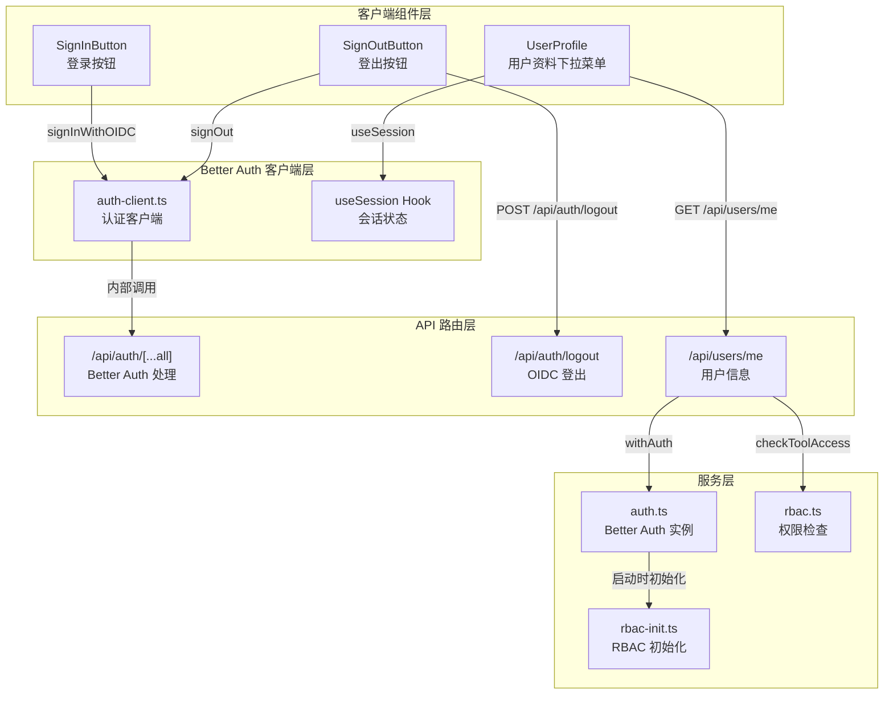
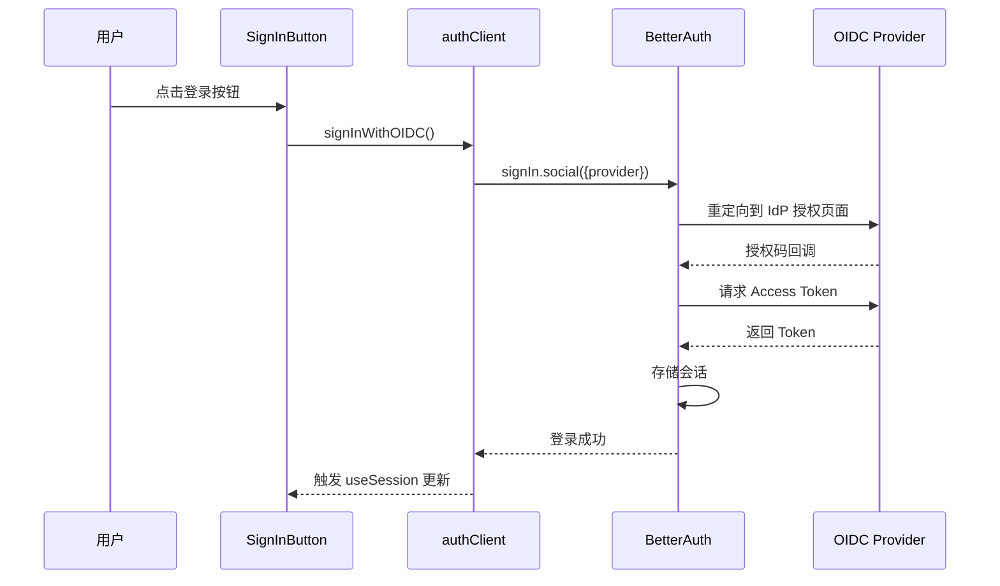
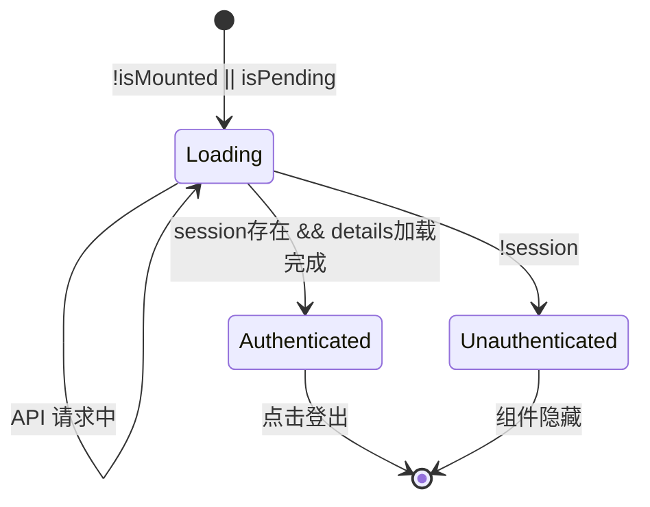
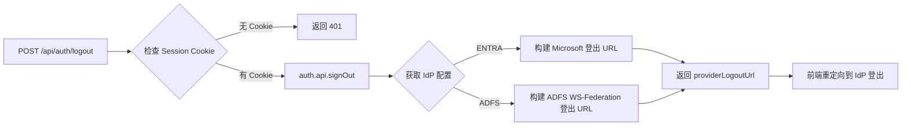

本文档详细阐述基于 **Better Auth** 框架构建的客户端认证组件体系，涵盖登录按钮、登出按钮、用户资料组件三大核心 UI 组件，以及它们与后端认证服务、RBAC 权限系统的完整交互流程。

---

## 组件架构概览

认证组件采用**客户端优先（Client-First）** 架构，通过 `useSession` Hook 实现实时会话状态监听，组件内部通过 fetch 调用后端 API 获取用户角色、租户信息和工具访问权限等扩展数据。



Sources: [sign-in-button.tsx](src/components/auth/sign-in-button.tsx#L1-L27), [sign-out-button.tsx](src/components/auth/sign-out-button.tsx#L1-L32), [user-profile.tsx](src/components/auth/user-profile.tsx#L1-L246), [auth-client.ts](src/lib/auth-client.ts#L1-L71)

---

## 认证客户端配置

认证客户端模块 `auth-client.ts` 是整个前端认证体系的核心，它封装了与 Better Auth 框架交互的所有方法，并针对 OIDC 提供商（Microsoft Entra ID / ADFS）提供了专门的登录流程处理。



### 核心导出函数

| 函数名 | 用途 | 返回值 |
|--------|------|--------|
| `useSession` | 订阅当前会话状态 | `{ data, isPending, error }` |
| `getSession` | 获取当前会话（非响应式） | `Session | null` |
| `signIn` | 凭证登录 / 社交登录 | `Promise<void>` |
| `signOut` | 登出当前会话 | `Promise<void>` |
| `signInWithOIDC` | OIDC 社交登录 | `Promise<void>` |
| `signOutFromOIDC` | OIDC 登出（含 IdP 登出） | `Promise<void>` |
| `signInWithCredentials` | 邮箱密码登录 | `Promise<void>` |

Sources: [auth-client.ts](src/lib/auth-client.ts#L1-L71)

---

## SignInButton 组件

`SignInButton` 是最简单的认证组件，仅负责在用户未登录时显示登录入口。该组件遵循**条件渲染模式**——会话加载期间显示加载状态，会话存在时返回 `null` 隐藏自身。

```typescript
// 状态流：水合检查 → 加载状态 → 已登录隐藏 → 未登录显示按钮
if (isPending) {
  return <Button disabled>Loading...</Button>;
}
if (session) {
  return null;  // 已登录时不渲染
}
return <Button onClick={signInWithOIDC}>Sign in</Button>;
```

Sources: [sign-in-button.tsx](src/components/auth/sign-in-button.tsx#L1-L27)

### 集成位置

该组件被集成在**首页布局**中，当未认证用户访问首页时显示。用户点击后将触发 OIDC 登录流程，完成后重定向到 `/dashboard` 页面。

```typescript
// 登录成功后的重定向目标
await signInWithOIDC("/dashboard");
```

---

## SignOutButton 组件

`SignOutButton` 同样采用条件渲染模式，在会话加载期间显示加载状态，用户已登录时显示登出按钮，点击后执行本地会话清除并刷新页面。

```typescript
// 登出后重定向到首页
await signOut();
router.replace("/");
router.refresh();
```

**重要特性**：该组件仅执行本地会话清除，不包含 IdP（身份提供商）层面的登出。要实现完整的单点登出，需使用 `UserProfile` 组件中的 `signOutFromOIDC` 方法。

Sources: [sign-out-button.tsx](src/components/auth/sign-out-button.tsx#L1-L32)

---

## UserProfile 组件

`UserProfile` 是功能最丰富的认证组件，它不仅显示用户头像和基本信息，还通过额外的 API 调用获取并展示用户的角色、租户信息和工具访问权限。对于管理员用户，还提供直接跳转到管理页面的快捷入口。

### 组件状态机



### 核心功能模块

#### 1. 用户基本信息展示

```typescript
// 头像初始化：取用户姓名首字母，最多显示2个
const initials = user.name
  ?.split(" ")
  .map((n) => n[0])
  .join("")
  .toUpperCase()
  .slice(0, 2) || "U";
```

#### 2. 扩展数据获取

组件在 `useEffect` 中通过 `/api/users/me` 端点获取用户的详细信息：

```typescript
const res = await fetch("/api/users/me");
const payload = await res.json() as ApiResponse<ProfilePayload>;
// payload 结构: { user: { roles }, tenant: { name }, toolAccess: [...] }
```

Sources: [user-profile.tsx](src/components/auth/user-profile.tsx#L1-L246), [me/route.ts](src/app/api/users/me/route.ts#L1-L20)

#### 3. 角色徽章展示

```typescript
{details?.roles?.map((role) => (
  <Badge key={role} variant="secondary">
    <ShieldCheck className="mr-1 h-3 w-3" />
    {role}
  </Badge>
))}
```

#### 4. 工具访问权限可视化

```typescript
// 工具访问状态映射
{assignedTools.map((tool) => (
  <Badge
    key={tool.id}
    variant={tool.enabled ? "outline" : "destructive"}
  >
    {tool.id}
    {!tool.enabled && tool.reason ? ` (${tool.reason})` : ""}
  </Badge>
))}
```

#### 5. 管理员快捷入口

当用户拥有 `admin` 角色时，显示管理功能入口：

```typescript
{hasAdminRole && (
  <>
    <DropdownMenuItem asChild>
      <Link href="/dashboard/tenant-settings">
        <Settings2 className="mr-2 h-4 w-4" />
        管理租户功能
      </Link>
    </DropdownMenuItem>
    <DropdownMenuItem asChild>
      <Link href="/dashboard/user-access">
        <ShieldCheck className="mr-2 h-4 w-4" />
        管理用户角色
      </Link>
    </DropdownMenuItem>
  </>
)}
```

Sources: [user-profile.tsx](src/components/auth/user-profile.tsx#L175-L200)

#### 6. OIDC 完整登出流程

点击登出时，调用 `signOutFromOIDC` 执行完整的登出流程：

```typescript
async function signOutFromOIDC() {
  // 1. 调用后端获取 IdP 登出 URL
  const response = await fetch("/api/auth/logout", { method: "POST" });
  const { providerLogoutUrl } = await response.json();
  
  // 2. 清除本地 Better Auth 会话
  await signOut();
  
  // 3. 重定向到 IdP 登出端点（可选）
  if (providerLogoutUrl) {
    window.location.href = providerLogoutUrl;
  }
}
```

Sources: [auth-client.ts](src/lib/auth-client.ts#L25-L50)

---

## 后端登出 API

`/api/auth/logout` 路由负责处理登出请求，它同时清除本地会话并返回 IdP 的登出 URL（用于实现 SSO 单点登出）。



### Entra ID 登出 URL

```typescript
`https://login.microsoftonline.com/${tenantId}/oauth2/v2.0/logout?post_logout_redirect_uri=${encodeURIComponent(postLogoutRedirect)}`
```

### ADFS 登出 URL

```typescript
`${issuer}/ls/?wa=wsignout1.0&post_logout_redirect_uri=${encodeURIComponent(postLogoutRedirect)}`
```

Sources: [logout/route.ts](src/app/api/auth/logout/route.ts#L1-L65)

---

## 中间件认证守卫

Next.js 中间件在请求到达页面或 API 路由之前进行初步的认证检查：

```typescript
export function middleware(request: NextRequest) {
  const sessionToken = 
    request.cookies.get("__Secure-better-auth.session_token") ??
    request.cookies.get("better-auth.session_token");
  
  const publicPaths = ["/", "/login", "/unauthorized", "/api/auth"];
  const isPublicPath = publicPaths.some(p => pathname.startsWith(p));
  
  if (!sessionToken && !isPublicPath) {
    if (isApiRoute) {
      return NextResponse.json({ error: "Unauthorized" }, { status: 401 });
    }
    // Web 页面重定向到首页
    return NextResponse.redirect(url);
  }
}
```

Sources: [middleware.ts](src/middleware.ts#L1-L36)

---

## 与 RBAC 系统集成

认证组件的 `UserProfile` 组件通过 `/api/users/me` 接口与 RBAC 系统深度集成。当 API 路由处理请求时：

```typescript
export const GET = withAuth(async (_req, { user, tenant, traceId }) => {
  const toolAccess = await getToolAccessSummary(user.id);
  return ok({ user, tenant, toolAccess }, traceId);
});
```

`getToolAccessSummary` 函数会加载用户的所有角色及其关联权限，并评估每个工具的访问状态：

```typescript
interface AccessResult {
  allowed: boolean;      // 是否允许访问
  reason?: string;       // 拒绝原因（deny 时）
}

// 工具权限映射
const TOOL_PERMISSION_MAP = {
  ppt: { resource: "ppt", action: "read" },
  ocr: { resource: "ocr", action: "read" },
  tianyancha: { resource: "tianyancha", action: "read" },
  qualityCheck: { resource: "qualityCheck", action: "read" },
  fileCompare: { resource: "fileCompare", action: "read" },
  zimage: { resource: "zimage", action: "read" },
};
```

Sources: [me/route.ts](src/app/api/users/me/route.ts#L1-L20), [rbac.ts](src/lib/rbac.ts#L1-L205)

---

## 组件使用示例

### 在页面中使用认证组件

```tsx
import { SiteHeader } from "@/components/site-header";
import { UserProfile } from "@/components/auth/user-profile";
import { SignInButton } from "@/components/auth/sign-in-button";

export default function Header() {
  return (
    <header>
      {/* 导航栏 */}
      <nav>...</nav>
      
      {/* 右侧用户区域 */}
      <div className="flex items-center gap-2">
        <ModeToggle />
        <UserProfile />  {/* 已登录显示下拉菜单 */}
        <SignInButton /> {/* 未登录显示登录按钮 */}
      </div>
    </header>
  );
}
```

### 客户端会话检查

```tsx
"use client";
import { useSession } from "@/lib/auth-client";

export function MyComponent() {
  const { data: session, isPending } = useSession();
  
  if (isPending) return <Skeleton />;
  if (!session) return <p>请先登录</p>;
  
  return <p>欢迎, {session.user.name}</p>;
}
```

---

## 相关文档

- [Better Auth 配置](7-better-auth-pei-zhi) — 后端认证服务配置详解
- [Microsoft Entra ID 集成](8-microsoft-entra-id-ji-cheng) — Entra ID OAuth 配置指南
- [ADFS 集成](9-adfs-ji-cheng) — ADFS WS-Federation 配置指南
- [RBAC 权限模型](12-rbac-quan-xian-mo-xing) — 权限检查机制详解
- [工具访问控制](13-gong-ju-fang-wen-kong-zhi) — 工具级权限控制实现