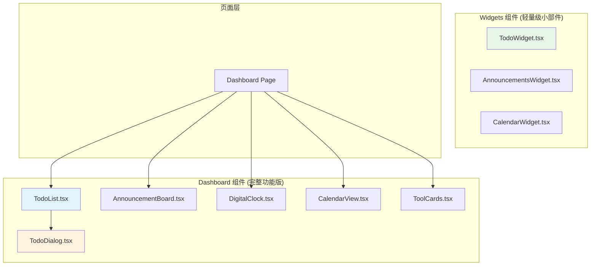
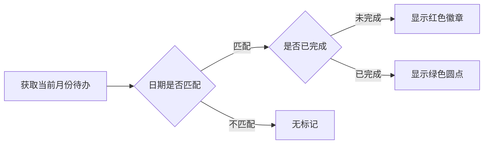

工作台是用户登录后的核心交互界面，提供待办事项管理、公告浏览、日程查看和工具入口等核心功能。组件采用双层架构设计：完整功能版组件用于专用页面，轻量级小部件版用于嵌入式场景。

## 组件架构概览

工作台组件分为两个层级，分别位于 `src/components/dashboard/` 和 `src/components/widgets/` 目录：



Sources: [src/app/dashboard/page.tsx](src/app/dashboard/page.tsx#L1-L94)
Sources: [src/components/dashboard/](src/components/dashboard/todo-list.tsx#L1-L196)
Sources: [src/components/widgets/](src/components/widgets/todo-widget.tsx#L1-L77)

## 待办事项组件

### TodoList 完整版

`TodoList` 组件提供完整的待办事项管理功能，包括创建、编辑、完成标记和删除操作。

**核心功能实现**：

状态管理采用 React `useState` Hook，通过 `mockTodos` 初始化本地状态：

```typescript
const [todos, setTodos] = useState<Todo[]>(mockTodos);
const [dialogOpen, setDialogOpen] = useState(false);
const [editingTodo, setEditingTodo] = useState<Todo | undefined>();
```

Sources: [src/components/dashboard/todo-list.tsx](src/components/dashboard/todo-list.tsx#L10-L14)

**事件处理模式**：

```typescript
const handleToggleTodo = (id: string) => {
  setTodos((prev) =>
    prev.map((todo) =>
      todo.id === id ? { ...todo, completed: !todo.completed } : todo
    )
  );
};
```

Sources: [src/components/dashboard/todo-list.tsx](src/components/dashboard/todo-list.tsx#L16-L22)

组件通过状态提升模式与 `TodoDialog` 子组件通信，支持新增和编辑两种操作模式。当 `editingTodo` 为 `undefined` 时表示新增模式，否则为编辑模式。

### TodoDialog 对话框组件

`TodoDialog` 是受控对话框组件，通过 Props 接收外部状态：

```typescript
interface TodoDialogProps {
  open: boolean;
  onOpenChange: (open: boolean) => void;
  todo?: Todo;
  onSave: (todo: Partial<Todo>) => void;
}
```

Sources: [src/components/dashboard/todo-dialog.tsx](src/components/dashboard/todo-dialog.tsx#L10-L16)

表单字段包括标题（必填）、描述（可选）和截止日期。`useEffect` 监听 `todo` 和 `open` 变化自动填充或清空表单：

```typescript
useEffect(() => {
  if (todo) {
    setTitle(todo.title);
    setDescription(todo.description || "");
    setDueDate(todo.dueDate || "");
  } else {
    setTitle("");
    setDescription("");
    setDueDate("");
  }
}, [todo, open]);
```

Sources: [src/components/dashboard/todo-dialog.tsx](src/components/dashboard/todo-dialog.tsx#L25-L38)

### TodoWidget 轻量版

`TodoWidget` 组件为嵌入式场景设计，渲染静态 Mock 数据，不支持交互操作：

```typescript
const todos = [
  { id: 1, text: "查看今日报表", completed: false, dueDate: new Date(2025, 10, 25) },
  { id: 2, text: "准备项目演示", completed: false, dueDate: new Date(2025, 10, 18) },
  { id: 3, text: "团队会议", completed: true, dueDate: new Date(2025, 10, 12) },
];
```

Sources: [src/components/widgets/todo-widget.tsx](src/components/widgets/todo-widget.tsx#L8-L16)

使用 `date-fns` 库进行日期格式化，支持中文本地化：

```typescript
import { format } from "date-fns";
import { zhCN } from "date-fns/locale";

format(todo.dueDate, "MM月dd日", { locale: zhCN })
```

Sources: [src/components/widgets/todo-widget.tsx](src/components/widgets/todo-widget.tsx#L2-L4)

## 公告组件

### AnnouncementBoard 完整版

`AnnouncementBoard` 支持多类型公告显示，根据 `type` 属性渲染不同图标：

| type 值 | 图标 | 颜色 |
|---------|------|------|
| `info` | Info | `text-blue-500` |
| `warning` | AlertTriangle | `text-yellow-500` |
| `success` | CheckCircle | `text-green-500` |
| `error` | XCircle | `text-red-500` |

Sources: [src/components/dashboard/announcement-board.tsx](src/components/dashboard/announcement-board.tsx#L35-L65)

公告内容通过 `ReactMarkdown` 组件渲染，支持 GFM (GitHub Flavored Markdown) 语法。组件使用 `ScrollArea` 包装公告列表，固定高度 400px：

```typescript
<ScrollArea className="h-[400px] pr-4">
  <div className="space-y-4">
    {announcements.map((announcement) => (
      <div key={announcement.id} className="p-4 rounded-lg border bg-card">
        {/* 公告内容 */}
      </div>
    ))}
  </div>
</ScrollArea>
```

Sources: [src/components/dashboard/announcement-board.tsx](src/components/dashboard/announcement-board.tsx#L128-L146)

### AnnouncementsWidget 轻量版

简化版组件只显示最新一条公告，通过 `mockAnnouncements[0]` 获取数据。Markdown 渲染配置自定义组件样式以适配小部件尺寸：

```typescript
<ReactMarkdown
  remarkPlugins={[remarkGfm]}
  components={{
    p: ({ children }) => (
      <p className="mb-3 last:mb-0 text-sm leading-relaxed font-medium">
        {children}
      </p>
    ),
    li: ({ children }) => (
      <li className="text-sm leading-relaxed flex items-start gap-2.5">
        <span className="text-primary mt-1 select-none text-xs">•</span>
        <span className="flex-1">{children}</span>
      </li>
    ),
  }}
>
```

Sources: [src/components/widgets/announcements-widget.tsx](src/components/widgets/announcements-widget.tsx#L40-L64)

## 日历组件

### CalendarView 完整版

完整版日历视图与待办事项深度集成，支持在日历格子上直接显示待办数量标记：



核心数据关联逻辑：

```typescript
const getTodosForDate = (date: Date) => {
  const dateStr = date.toISOString().split("T")[0];
  return todos.filter((todo) => todo.dueDate === dateStr);
};

const hasTodosOnDate = (date: Date) => {
  return getTodosForDate(date).length > 0;
};
```

Sources: [src/components/dashboard/calendar-view.tsx](src/components/dashboard/calendar-view.tsx#L16-L24)

日历网格渲染采用动态生成方式，计算每月首日星期偏移：

```typescript
const getDaysInMonth = (date: Date) => {
  const year = date.getFullYear();
  const month = date.getMonth();
  const firstDay = new Date(year, month, 1);
  const lastDay = new Date(year, month + 1, 0);
  return { daysInMonth: lastDay.getDate(), startingDayOfWeek: firstDay.getDay() };
};
```

Sources: [src/components/dashboard/calendar-view.tsx](src/components/dashboard/calendar-view.tsx#L10-L15)

### CalendarWidget 轻量版

轻量版移除待办关联功能，仅提供月历浏览。采用纯 CSS Grid 布局，支持月份切换：

```typescript
const monthNames = [
  "一月", "二月", "三月", "四月", "五月", "六月",
  "七月", "八月", "九月", "十月", "十一月", "十二月"
];
```

Sources: [src/components/widgets/calendar-widget.tsx](src/components/widgets/calendar-widget.tsx#L50-L52)

## 数字时钟组件

`DigitalClock` 组件使用 `useEffect` + `setInterval` 实现实时更新：

```typescript
const [time, setTime] = useState<Date>(new Date());

useEffect(() => {
  const timer = setInterval(() => {
    setTime(new Date());
  }, 1000);

  return () => clearInterval(timer);
}, []);
```

Sources: [src/components/dashboard/digital-clock.tsx](src/components/dashboard/digital-clock.tsx#L5-L13)

时间显示使用 `tabular-nums` CSS 属性确保数字等宽，避免数字跳动影响可读性：

```typescript
<div className="text-4xl font-bold tabular-nums mb-2">
  {formatTime(time)}
</div>
```

Sources: [src/components/dashboard/digital-clock.tsx](src/components/dashboard/digital-clock.tsx#L36-L38)

## 工具卡片组件

`ToolCards` 组件以卡片网格形式展示工具入口，支持 5 种工具：

| 工具 ID | 标题 | 描述 | 主题色 |
|---------|------|------|--------|
| `ppt-generator` | PPT 生成器 | 快速创建专业的演示文稿 | 蓝色 |
| `ocr` | OCR 识别工具 | 智能文字识别 | 绿色 |
| `tianyancha` | 天眼查企业查询 | 快速查询企业工商信息 | 紫色 |
| `file-compare` | 文档对比工具 | 智能对比内容差异 | 粉色 |
| `zimage` | AI 图像生成 | AI 智能生成高质量图像 | 青色 |

Sources: [src/components/dashboard/tool-cards.tsx](src/components/dashboard/tool-cards.tsx#L5-L44)

卡片采用多层视觉效果设计，包括悬停时的渐变光晕、斜向闪光动画和缩放变换：

```typescript
<Card className={`
  relative h-full overflow-hidden
  transition-all duration-500 ease-out
  group-hover:scale-[1.02]
  group-hover:shadow-xl
  ${tool.borderGlow}
`}>
  {/* 闪光动画 */}
  <div className="absolute inset-0 -translate-x-full group-hover:translate-x-full 
                  transition-transform duration-1000 ease-out 
                  bg-gradient-to-r from-transparent via-primary/5 to-transparent" />
</Card>
```

Sources: [src/components/dashboard/tool-cards.tsx](src/components/dashboard/tool-cards.tsx#L75-L83)

## 页面布局

Dashboard 页面采用响应式 CSS Grid 布局，通过 Tailwind 断点控制列跨度：

```typescript
<div className="grid gap-6 md:grid-cols-2 lg:grid-cols-3">
  {/* Clock - 中屏占2列，大屏占1列 */}
  <div className="md:col-span-2 lg:col-span-1">
    <DigitalClock />
  </div>

  {/* Todo List - 中屏占2列，大屏占2列 */}
  <div className="md:col-span-2 lg:col-span-2">
    <TodoList />
  </div>

  {/* Calendar - 单列 */}
  <div className="md:col-span-1 lg:col-span-1">
    <CalendarView />
  </div>

  {/* Announcement - 大屏占2列 */}
  <div className="md:col-span-1 lg:col-span-2">
    <AnnouncementBoard />
  </div>
</div>
```

Sources: [src/app/dashboard/page.tsx](src/app/dashboard/page.tsx#L54-L79)

页面结构分为三个主要区域：欢迎区、主内容区（待办/日历/公告）和工具中心区。使用 `Separator` 组件区分不同功能模块。

## 数据类型定义

核心类型定义位于 `src/types/index.ts`：

```typescript
// 待办事项类型
export interface Todo {
  id: string;
  title: string;
  description?: string;
  completed: boolean;
  dueDate?: string; // ISO 8601 date string
  createdAt: string;
  userId: string;
}

// 公告类型
export interface Announcement {
  id: string;
  title: string;
  content: string;
  priority: "high" | "medium" | "low";
  publishedAt: string;
  type?: "info" | "warning" | "success" | "error";
}
```

Sources: [src/types/index.ts](src/types/index.ts#L11-L27)

Mock 数据在 `src/lib/mock-data.ts` 中定义，用于开发阶段和演示环境：

```typescript
export const mockTodos: Todo[] = [
  {
    id: "todo-001",
    title: "完成项目需求文档",
    completed: false,
    dueDate: "2025-11-15",
    // ...
  },
];
```

Sources: [src/lib/mock-data.ts](src/lib/mock-data.ts#L1-L47)

## 设计模式总结

**组件分层模式**：完整功能版与轻量级小部件分离，完整版支持 CRUD 操作，轻量版仅展示数据。

**状态管理模式**：使用 React `useState` 进行组件级状态管理，通过 Props 传递回调函数实现父子通信。

**视觉反馈模式**：
- 待办事项完成时显示删除线和灰色文字
- 日历中未完成待办显示红色徽章，已完成显示绿色圆点
- 工具卡片悬停时触发渐变光晕和缩放动画

**国际化处理**：使用 `date-fns` 的 `zhCN` locale 支持中文日期格式化，硬编码中文月份和星期名称。

## 下一步阅读

- 深入了解工具组件实现，请参阅 [工具组件](21-gong-ju-zu-jian)
- 了解认证组件架构，请参阅 [认证组件](19-ren-zheng-zu-jian)