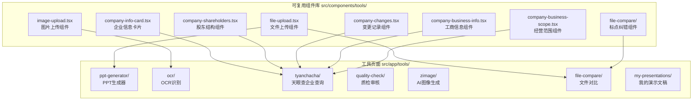
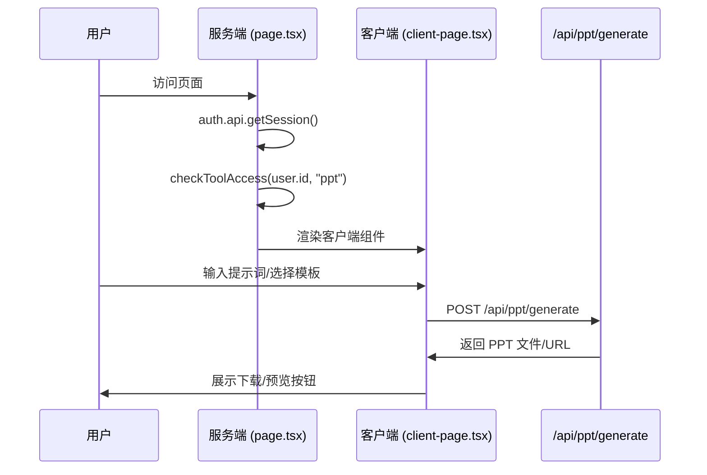

本页面详细记录了项目中的工具组件架构，包括可复用组件库、工具页面实现以及类型定义。这些组件共同构成了企业级应用的核心功能模块，为 PPT 生成、OCR 识别、企业查询、质检审核等业务场景提供统一的前端解决方案。

## 组件架构总览

项目中的工具组件分为两个层级：**可复用组件库**（位于 `src/components/tools/`）和**工具页面**（位于 `src/app/tools/`）。可复用组件库提供原子级别的 UI 能力，工具页面则将这些组件组合成完整的业务功能页面。



Sources: [src/components/tools/](file:///Users/lindaw/Documents/homepage2/src/components/tools) [src/app/tools/](file:///Users/lindaw/Documents/homepage2/src/app/tools)

## 可复用组件库

### 文件上传组件 (FileUpload)

`FileUpload` 组件是项目中通用的文件上传解决方案，支持拖拽上传和点击选择两种交互模式。该组件内置了文件类型验证、大小限制、去重处理等能力，适用于需要上传文档的业务场景。

**核心功能特性：**

| 功能 | 说明 | 默认值 |
|------|------|--------|
| 拖拽上传 | 支持将文件拖入上传区域 | - |
| 点击选择 | 触发系统文件选择对话框 | - |
| 类型验证 | 根据扩展名白名单验证 | `[".pdf", ".txt", ".pptx", ".docx"]` |
| 大小限制 | 单文件最大体积 | 10MB |
| 去重处理 | 自动过滤同名同大小文件 | - |
| 错误展示 | 显示验证失败的错误信息 | - |

**组件接口定义：**

```typescript
interface FileUploadProps {
  /** 当前已上传的文件列表 */
  files: File[];
  /** 文件列表变更回调函数 */
  onFilesChange: (files: File[]) => void;
  /** 允许的文件扩展名，如 [".pdf", ".txt"] */
  accept?: string[];
  /** 单个文件最大大小（MB） */
  maxSizeMB?: number;
  /** 辅助提示文本 */
  helperText?: string;
}
```

**使用示例：**

```tsx
const [files, setFiles] = useState<File[]>([]);

<FileUpload
  files={files}
  onFilesChange={setFiles}
  accept={[".pdf", ".docx"]}
  maxSizeMB={10}
  helperText="支持 PDF 和 DOCX 文件"
/>
```

该组件通过 `cn` 工具函数动态切换拖拽状态样式，在拖拽进入时添加 `scale-[1.02]` 变换效果提升交互反馈。文件列表展示区使用 `FileText` 图标标识文件类型，并通过格式化显示文件大小。

Sources: [src/components/tools/file-upload.tsx](file:///Users/lindaw/Documents/homepage2/src/components/tools/file-upload.tsx#L1-L195)

### 图片上传组件 (ImageUpload)

`ImageUpload` 组件专为图片上传场景设计，相比 `FileUpload`，它增加了图片预览功能和更紧凑的展示模式。该组件同样支持拖拽和点击两种上传方式，并自动生成图片预览 URL。

**核心功能特性：**

| 功能 | 说明 |
|------|------|
| 图片预览 | 使用 `URL.createObjectURL` 生成预览 |
| 类型限制 | 仅支持 `image/jpeg`, `image/png`, `image/webp` |
| 大小限制 | 默认 5MB |
| 紧凑模式 | 通过 `compact` 属性切换展示密度 |
| 资源清理 | 组件卸载时自动调用 `URL.revokeObjectURL` |

**组件接口定义：**

```typescript
interface ImageUploadProps {
  /** 当前上传的图片文件 */
  file: File | null;
  /** 图片预览 URL */
  previewUrl: string | null;
  /** 图片变更回调函数 */
  onChange: (file: File | null, previewUrl: string | null) => void;
  /** 辅助提示文本 */
  helperText?: string;
  /** 是否使用紧凑展示 */
  compact?: boolean;
}
```

组件内部使用 `Image` 组件配合 `fill` 属性实现自适应图片预览，通过 `sizes` 属性优化不同视口下的图片加载尺寸。紧凑模式下去掉了辅助文本和文件类型提示标签，保持界面简洁。

Sources: [src/components/tools/image-upload.tsx](file:///Users/lindaw/Documents/homepage2/src/components/tools/image-upload.tsx#L1-L167)

### 企业信息相关组件

项目为天眼查企业查询功能封装了一组专用组件，分别负责展示企业信息的不同维度。

#### CompanyInfoCard 企业信息卡片

`CompanyInfoCard` 是企业查询结果的主展示卡片，集成了基本信息展示和尽调报告生成功能。该组件根据企业状态（`active`、`cancelled`、`revoked`）显示不同的状态徽章。

**核心数据结构：**

```typescript
interface CompanyInfo {
  id: string;
  name: string;                              // 企业名称
  legalRepresentative: string;               // 法人代表
  registeredCapital: string;                  // 注册资本
  establishDate: string;                     // 成立日期
  status: "active" | "cancelled" | "revoked"; // 在业/注销/吊销
  creditCode: string;                         // 统一社会信用代码
  registeredAddress: string;                 // 注册地址
  businessInfo: CompanyBusinessInfo;         // 工商详细信息
  shareholders: Shareholder[];               // 股东列表
  changeRecords: ChangeRecord[];             // 变更记录
  businessScope: string;                      // 经营范围
}
```

**状态徽章映射：**

| 状态值 | 显示标签 | 徽章样式 |
|--------|----------|----------|
| `active` | 在业 | `default` (蓝色) |
| `cancelled` | 已注销 | `secondary` (灰色) |
| `revoked` | 已吊销 | `destructive` (红色) |

卡片通过 `InfoRow` 子组件统一渲染信息行，每个信息行包含图标、标签和数值三部分，使用网格布局在中等及以上屏幕采用双列展示。

Sources: [src/components/tools/company-info-card.tsx](file:///Users/lindaw/Documents/homepage2/src/components/tools/company-info-card.tsx#L1-L82)

#### CompanyShareholders 股东结构组件

`CompanyShareholders` 组件以表格形式展示企业的股东信息，包括股东名称、持股比例、认缴出资额和实缴出资额。该组件接收 `Shareholder[]` 数组作为数据源，使用 shadcn/ui 的 `Table` 系列组件构建结构化展示。

**数据类型定义：**

```typescript
interface Shareholder {
  id: string;
  name: string;              // 股东名称
  shareholdingRatio: string; // 持股比例
  subscribedCapital: string; // 认缴出资额
  paidInCapital: string;     // 实缴出资额
}
```

Sources: [src/components/tools/company-shareholders.tsx](file:///Users/lindaw/Documents/homepage2/src/components/tools/company-shareholders.tsx#L1-L42)

#### CompanyChanges 变更记录组件

`CompanyChanges` 组件展示企业的工商变更历史，通过 `ScrollArea` 组件限制表格高度为 288px（`h-72`），超出部分可滚动查看。

**数据类型定义：**

```typescript
interface ChangeRecord {
  id: string;
  changeDate: string;        // 变更日期
  changeItem: string;        // 变更项目
  contentBefore: string;      // 变更前内容
  contentAfter: string;      // 变更后内容
}
```

Sources: [src/components/tools/company-changes.tsx](file:///Users/lindaw/Documents/homepage2/src/components/tools/company-changes.tsx#L1-L45)

#### CompanyBusinessInfo 工商信息组件

`CompanyBusinessInfo` 组件以描述列表（`<dl>`）形式展示企业的工商详细信息，包括企业类型、营业期限、登记机关、核准日期和组织机构代码。

**数据类型定义：**

```typescript
interface CompanyBusinessInfo {
  companyType: string;           // 企业类型
  operatingPeriod: string;       // 营业期限
  registrationAuthority: string;  // 登记机关
  approvalDate: string;           // 核准日期
  organizationCode: string;       // 组织机构代码
}
```

Sources: [src/components/tools/company-business-info.tsx](file:///Users/lindaw/Documents/homepage2/src/components/tools/company-business-info.tsx#L1-L39)

#### CompanyBusinessScope 经营范围组件

`CompanyBusinessScope` 组件展示企业的经营范围文本，并支持关键词高亮功能。组件预设了 `["科技", "数据", "金融", "教育", "制造", "AI", "出海"]` 等关键词，当这些词汇出现在经营范围文本中时，会使用 `<mark>` 标签添加黄色背景高亮效果。

```typescript
function highlightKeywords(text: string) {
  return keywordList.reduce((acc, keyword) => {
    const pattern = new RegExp(keyword, "gi");
    return acc.replace(pattern, (match) => 
      `<mark class="bg-primary/20 px-1 rounded">${match}</mark>`
    );
  }, text);
}
```

Sources: [src/components/tools/company-business-scope.tsx](file:///Users/lindaw/Documents/homepage2/src/components/tools/company-business-scope.tsx#L1-L41)

## 工具页面实现

### PPT 生成器 (ppt-generator)

PPT 生成器是项目的核心功能之一，允许用户通过自然语言描述生成演示文稿。该页面采用服务端认证 + 客户端渲染的架构模式，通过中间件验证用户身份和工具访问权限。

**页面架构：**



**核心功能实现：**

页面使用 `useCallback` 封装 `handleGenerate` 异步函数，处理 PPT 生成请求。生成状态通过 `GenerationStatus` 类型管理，支持 `idle`、`generating`、`completed`、`error` 四种状态。错误处理部分区分了 `PPTApiError` 和通用 `Error` 类型，提供差异化的错误提示。

**主题模板选择：**

页面预置了 5 个通用主题模板（来源于 `mockPPTTemplates`），用户点击模板卡片后自动填充对应的描述文本到输入框。模板数据包含 `name`（名称）、`description`（描述）、`category`（分类）等字段。

```typescript
// 生成状态类型
type GenerationStatus = "idle" | "generating" | "completed" | "error";

// API 调用封装
const handleGenerate = useCallback(async () => {
  const generationResult = await generatePpt({
    content: prompt,
    n_slides: slideCount,
  });
  setResult(generationResult);
  setStatus("completed");
}, [prompt, slideCount]);
```

Sources: [src/app/tools/ppt-generator/page.tsx](file:///Users/lindaw/Documents/homepage2/src/app/tools/ppt-generator/page.tsx#L1-L28) [src/app/tools/ppt-generator/client-page.tsx](file:///Users/lindaw/Documents/homepage2/src/app/tools/ppt-generator/client-page.tsx#L1-L356)

### OCR 文本识别 (ocr)

OCR 识别工具基于深度学习模型提供图片文字提取功能，支持将图片内容转换为 Markdown 格式并完整保留文档结构。

**工作流程：**


**核心实现：**

页面使用 `useEffect` 清理预览 URL 和定时器资源，避免内存泄漏。图片上传后通过 `FileReader.readAsDataURL` 转换为 Base64 格式，去掉前缀后发送到 `/api/ocr/recognize` 接口。

```typescript
const fileToBase64 = (file: File): Promise<string> => {
  return new Promise((resolve, reject) => {
    const reader = new FileReader();
    reader.onload = () => {
      const base64 = reader.result as string;
      resolve(base64.split(',')[1]);
    };
    reader.onerror = reject;
    reader.readAsDataURL(file);
  });
};
```

**功能特性：**

- 支持 JPEG、PNG、WebP 格式图片
- 自动计算推理耗时
- 一键复制识别结果到剪贴板
- 针对票据/表格做专项优化

Sources: [src/app/tools/ocr/client-page.tsx](file:///Users/lindaw/Documents/homepage2/src/app/tools/ocr/client-page.tsx#L1-L290)

### 天眼查企业查询 (tianyancha)

天眼查工具提供企业信息查询和尽调报告生成功能，集成了前面介绍的所有企业信息相关组件。

**查询流程：**

1. 用户输入企业名称并提交查询
2. 调用 `/api/tianyancha/search` 验证企业是否存在
3. 解析返回数据构建 `CompanyInfo` 对象
4. 后台异步调用 `/api/tianyancha/generate-report` 生成报告
5. 报告生成完成后缓存到内存，支持随时下载

**报告缓存机制：**

页面使用 `useRef` 存储报告缓存，确保页面刷新或关闭后缓存自动清除。下载功能通过 `URL.createObjectURL` 创建临时 Blob URL 实现。

```typescript
// 报告缓存类型
interface ReportCache {
  blob: Blob;
  filename: string;
  generatedAt: Date;
  companyName: string;
}

const reportCacheRef = useRef<ReportCache | null>(null);

// 下载流程
const downloadFromCache = (cache: ReportCache) => {
  const url = window.URL.createObjectURL(cache.blob);
  const a = document.createElement("a");
  a.href = url;
  a.download = cache.filename;
  document.body.appendChild(a);
  a.click();
  window.URL.revokeObjectURL(url);
};
```

Sources: [src/app/tools/tianyancha/client-page.tsx](file:///Users/lindaw/Documents/homepage2/src/app/tools/tianyancha/client-page.tsx#L1-L435)

### 质检审核 (quality-check)

质检审核工具提供催收录音质检结果的查询功能，支持按催收员 ID、日期文件夹、分数、扣分项等多个字段进行检索。

**分页实现：**

页面实现了完整的分页功能，包括每页条数选择、上一页/下一页、页码跳转。查询请求使用 `AbortController` 支持取消操作，避免竞态条件。

```typescript
// 分页状态管理
interface PaginationInfo {
  total: number;       // 总记录数
  page: number;        // 当前页码
  pageSize: number;    // 每页条数
  totalPages: number;  // 总页数
}

// 请求取消机制
const abortControllerRef = useRef<SignalController | null>(null);

if (abortControllerRef.current) {
  abortControllerRef.current.abort();
}
abortControllerRef.current = new AbortController();
```

**查询字段映射：**

| 字段值 | 中文标签 |
|--------|----------|
| `coll_id` | 催收员ID |
| `date_folder` | 日期文件夹 |
| `score` | 分数 |
| `deductions` | 扣分项 |

Sources: [src/app/tools/quality-check/client-page.tsx](file:///Users/lindaw/Documents/homepage2/src/app/tools/quality-check/client-page.tsx#L1-L552)

### AI 图像生成 (zimage)

图像生成工具调用 AI 模型根据文字描述生成高质量图片，支持多种图像尺寸选择。

**尺寸选项：**

| 尺寸值 | 显示标签 |
|--------|----------|
| `1024x1024` | 1024×1024 (方形) |
| `1024x1792` | 1024×1792 (竖版) |
| `1792x1024` | 1792×1024 (横版) |
| `512x512` | 512×512 (小图) |

**下载实现：**

页面支持 Base64 和 URL 两种图片格式下载。对于 Base64 格式，将 base64 字符串解码为 `Uint8Array`，创建 Blob 对象后通过临时 URL 下载。

```typescript
const handleDownload = async () => {
  const imageData = result?.data?.[0];
  if (imageData.b64_json) {
    const byteArray = Uint8Array.from(atob(imageData.b64_json), (c) => 
      c.charCodeAt(0)
    );
    const blob = new Blob([byteArray], { type: "image/png" });
    const url = URL.createObjectURL(blob);
    // ... 执行下载
  }
};
```

Sources: [src/app/tools/zimage/client-page.tsx](file:///Users/lindaw/Documents/homepage2/src/app/tools/zimage/client-page.tsx#L1-L357)

### 文件对比 (file-compare)

文件对比工具提供标点纠错功能，支持上传 Word 文档并自动检测、修正标点问题。

**功能模块：**

| 模块 | 说明 |
|------|------|
| 标点纠错 | 分析 Word 文档，修正标点符号 |
| 结果展示 | 左右对比原文和修正后文本 |
| 一键复制 | 分别复制原文或修正后文本 |

页面使用 `react-markdown` 配合 `remark-gfm` 和 `rehype-sanitize` 插件渲染 Markdown 内容。纠错结果通过左右两栏对比展示，支持独立复制功能。

Sources: [src/app/tools/file-compare/client-page.tsx](file:///Users/lindaw/Documents/homepage2/src/app/tools/file-compare/client-page.tsx#L1-L481)

## 类型定义

项目的工具组件使用统一的类型定义，确保前后端数据一致性。所有工具相关类型都定义在 `src/types/index.ts` 文件中。

```typescript
// PPT 模板类型
interface PPTTemplate {
  id: string;
  name: string;
  description: string;
  thumbnail?: string;
  theme: "business" | "creative" | "simple" | "modern";
  colorScheme: string;
  slideCount: number;
  category: string;
  tags: string[];
  createdAt: string;
}

// PPT 创建设置类型
interface PPTSettings {
  slideCount: 5 | 10 | 15 | 20 | 30;
  language: "zh" | "en" | "ja" | "ko";
  theme?: string;
  colorScheme?: string;
  fontSize?: "small" | "medium" | "large";
}

// OCR 识别结果类型
interface OCRResult {
  id: string;
  text: string;
  confidence: number;
  processTime: number; // 毫秒
  imageUrl?: string;
  mode: "normal" | "structured" | "custom";
  modelSize: "mini" | "small" | "base" | "large" | "recommended";
  createdAt: string;
}

// 质检审核结果类型
interface QualityAuditResult {
  id: number;
  collId: string | null;
  dateFolder: string | null;
  score: number | null;
  deductions: string | null;
  txtFilename: string | null;
  processedAt: Date | null;
}
```

Sources: [src/types/index.ts](file:///Users/lindaw/Documents/homepage2/src/types/index.ts#L1-L141)

## 路由配置

工具页面的路由通过 `src/config/routes.ts` 集中管理，避免硬编码路径。

```typescript
export const ROUTES = {
  HOME: "/home",
  LANDING: "/",
  PPT_GENERATOR: "/tools/ppt-generator",
  MY_PRESENTATIONS: "/tools/my-presentations",
  FILE_COMPARE: "/tools/file-compare",
  ZIMAGE: "/tools/zimage",
} as const;
```

工具页面的服务端渲染层（`page.tsx`）统一执行认证检查和权限验证，未登录用户会被重定向到登录页，无权限用户会看到授权拒绝页面。

Sources: [src/config/routes.ts](file:///Users/lindaw/Documents/homepage2/src/config/routes.ts#L1-L25)

## 相关文档

- [认证组件](19-ren-zheng-zu-jian)：了解工具页面的认证机制
- [工作台组件](20-gong-zuo-tai-zu-jian)：了解工作台与工具的集成方式
- [工具访问控制](13-gong-ju-fang-wen-kong-zhi)：了解工具权限管理详情
- [PPT 生成接口](14-ppt-sheng-cheng-jie-kou)：了解 PPT 生成 API 规范
- [OCR 识别接口](15-ocr-shi-bie-jie-kou)：了解 OCR API 规范
- [天眼查企业查询](16-tian-yan-cha-qi-ye-cha-xun)：了解天眼查 API 集成