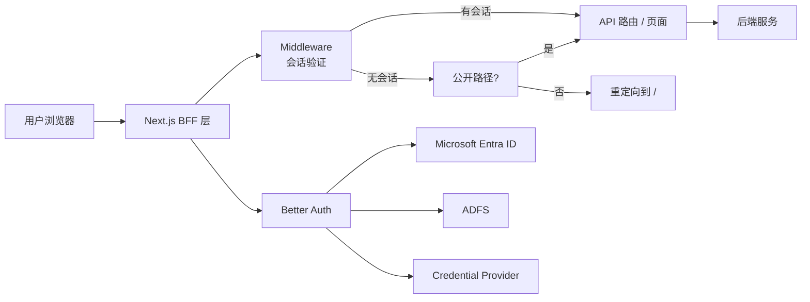
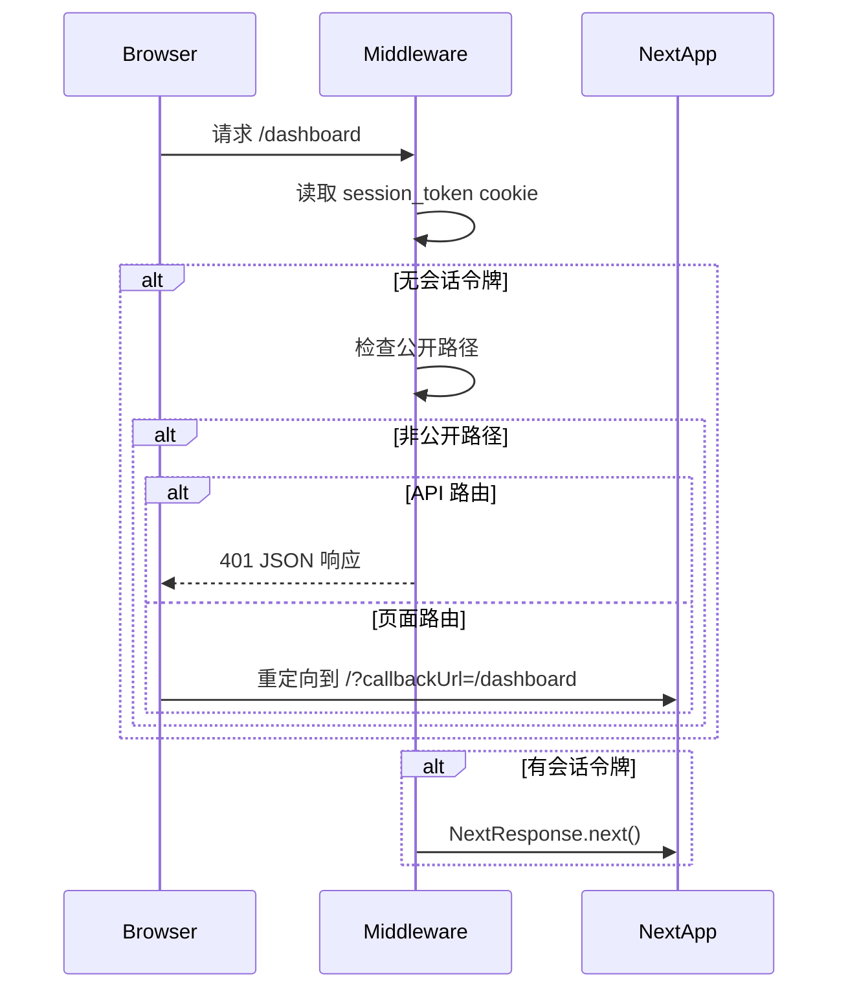
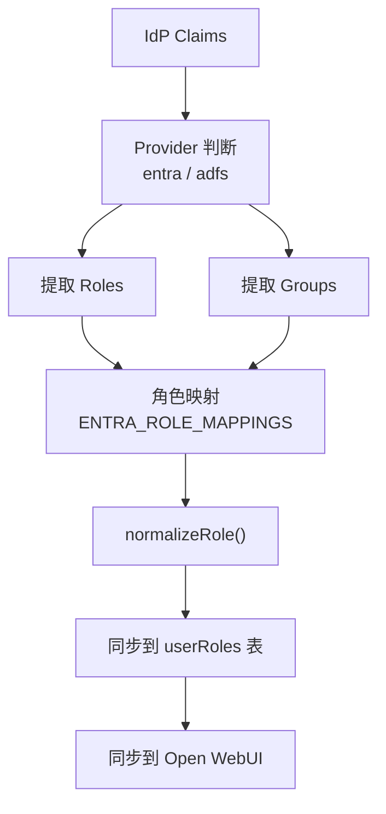
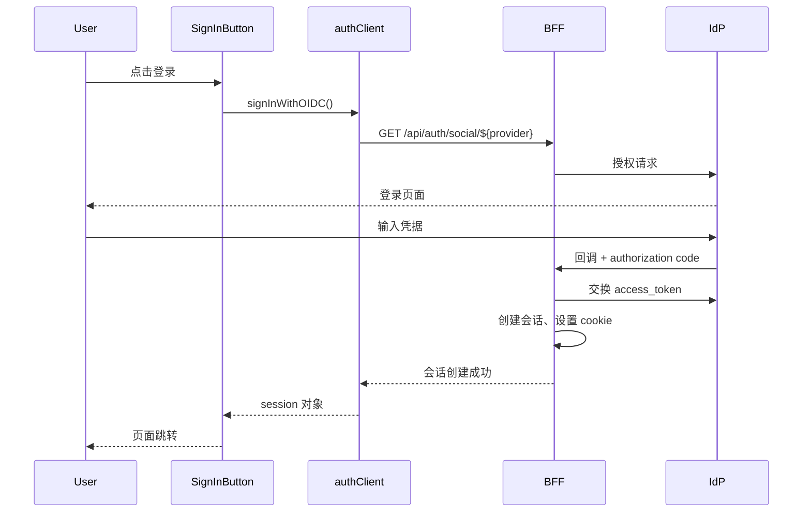

本页面阐述项目采用的 **BFF（Backend for Frontend）认证架构**，涵盖身份验证流程、会话管理、OAuth 集成以及客户端认证组件的协作模式。

---

## 架构概述

本项目基于 Next.js 构建 BFF 层，将认证逻辑从前端应用和后端服务中分离。认证请求首先到达 Next.js API 路由，经 Better Auth 库处理后，根据身份提供商（IdP）的响应决定是否放行或重定向。



**核心设计原则**：

| 原则 | 实现方式 |
|------|----------|
| 会话集中管理 | 所有会话存储于数据库（PostgreSQL），浏览器仅持 cookie |
| 无状态 API | 每次 API 调用通过 cookie 携带会话令牌，BFF 层验证 |
| 声明式权限 | 用户角色从 IdP claims 同步到本地 RBAC 表 |
| 联邦登出 | 退出时同时清除本地会话和 IdP 会话 |

Sources: [middleware.ts](src/middleware.ts#L1-L36), [auth.ts](src/lib/auth.ts#L1-L100)

---

## 请求拦截与路由保护

### Middleware 拦截机制

Middleware 位于所有请求的入口点，通过检查会话 cookie 判断用户是否已认证。



**公开路径白名单**：

| 路径 | 用途 |
|------|------|
| `/` | 首页/落地页 |
| `/login` | 登录页 |
| `/unauthorized` | 无权限提示页 |
| `/api/auth/*` | Better Auth 所有认证 API |

```typescript
// middleware.ts 核心逻辑
const sessionToken =
  request.cookies.get("__Secure-better-auth.session_token") ??
  request.cookies.get("better-auth.session_token");

if (!sessionToken && !isPublicPath) {
  if (isApiRoute) {
    return NextResponse.json(
      { error: "Unauthorized", message: "请先登录" },
      { status: 401 }
    );
  }
  // 页面路由重定向并携带回调地址
  url.searchParams.set("callbackUrl", pathname);
  return NextResponse.redirect(url);
}
```

Sources: [middleware.ts](src/middleware.ts#L9-L32)

---

## 会话管理

### Better Auth 配置

会话管理由 Better Auth 库处理，配置项控制会话生命周期和安全策略：

```typescript
export const auth = betterAuth({
  database: drizzleAdapter(db, {
    provider: "pg",
    schema: { ...schema },
  }),
  baseURL: process.env.BETTER_AUTH_URL || process.env.NEXT_PUBLIC_APP_URL,
  secret: process.env.BETTER_AUTH_SECRET,
  session: {
    expiresIn: parseInt(process.env.SESSION_MAX_AGE || "28800", 10), // 默认 8 小时
    updateAge: 3600, // 1 小时后更新会话时间戳
  },
  emailAndPassword: { enabled: true },
  socialProviders: { /* Entra 或 ADFS 配置 */ },
  plugins: [ /* genericOAuth for ADFS */ ],
});
```

**会话配置参数说明**：

| 参数 | 类型 | 默认值 | 说明 |
|------|------|--------|------|
| `expiresIn` | 秒 | 28800 (8h) | 会话有效期 |
| `updateAge` | 秒 | 3600 | 更新会话时间戳的间隔 |
| `secure` | 布尔 | 自动 | 生产环境自动启用 HTTPS-only |

### 会话数据库结构

会话数据存储于 `session` 表，关联 `user` 表：

```typescript
export const session = pgTable("session", {
  id: text("id").primaryKey(),
  expiresAt: timestamp("expires_at").notNull(),
  token: text("token").unique().notNull(),  // 浏览器 cookie 中的令牌
  userId: text("user_id")
    .notNull()
    .references(() => user.id, { onDelete: "cascade" }),
  ipAddress: text("ip_address"),
  userAgent: text("user_agent"),
});
```

Sources: [auth.ts](src/lib/auth.ts#L240-L290), [schema.ts](src/lib/schema.ts#L55-L70)

---

## OAuth 身份提供商集成

### 提供商选择机制

系统支持两种 OAuth 提供商，通过环境变量 `OIDC_PROVIDER` 切换：

| 环境变量值 | 提供商 | 适用场景 |
|-----------|--------|----------|
| `entra` 或未设置 | Microsoft Entra ID | Azure 云环境、企业 Microsoft 365 |
| `adfs` | Active Directory Federation Services | 本地 AD 混合部署 |

```typescript
const activeProvider =
  (process.env.OIDC_PROVIDER === "adfs" ? "adfs" : "entra") as "entra" | "adfs";
```

### Microsoft Entra ID 配置

```typescript
function getMicrosoftProviderConfig() {
  return {
    clientId: process.env.ENTRA_CLIENT_ID,
    clientSecret: process.env.ENTRA_CLIENT_SECRET,
    tenantId: process.env.ENTRA_TENANT_ID || "common",
    authority: process.env.ENTRA_AUTHORITY || "https://login.microsoftonline.com",
    scope: ["openid", "profile", "email", "offline_access", "User.Read"],
  };
}
```

### ADFS 配置

ADFS 使用 genericOAuth 插件，支持自定义用户信息映射：

```typescript
plugins: [
  genericOAuth({
    config: [{
      providerId: "adfs",
      clientId: process.env.ADFS_CLIENT_ID!,
      authorizationUrl: process.env.ADFS_AUTHORIZATION_URL!,
      tokenUrl: process.env.ADFS_TOKEN_URL!,
      userInfoUrl: process.env.ADFS_USERINFO_URL!,
      pkce: true,
      mapProfileToUser: async (profile) => {
        // 合并 ID Token claims 与 UserInfo 响应
        const idTokenClaims = idTokenClaimsCache.get(profile.sub);
        const mergedProfile = { ...profile, ...idTokenClaims };
        
        const standardClaims = mapClaimsToUser(mergedProfile, "adfs");
        return {
          id: standardClaims.id,
          name: standardClaims.name || standardClaims.username,
          email: standardClaims.email || `${standardClaims.username}@adfs.local`,
          emailVerified: true,
        };
      },
    }],
  }),
]
```

**关键实现**：ADFS 模式下，系统通过拦截 Token Exchange 响应，缓存解码后的 ID Token claims，用于后续 UserInfo 映射。

Sources: [auth.ts](src/lib/auth.ts#L35-L90), [auth.ts](src/lib/auth.ts#L290-L348)

---

## 声明式权限同步

### Claims 到用户信息的映射

身份提供商的 claims（角色、组）需要映射为本地用户属性：



### Claims 映射策略

```typescript
// 提取 Entra ID 角色
function extractEntraRoles(claims: Record<string, unknown>): string[] {
  const roles = Array.isArray(claims.roles) ? claims.roles : [];
  const groups = Array.isArray(claims.groups) ? claims.groups : [];
  const mappings = getMapping(process.env.ENTRA_ROLE_MAPPINGS);

  return [...roles, ...groups]
    .map((role) => mappings[role] || role)  // 应用自定义映射
    .map(normalizeRole)  // 清理 DN 格式
    .filter(Boolean);
}
```

**角色映射配置示例**：

```json
// ENTRA_ROLE_MAPPINGS 环境变量
{
  "CN=Domain Admins,OU=Groups,DC=contoso,DC=com": "admin",
  "PPT-Users": "ppt_admin"
}
```

Sources: [auth-utils.ts](src/lib/auth-utils.ts#L60-L95), [auth-utils.ts](src/lib/auth-utils.ts#L100-L140)

---

## 客户端认证组件

### 组件架构

```
src/components/auth/
├── sign-in-button.tsx    # 触发 OIDC 登录
├── sign-out-button.tsx   # 本地登出
└── user-profile.tsx      # 用户信息与工具权限展示
```

### 会话状态获取

客户端通过 `useSession` hook 订阅会话状态：

```typescript
// 组件中使用
const { data: session, isPending } = useSession();

if (isPending) {
  return <Button disabled>Loading...</Button>;
}

if (!session) {
  return <SignInButton />;
}

return <UserProfile />;
```

### OIDC 登录流程



### 联邦登出

退出时需要同时清除本地会话和 IdP 会话：

```typescript
export async function signOutFromOIDC() {
  // 1. 获取 IdP 登出 URL
  const response = await fetch("/api/auth/logout", { method: "POST" });
  const { providerLogoutUrl } = await response.json();

  // 2. 清除本地会话
  await signOut();

  // 3. 重定向到 IdP 登出（可选）
  if (providerLogoutUrl) {
    window.location.href = providerLogoutUrl;
  }
}
```

Sources: [auth-client.ts](src/lib/auth-client.ts#L1-L70), [sign-in-button.tsx](src/components/auth/sign-in-button.tsx#L1-L27)

---

## 用户信息与权限展示

### UserProfile 组件

该组件展示当前用户信息、角色和工具访问权限：

```typescript
interface ProfileDetails {
  roles: string[];
  tools: Array<{ id: string; enabled: boolean; reason?: string }>;
  tenantName?: string;
}
```

**数据获取流程**：

1. 初始加载时调用 `/api/users/me` 获取完整用户信息
2. 包含用户角色、租户名称、工具访问权限
3. 通过 `useEffect` 监听 `session.user` 变化自动刷新

### 工具权限展示

权限通过 RBAC 系统评估，组件展示格式：

| 状态 | Badge 样式 | 说明 |
|------|-----------|------|
| 已授权 | 绿色 outline | 用户拥有访问权限 |
| 未授权 | 红色 destructive | 缺少必要角色 |
| 加载中 | 灰色 | 正在获取权限信息 |

Sources: [user-profile.tsx](src/components/auth/user-profile.tsx#L1-L100), [rbac.ts](src/lib/rbac.ts#L1-L80)

---

## 环境变量配置

| 变量 | 必需 | 说明 |
|------|------|------|
| `BETTER_AUTH_SECRET` | 是 | 会话加密密钥 |
| `BETTER_AUTH_URL` | 是 | 应用公开 URL |
| `NEXT_PUBLIC_APP_URL` | 是 | 前端公开 URL |
| `OIDC_PROVIDER` | 否 | `entra` 或 `adfs` |
| `ENTRA_CLIENT_ID` | Entra 必需 | Azure 应用客户端 ID |
| `ENTRA_CLIENT_SECRET` | Entra 必需 | Azure 应用客户端密钥 |
| `ENTRA_TENANT_ID` | Entra 必需 | Azure 租户 ID |
| `SESSION_MAX_AGE` | 否 | 会话有效期（秒），默认 28800 |

Sources: [auth.ts](src/lib/auth.ts#L240-L260)

---

## 后续阅读

- **[Better Auth 配置](7-better-auth-pei-zhi)**：深入了解 Better Auth 的高级配置选项
- **[Microsoft Entra ID 集成](8-microsoft-entra-id-ji-cheng)**：企业 Azure AD 配置详解
- **[ADFS 集成](9-adfs-ji-cheng)**：本地 AD 混合部署配置指南
- **[RBAC 权限模型](12-rbac-quan-xian-mo-xing)**：基于角色的访问控制实现细节