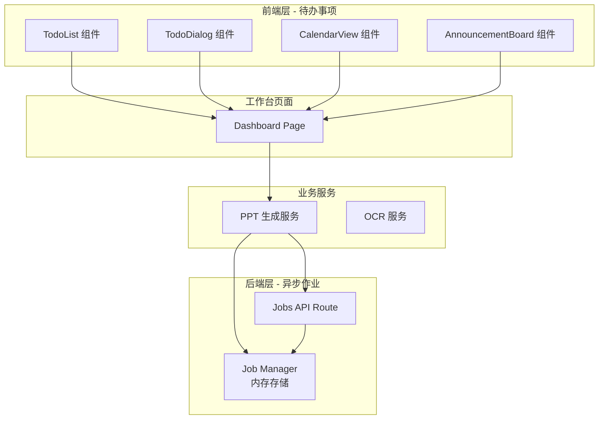
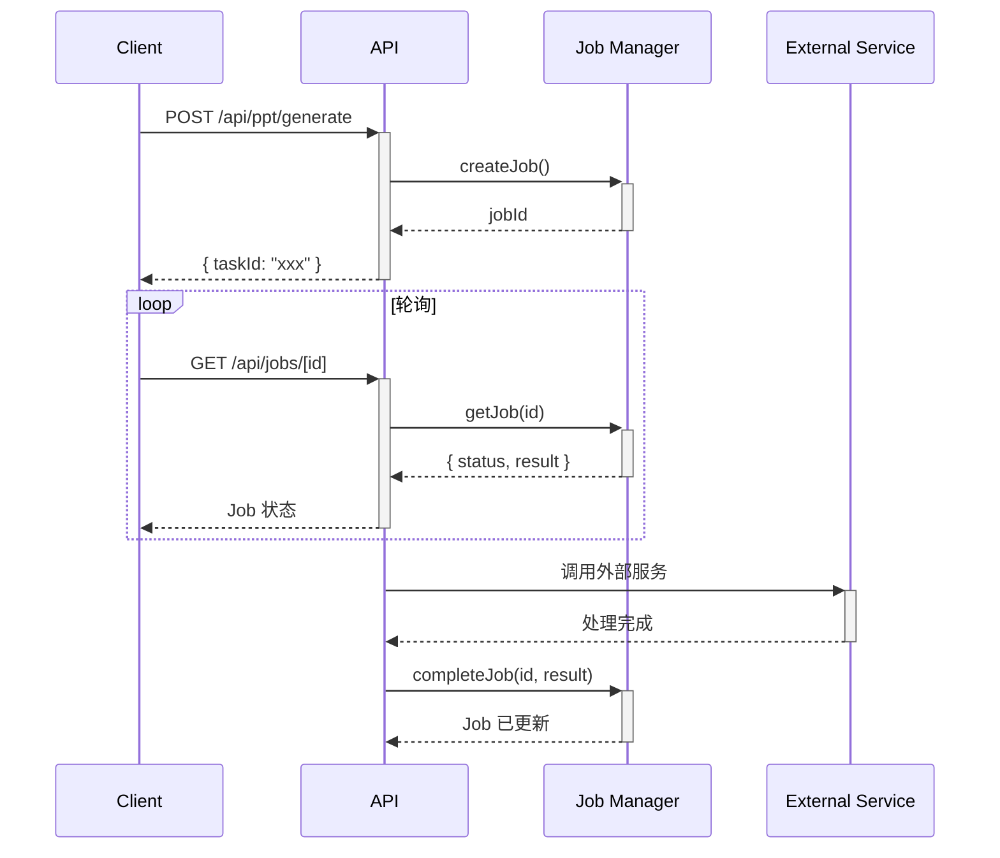

作业管理系统是 homepage2 项目中用于管理个人待办事项和异步任务的核心模块。该系统由两个互补的子系统组成：**待办事项模块**（Todo）负责前端个人任务管理，**异步作业模块**（Job）则处理后端长时间运行任务的状态追踪。

## 系统架构概览



## 待办事项模块 (Todo)

### 核心组件

待办事项模块包含四个核心组件，均位于 `src/components/dashboard/` 目录下。

**TodoList** 是主列表组件，负责渲染待办事项卡片列表，支持添加、编辑、完成标记和删除操作。该组件使用 React 的 `useState` 管理本地状态，数据来源为 `mockTodos`。待办事项按创建时间倒序排列，已完成事项显示删除线效果，未完成且已逾期的待办事项以红色高亮显示。

Sources: [todo-list.tsx](src/components/dashboard/todo-list.tsx#L1-L196)

**TodoDialog** 是新增/编辑对话框组件，提供标题、描述和截止日期三个字段的输入界面。使用 Zod 验证后，通过 `onSave` 回调将数据回传给父组件。该组件采用受控组件模式，通过 `useEffect` 同步 `open` 和 `todo` props 的变化。

Sources: [todo-dialog.tsx](src/components/dashboard/todo-dialog.tsx#L1-L113)

**CalendarView** 是日历视图组件，以月视图展示当前月份的日历网格。每个日期格子显示是否有待办事项标记：红色徽章表示未完成事项数量，绿色圆点表示所有事项已完成。日历支持月份切换，未完成待办数实时反映待办事项的截止日期分布。

Sources: [calendar-view.tsx](src/components/dashboard/calendar-view.tsx#L1-L164)

### 数据类型定义

待办事项的数据结构定义在 `src/types/index.ts` 中：

```typescript
export interface Todo {
  id: string;
  title: string;
  description?: string;
  completed: boolean;
  dueDate?: string;  // ISO 8601 date string
  createdAt: string;
  userId: string;
}
```

Sources: [types/index.ts](src/types/index.ts#L12-L19)

### Mock 数据结构

开发阶段使用 `src/lib/mock-data.ts` 中的 `mockTodos` 作为数据源，包含 6 条预设待办事项，覆盖项目开发场景：

| 字段 | 说明 |
|------|------|
| `id` | 唯一标识符，格式为 `todo-XXX` |
| `title` | 待办事项标题 |
| `description` | 可选描述文本 |
| `completed` | 完成状态布尔值 |
| `dueDate` | ISO 8601 日期字符串 |
| `createdAt` | 创建时间戳 |
| `userId` | 所属用户 ID |

Sources: [mock-data.ts](src/lib/mock-data.ts#L5-L60)

### 工作台集成

Todo 模块作为工作台页面的核心组成部分，与其他组件协同工作。页面布局采用响应式网格设计，`TodoList` 占据两列宽度，`CalendarView` 和 `AnnouncementBoard` 分别占据一列和两列宽度。

Sources: [dashboard/page.tsx](src/app/dashboard/page.tsx#L1-L94)

## 异步作业模块 (Job)

### 设计理念

异步作业模块采用**立即返回 + 状态轮询**模式处理长时间运行的后端任务。当客户端提交耗时操作（如 PPT 生成）时，服务端立即返回一个作业 ID，客户端随后通过该 ID 轮询获取作业状态和结果。这种设计避免了 HTTP 超时问题，同时支持任务进度的实时反馈。



### 作业状态机

作业在生命周期内经历四种状态转换：

| 状态 | 说明 | 可能的下一状态 |
|------|------|---------------|
| `pending` | 作业已创建，等待处理 | `processing` |
| `processing` | 正在处理中 | `completed` 或 `failed` |
| `completed` | 处理成功，结果可用 | 终止状态 |
| `failed` | 处理失败，错误信息可用 | 终止状态 |

Sources: [core/types.ts](src/lib/core/types.ts#L73-L79)

### Job Manager 核心实现

Job Manager 使用内存 Map 存储作业记录，提供完整的 CRUD 操作和自动清理机制。

Sources: [core/job-manager.ts](src/lib/core/job-manager.ts#L1-L228)

**关键特性**：

- **自动清理机制**：每小时清理过期作业（超过 1 小时未更新的作业）
- **容量限制**：最多保留 1000 个作业，超出时删除最旧的作业
- **线程安全**：Node.js 单线程环境下 Map 操作是原子的
- **追踪支持**：每个作业关联 traceId 用于日志追踪

```typescript
// 作业数据结构
export interface Job<T = unknown> {
  id: string;           // UUID v4
  status: JobStatus;
  createdAt: Date;
  updatedAt: Date;
  result?: T;           // 成功结果
  error?: ApiError;     // 错误信息
  traceId?: string;     // 追踪 ID
}
```

Sources: [core/types.ts](src/lib/core/types.ts#L81-L89)

**API 函数**：

| 函数 | 说明 | 参数 | 返回值 |
|------|------|------|--------|
| `createJob<T>()` | 创建新作业 | `traceId?: string` | `Job<T>` |
| `getJob<T>()` | 获取作业状态 | `jobId: string` | `Job<T> \| null` |
| `updateJobStatus()` | 更新作业状态 | `jobId, status, traceId` | `Job \| null` |
| `completeJob<T>()` | 标记作业完成 | `jobId, result, traceId` | `Job<T> \| null` |
| `failJob()` | 标记作业失败 | `jobId, error, traceId` | `Job \| null` |
| `deleteJob()` | 删除作业 | `jobId, traceId` | `boolean` |
| `listJobs()` | 列出所有作业 | `status?: JobStatus` | `Job[]` |

### REST API 接口

作业管理提供两个 REST 端点，位于 `src/app/api/jobs/[id]/route.ts`：

**GET /api/jobs/[id]** — 获取作业状态

```json
// 成功响应
{
  "success": true,
  "data": {
    "id": "uuid",
    "status": "completed",
    "createdAt": "2025-01-13T10:00:00Z",
    "updatedAt": "2025-01-13T10:05:00Z",
    "result": { ... },
    "error": null,
    "traceId": "trace-id"
  },
  "traceId": "trace-id"
}
```

**DELETE /api/jobs/[id]** — 删除作业

```json
// 成功响应
{
  "success": true,
  "data": { "deleted": true },
  "traceId": "trace-id"
}
```

Sources: [jobs/[id]/route.ts](src/app/api/jobs/[id]/route.ts#L1-L96)

### 与 PPT 服务的集成

作业系统与 PPT 生成服务深度集成。当客户端请求异步 PPT 生成时，API 路由调用 `generatePptAsync()` 返回任务 ID，客户端随后轮询作业状态获取生成结果。

Sources: [ppt/generate/route.ts](src/app/api/ppt/generate/route.ts#L1-L213)

## 当前实现状态与限制

### 待办事项模块

| 特性 | 当前状态 | 说明 |
|------|---------|------|
| 本地状态管理 | ✅ 已实现 | 使用 useState |
| Mock 数据 | ✅ 已实现 | 6 条预设数据 |
| 持久化存储 | ❌ 未实现 | 无数据库表 |
| 多用户隔离 | ❌ 未实现 | 所有用户共享数据 |
| 实时同步 | ❌ 未实现 | 刷新页面数据丢失 |

### 异步作业模块

| 特性 | 当前状态 | 说明 |
|------|---------|------|
| 内存存储 | ✅ 已实现 | Map 数据结构 |
| 状态追踪 | ✅ 已实现 | 完整状态机 |
| 自动清理 | ✅ 已实现 | 1 小时过期 + 容量限制 |
| 持久化存储 | ❌ 未实现 | 服务重启丢失 |
| 分布式部署 | ❌ 不支持 | 单节点内存存储 |
| WebSocket 推送 | ❌ 未实现 | 需轮询获取状态 |

## 后续阅读建议

作业管理系统与项目的多个模块存在关联关系，建议按以下顺序深入了解：

- [PPT 生成接口](14-ppt-sheng-cheng-jie-kou) — 了解作业系统如何被 PPT 服务调用
- [数据库模式设计](10-shu-ju-ku-mo-shi-she-ji) — 了解项目数据库架构，为待办事项持久化做准备
- [RBAC 权限模型](12-rbac-quan-xian-mo-xing) — 了解用户权限体系，为多用户隔离做准备