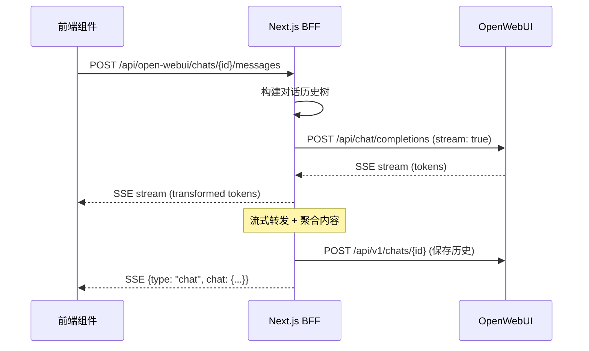

本文档详细介绍项目中流式响应的完整实现架构，涵盖 SSE（Server-Sent Events）协议处理、代理转发机制、客户端消费以及与 OpenWebUI 的集成模式。

## 架构概览

流式响应处理采用典型的 BFF（Backend for Frontend）代理模式，Next.js 服务端作为中间层，转发来自 OpenWebUI 的流式响应，同时处理认证、对话历史构建和消息持久化。



Sources: [src/app/api/open-webui/chats/[chatId]/messages/route.ts](src/app/api/open-webui/chats/[chatId]/messages/route.ts#L1-L50)

## SSE 工具函数

### 消息格式转换

`sanitizeMessage` 函数负责将 OpenWebUI 的多种响应格式统一转换为标准文本：

```typescript
export function extractToken(delta: unknown): string {
  if (!delta) return "";

  // 字符串直接返回
  if (typeof delta === "string") {
    return delta;
  }

  // 处理数组格式（可能包含 {text: "..."} 对象）
  if (Array.isArray(delta)) {
    return delta
      .map((entry) => {
        if (typeof entry === "string") return entry;
        if (entry && typeof entry === "object" && "text" in entry) {
          return (entry as { text?: string }).text ?? "";
        }
        return "";
      })
      .join("");
  }

  // 递归处理嵌套 content
  if (delta && typeof delta === "object" && "content" in delta) {
    return extractToken((delta as { content?: unknown }).content);
  }

  return "";
}
```

该函数能够处理三种典型的 OpenWebUI 响应格式：
- 纯字符串 token
- 包含 `text` 字段的对象数组
- 嵌套 `content` 结构的复杂对象

Sources: [src/lib/open-webui/stream-utils.ts](src/lib/open-webui/stream-utils.ts#L1-L35)

### SSE Chunk 生成

`toSseChunk` 将任意数据序列化为符合 SSE 规范的格式：

```typescript
export function toSseChunk(data: unknown) {
  return `data: ${JSON.stringify(data)}\n\n`;
}
```

SSE 协议要求每个事件以两个换行符 `\n\n` 结尾，`data:` 前缀标识事件数据。

Sources: [src/lib/open-webui/stream-utils.ts](src/lib/open-webui/stream-utils.ts#L1-L3)

## 服务端流式端点

### 端点路由

`POST /api/open-webui/chats/[chatId]/messages` 是核心流式处理入口，采用 Next.js App Router 的 Route Handler 模式实现。

Sources: [src/app/api/open-webui/chats/[chatId]/messages/route.ts](src/app/api/open-webui/chats/[chatId]/messages/route.ts#L1-L25)

### 请求验证

```typescript
const SendMessageSchema = z.object({
  message: z.string().min(1, "Message content is required"),
  model: z.string().min(1, "Model is required"),
  messageId: z.string().uuid().optional(),
  files: z.array(z.string()).optional(),
});
```

采用 Zod 进行运行时类型验证，确保必需字段存在且格式正确。

Sources: [src/app/api/open-webui/chats/[chatId]/messages/route.ts](src/app/api/open-webui/chats/[chatId]/messages/route.ts#L18-L25)

### 对话历史构建

这是流式处理的关键步骤 — 从 OpenWebUI 的树形历史结构中提取线性对话上下文：

```typescript
// 提取历史消息（保留父子关系）
const existingHistoryMessages = rawChatResponse.chat?.history?.messages ?? {};
const currentId = rawChatResponse.chat?.history?.currentId;

// 从当前节点回溯到根节点，构建线性对话
const messageChain: Array<unknown> = [];
let nodeId: string | null | undefined = currentId;

while (nodeId && existingHistoryMessages[nodeId]) {
  const node = existingHistoryMessages[nodeId] as {
    parentId?: string | null;
    role?: string;
    content?: string;
  };
  messageChain.unshift(node); // 头部插入保持顺序
  nodeId = node.parentId;
}
```

OpenWebUI 使用树形结构存储消息，每个消息包含 `parentId` 和 `childrenIds`，支持分支对话。构建线性上下文时从当前节点回溯到根。

Sources: [src/app/api/open-webui/chats/[chatId]/messages/route.ts](src/app/api/open-webui/chats/[chatId]/messages/route.ts#L52-L75)

### 流式代理与响应转换

```typescript
const upstream = await openWebuiClient.stream("/api/chat/completions", {
  accessToken,
  traceId,
  timeout: openWebuiClient.getCompletionTimeout(),
  userId: user.id,
  chatId,
  body: {
    model: data.model,
    stream: true,
    chat_id: chatId,
    id: assistantMessageId,
    messages: conversationMessages,
    files: data.files,
  },
});
```

BFF 接收上游 OpenWebUI 的 SSE 流，创建新的 `ReadableStream` 进行转换和转发：

```typescript
const stream = new ReadableStream<Uint8Array>({
  async start(controller) {
    const reader = upstream.body?.getReader();
    let buffer = "";

    while (!upstreamDone) {
      const { value, done } = await reader.read();
      if (done) break;

      const chunk = decoder.decode(value, { stream: true });
      buffer += chunk;

      // 解析 SSE 事件
      while ((boundary = buffer.indexOf("\n\n")) !== -1) {
        const rawEvent = buffer.slice(0, boundary);
        buffer = buffer.slice(boundary + 2);
        
        // 提取 data: 行并解析 JSON
        const json = JSON.parse(dataLine.replace(/^data:\s*/, ""));
        const token = extractToken(json.choices?.[0]?.delta?.content);
        
        if (token) {
          aggregatedContent += token;
          // 转发给前端
          controller.enqueue(encoder.encode(toSseChunk({ type: "token", token })));
        }
      }
    }
  }
});
```

Sources: [src/app/api/open-webui/chats/[chatId]/messages/route.ts](src/app/api/open-webui/chats/[chatId]/messages/route.ts#L103-L175)

### 消息持久化

流式传输完成后，BFF 负责将完整对话保存回 OpenWebUI：

```typescript
// 构建完整的历史树
const historyMessages: Record<string, HistoryNode> = {};

// 克隆现有历史
for (const msgId in existingHistoryMessages) {
  historyMessages[msgId] = { ...existingHistoryMessages[msgId] };
}

// 添加新用户消息
historyMessages[userMessageId] = {
  id: userMessageId,
  parentId: currentId,
  childrenIds: [finalAssistantId],
  role: "user",
  content: data.message,
  timestamp,
};

// 添加助手响应
historyMessages[finalAssistantId] = {
  id: finalAssistantId,
  parentId: userMessageId,
  childrenIds: [],
  role: "assistant",
  content: aggregatedContent,
  timestamp,
  done: true,
};

// 保存到 OpenWebUI
await openWebuiClient.request(`/api/v1/chats/${chatId}`, "POST", {
  chat: {
    id: chatId,
    title: finalTitle,
    history: { messages: historyMessages, currentId: finalAssistantId },
  },
}, { accessToken, traceId, userId, chatId });
```

Sources: [src/app/api/open-webui/chats/[chatId]/messages/route.ts](src/app/api/open-webui/chats/[chatId]/messages/route.ts#L215-L295)

### 响应头配置

```typescript
return new Response(stream, {
  headers: {
    "Content-Type": "text/event-stream",
    "Cache-Control": "no-cache",
    Connection: "keep-alive",
    "X-Trace-Id": traceId,
  },
});
```

SSE 响应必须设置 `Content-Type: text/event-stream`，并禁用缓存以确保客户端实时接收数据。

Sources: [src/app/api/open-webui/chats/[chatId]/messages/route.ts](src/app/api/open-webui/chats/[chatId]/messages/route.ts#L420-L430)

## 客户端流式消费

### API 客户端实现

```typescript
export async function streamChatMessage({
  chatId,
  message,
  model,
  messageId,
  signal,
  onEvent,
}: StreamParams) {
  const response = await fetch(`${API_BASE}/chats/${chatId}/messages`, {
    method: "POST",
    headers: { "Content-Type": "application/json" },
    body: JSON.stringify({ message, model, messageId }),
    signal, // 支持 AbortController 取消
  });

  const reader = response.body.getReader();
  const decoder = new TextDecoder();
  let buffer = "";

  while (true) {
    const { value, done } = await reader.read();
    if (done) break;
    
    buffer += decoder.decode(value, { stream: true });

    // 解析 SSE 事件
    let boundary;
    while ((boundary = buffer.indexOf("\n\n")) !== -1) {
      const raw = buffer.slice(0, boundary);
      buffer = buffer.slice(boundary + 2);

      const line = raw.split(/\n/).find((s) => s.startsWith("data:"));
      if (!line) continue;

      const event = JSON.parse(line.replace(/^data:\s*/, ""));
      onEvent(event); // 触发回调
    }
  }
}
```

客户端使用 `fetch` + `ReadableStream` API 消费 SSE，支持通过 `AbortSignal` 中断请求。

Sources: [src/lib/api/open-webui.ts](src/lib/api/open-webui.ts#L90-L130)

### 事件类型定义

```typescript
export type OpenWebuiStreamEvent =
  | { type: "token"; token: string }      // 增量文本片段
  | { type: "error"; error: string }        // 错误信息
  | { type: "chat"; chat: OpenWebuiChatDetail }  // 完整对话状态
  | { type: "done" };                       // 流结束信号
```

Sources: [src/types/open-webui.ts](src/types/open-webui.ts#L40-L46)

### 前端组件集成

```typescript
const sendMessage = useCallback(async () => {
  await streamChatMessage({
    chatId: activeChatId,
    message: userMessage,
    model: resolvedModel,
    messageId,
    signal: controller.signal,
    onEvent: (event) => {
      if (event.type === "token") {
        // 更新流式内容
        setStreamedResponse((prev) => prev + event.token);
        // 乐观更新聊天缓存
        updateChatCache(activeChatId, (current) =>
          current ? {
            ...current,
            messages: current.messages.map((m) =>
              m.id === messageId ? { ...m, content: prev + event.token } : m
            ),
          } : current
        );
      } else if (event.type === "chat") {
        // 替换为持久化后的完整状态
        updateChatCache(activeChatId, () => event.chat);
      } else if (event.type === "error") {
        toast.error(event.error);
        // 清理不完整消息
        updateChatCache(activeChatId, (current) =>
          current ? {
            ...current,
            messages: current.messages.filter(
              (m) => m.id !== messageId && m.id !== `user-${messageId}`
            ),
          } : current
        );
      }
    },
  });
}, [/* dependencies */]);
```

前端通过 React Query 的 `queryClient.setQueryData` 实现乐观更新，在流式传输过程中实时渲染内容。

Sources: [src/components/open-webui/chat-workspace.tsx](src/components/open-webui/chat-workspace.tsx#L120-L175)

### 流状态管理

```typescript
interface ChatStore {
  isStreaming: boolean;
  setStreaming: (value: boolean) => void;
  streamedResponse: string;
  setStreamedResponse: (value: string) => void;
  abortControllerRef: React.MutableRefObject<AbortController | null>;
}
```

使用 Zustand 管理流式状态，包括当前是否正在流式传输、已接收的内容片段等。

Sources: [src/hooks/useChatStore.ts](src/hooks/useChatStore.ts#L1-L41)

## 断点续传与取消机制

### AbortController 集成

```typescript
const controller = new AbortController();
abortControllerRef.current = controller;

try {
  await streamChatMessage({
    // ...
    signal: controller.signal,
  });
} catch (error) {
  if (controller.signal.aborted) {
    toast.error("Generation cancelled");
  }
}

const handleStop = () => {
  abortControllerRef.current?.abort();
  setStreaming(false);
};
```

用户点击"停止"按钮时调用 `abort()`，客户端会中断 SSE 读取，服务端也会在下次 `read()` 时检测到 `done: true`。

Sources: [src/components/open-webui/chat-workspace.tsx](src/components/open-webui/chat-workspace.tsx#L260-L275)

## 流式事件类型对照表

| 事件类型 | 来源 | 用途 |
|---------|------|------|
| `token` | BFF → 前端 | 单个文本片段，用于实时渲染 |
| `chat` | BFF → 前端 | 完整对话状态，替换本地缓存 |
| `error` | BFF → 前端 | 错误信息，触发错误提示 |
| `done` | BFF → 前端 | 流结束信号，表示传输完成 |

Sources: [src/types/open-webui.ts](src/types/open-webui.ts#L40-L46)

## 测试覆盖

```typescript
describe("OpenWebUI stream helpers", () => {
  it("generates valid SSE chunks", () => {
    const chunk = toSseChunk({ type: "token", token: "hello" });
    expect(chunk.trim()).toBe('data: {"type":"token","token":"hello"}');
  });

  it("extracts plain string content", () => {
    expect(extractToken("hello")).toBe("hello");
  });

  it("extracts nested array tokens", () => {
    const token = extractToken([{ text: "foo" }, { text: "bar" }]);
    expect(token).toBe("foobar");
  });
});
```

Sources: [tests/open-webui-stream-utils.test.ts](tests/open-webui-stream-utils.test.ts#L1-L28)

## 延伸阅读

- [流式聊天处理](18-liu-shi-liao-tian-chu-li) — 深入了解聊天功能的完整流程
- [Open WebUI 代理](17-open-webui-dai-li) — 了解 BFF 与 OpenWebUI 的认证集成
- [PPT 生成接口](14-ppt-sheng-cheng-jie-kou) — 非流式 API 的对比参考