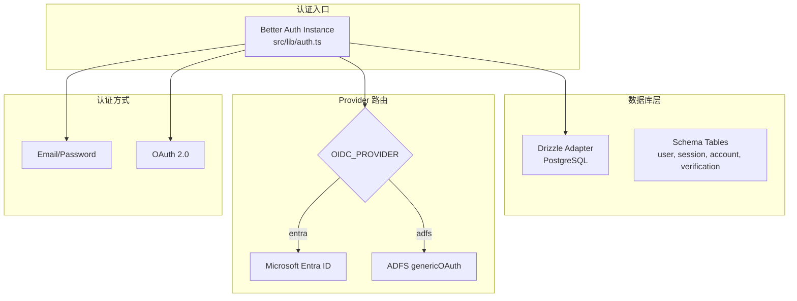
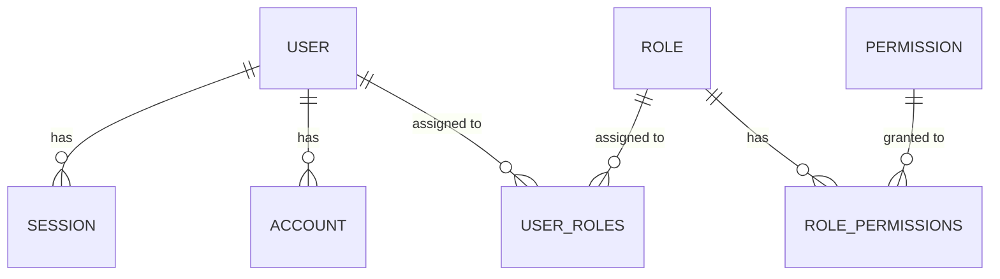

本文档详细介绍项目中 Better Auth 的配置架构、认证流程以及关键实现细节。Better Auth 作为核心认证框架，提供了 OAuth 2.0 联合登录、邮箱密码认证、Session 管理和 RBAC 权限控制等完整功能。

## 核心配置架构

### 认证服务器初始化

Better Auth 实例在 `src/lib/auth.ts` 中创建，通过 `betterAuth()` 函数完成配置。系统支持两种 OAuth Provider 模式，通过环境变量 `OIDC_PROVIDER` 动态切换。配置的核心结构包含数据库适配器、会话管理和社会化登录提供商三大模块。



核心配置代码位于 [auth.ts#L232-L343](src/lib/auth.ts#L232-L343)，展示了完整的 Better Auth 初始化过程：

```typescript
export const auth = betterAuth({
  database: drizzleAdapter(db, {
    provider: "pg",
    schema: {
      ...schema,
    },
  }),
  baseURL:
    process.env.BETTER_AUTH_URL ||
    process.env.NEXT_PUBLIC_APP_URL ||
    "http://localhost:3000",
  secret: authSecret,
  session: {
    expiresIn: parseInt(process.env.SESSION_MAX_AGE || "28800", 10),
    updateAge: 3600,
  },
  emailAndPassword: {
    enabled: true,
    requireEmailVerification: false,
  },
  socialProviders: {
    ...(activeProvider === "entra"
      ? {
          microsoft: {
            enabled: true,
            ...getMicrosoftProviderConfig(),
          },
        }
      : {}),
  },
  plugins: [
    ...(activeProvider === "adfs"
      ? [
          genericOAuth({
            config: [...],
          }),
        ]
      : []),
  ],
});
```

### 环境变量配置

认证系统需要配置以下关键环境变量，这些变量定义在 [env.example](env.example#L1-L37) 文件中：

| 变量分类 | 变量名 | 说明 | 示例值 |
|---------|--------|------|--------|
| **核心配置** | `BETTER_AUTH_SECRET` | 加密密钥（必填） | `your-secret-key` |
| | `BETTER_AUTH_URL` | 认证服务基础 URL | `http://localhost:3000` |
| | `SESSION_MAX_AGE` | Session 有效期（秒） | `28800`（8小时） |
| **Provider 选择** | `OIDC_PROVIDER` | OAuth 提供商 | `entra` 或 `adfs` |
| **Entra ID** | `ENTRA_CLIENT_ID` | Azure 应用客户端 ID | - |
| | `ENTRA_CLIENT_SECRET` | Azure 应用客户端密钥 | - |
| | `ENTRA_TENANT_ID` | Azure 租户 ID | `common` |
| | `ENTRA_ROLE_MAPPINGS` | 角色映射 JSON | `{"Group":"role"}` |
| **ADFS** | `ADFS_CLIENT_ID` | ADFS 客户端 ID | - |
| | `ADFS_CLIENT_SECRET` | ADFS 客户端密钥 | - |
| | `ADFS_AUTHORIZATION_URL` | 授权端点 | - |
| | `ADFS_TOKEN_URL` | Token 端点 | - |
| | `ADFS_USERINFO_URL` | 用户信息端点 | - |

## 双 Provider 支持机制

### Provider 动态切换

系统通过 `activeProvider` 变量实现 Provider 的动态切换，逻辑位于 [auth.ts#L13-L14](src/lib/auth.ts#L13-L14)：

```typescript
const activeProvider =
  (process.env.OIDC_PROVIDER === "adfs" ? "adfs" : "entra") as "entra" | "adfs";
```

这种设计允许在不同的部署环境中使用不同的身份提供商，而无需修改代码。

### Microsoft Entra ID 配置

Entra ID 配置通过 `getMicrosoftProviderConfig()` 函数构建，详情见 [auth.ts#L83-L108](src/lib/auth.ts#L83-L108)。该函数从环境变量读取配置，并设置了默认的认证作用域：

```typescript
function getMicrosoftProviderConfig() {
  const clientId =
    process.env.ENTRA_CLIENT_ID || process.env.OAUTH_CLIENT_ID || "";
  const clientSecret =
    process.env.ENTRA_CLIENT_SECRET || process.env.OAUTH_CLIENT_SECRET || "";
  const tenantId =
    process.env.ENTRA_TENANT_ID || process.env.TENANT_ID || "common";

  return {
    clientId,
    clientSecret,
    tenantId,
    authority,
    scope: ["openid", "profile", "email", "offline_access", "User.Read"],
  };
}
```

### ADFS genericOAuth 配置

当使用 ADFS 时，系统通过 `genericOAuth` 插件实现兼容。ADFS 配置包含更复杂的 ID Token 处理逻辑，用于合并 ID Token 和 UserInfo 端点的 Claims 数据，详见 [auth.ts#L262-L342](src/lib/auth.ts#L262-L342)。

## Claims 映射与用户同步

### 标准用户声明结构

系统定义了 `StandardUserClaims` 接口来统一不同 Provider 的用户数据，详见 [auth-utils.ts#L1-L9](src/lib/auth-utils.ts#L1-L9)：

```typescript
export interface StandardUserClaims {
  id: string;
  name: string;
  email: string;
  username: string;
  provider: "entra" | "adfs";
  providerId: string;
  roles: string[];
}
```

### Entra ID Claims 映射

`mapEntraClaims` 函数处理 Entra ID 的声明提取，逻辑位于 [auth-utils.ts#L39-L57](src/lib/auth-utils.ts#L39-L57)。该函数从 JWT Claims 中提取用户标识符、邮箱和角色信息：

```typescript
function mapEntraClaims(claims: Record<string, unknown>): StandardUserClaims {
  return {
    id: (claims.oid as string) || (claims.sub as string),
    name: (claims.name as string) || "",
    email:
      (claims.email as string) ||
      (claims.preferred_username as string) ||
      "",
    username:
      (claims.preferred_username as string) ||
      (claims.email as string) ||
      "",
    provider: "entra",
    providerId: (claims.oid as string) || (claims.sub as string),
    roles: extractEntraRoles(claims),
  };
}
```

### ADFS Claims 映射

ADFS 的声明映射更为复杂，因为 ADFS 可能使用不同的声明名称。`mapAdfsClaims` 函数支持多种可能的邮箱字段名，详情见 [auth-utils.ts#L59-L87](src/lib/auth-utils.ts#L59-L87)。函数会按优先级尝试提取邮箱：`upn` > `email` > `emailaddress`。

### 角色提取与规范化

角色提取函数 `extractEntraRoles` 和 `extractAdfsRoles` 分别处理不同 Provider 的角色声明。`normalizeRole` 函数用于清理 LDAP 格式的角色名（如移除 `CN=`、`OU=`、`DC=` 前缀），见 [auth-utils.ts#L20-L37](src/lib/auth-utils.ts#L20-L37)。

```typescript
export function normalizeRole(role: string): string {
  if (!role) return "";
  const cleaned = role.replace(/^(CN|OU|DC)=/i, "");
  const first = cleaned.split(",")[0] ?? "";
  return first.toLowerCase().trim();
}
```

## Session 管理

### Session 配置

Session 管理配置位于 [auth.ts#L244-L247](src/lib/auth.ts#L244-L247)：

```typescript
session: {
  expiresIn: parseInt(process.env.SESSION_MAX_AGE || "28800", 10),
  updateAge: 3600,
},
```

- `expiresIn`：Session 过期时间，默认为 8 小时（28800 秒）
- `updateAge`：Session 更新的频率（秒），每 1 小时检查并更新 Session

### Cookie 命名

系统同时支持两种 Cookie 名称以兼容不同环境：
- 安全环境：`__Secure-better-auth.session_token`
- 普通环境：`better-auth.session_token`

这在 [middleware.ts#L5-L7](src/middleware.ts#L5-L7) 中得到体现：

```typescript
const sessionToken =
  request.cookies.get("__Secure-better-auth.session_token") ??
  request.cookies.get("better-auth.session_token");
```

## 数据库模式

### 核心认证表

系统使用 Drizzle ORM 与 PostgreSQL 交互。认证相关的表定义在 [schema.ts](src/lib/schema.ts#L48-L109) 中：



| 表名 | 说明 | 关键字段 |
|------|------|----------|
| `user` | 用户表 | id, name, email, providerId, tenantId |
| `session` | 会话表 | id, token, expiresAt, userId |
| `account` | 账户表 | accountId, providerId, userId, claims, idToken |
| `verification` | 验证表 | identifier, value, expiresAt |

## 客户端配置

### Auth Client 初始化

客户端认证模块在 [auth-client.ts](src/lib/auth-client.ts#L1-L21) 中配置：

```typescript
export const authClient = createAuthClient({
  baseURL: process.env.NEXT_PUBLIC_APP_URL || "http://localhost:3000",
  plugins: [genericOAuthClient()],
});

export const { signIn, signOut, signUp, useSession, getSession } = authClient;
```

### 认证方法

系统提供多种认证方法：

| 方法 | 说明 | 使用场景 |
|------|------|----------|
| `signInWithOIDC()` | OIDC 社会化登录 | 点击登录按钮触发 |
| `signInWithCredentials()` | 邮箱密码登录 | 本地管理员登录 |
| `signOutFromOIDC()` | OIDC 登出 | 包含 Provider 端登出 |
| `useSession()` | 获取当前 Session | 组件内会话状态 |

## 退出登录流程

### 完整登出流程

退出登录需要同时处理本地 Session 销毁和 Provider 端登出。`signOutFromOIDC` 函数实现了这个逻辑，见 [auth-client.ts#L28-L52](src/lib/auth-client.ts#L28-L52)：

1. 调用 `/api/auth/logout` 端点获取 Provider 登出 URL
2. 销毁本地 Better Auth Session
3. 重定向到 Provider 的登出端点（如果存在）

服务端处理位于 [logout/route.ts](src/app/api/auth/logout/route.ts#L1-L65)：

```typescript
function getProviderLogoutUrl() {
  const postLogoutRedirect = `${getBaseRedirectUrl()}/login`;
  const provider = process.env.OIDC_PROVIDER === "adfs" ? "adfs" : "entra";

  if (provider === "adfs") {
    return `${issuer}/ls/?wa=wsignout1.0&post_logout_redirect_uri=${...}`;
  }

  return `https://login.microsoftonline.com/${tenantId}/oauth2/v2.0/logout?...`;
}
```

## API 路由

### 认证路由处理

所有 Better Auth API 请求通过 catch-all 路由处理，见 [api/auth/[...all]/route.ts](src/app/api/auth/[...all]/route.ts#L1-L4)：

```typescript
import { auth } from "@/lib/auth"
import { toNextJsHandler } from "better-auth/next-js"

export const { GET, POST } = toNextJsHandler(auth)
```

该路由自动处理以下端点：
- `/api/auth/sign-in` - 登录
- `/api/auth/sign-out` - 登出
- `/api/auth/session/get` - 获取会话
- `/api/auth/callback/[provider]` - OAuth 回调

## 初始化与数据同步

### 启动时数据初始化

系统启动时通过 `ensureCoreAuthData()` 函数初始化核心数据，包括默认租户、角色和权限，详见 [rbac-init.ts](src/lib/rbac-init.ts#L1-L212)。这个函数在 [auth.ts#L16-L18](src/lib/auth.ts#L16-L18) 中异步调用：

```typescript
void ensureCoreAuthData().catch((error) => {
  console.error("Failed to ensure authentication bootstrap data:", error);
});
```

### 用户数据同步

每次登录时，系统会从最新 Claims 同步用户信息，包括用户名、邮箱和角色分配。`syncUserFromLatestClaims` 函数处理这个流程，见 [auth.ts#L168-L225](src/lib/auth.ts#L168-L225)。

## 中间件保护

### 路由保护配置

`src/middleware.ts` 实现了请求级别的认证检查。公共路径包括：`/`, `/login`, `/unauthorized`, `/api/auth`。非公共路径的请求会被重定向到登录页面。

```typescript
const publicPaths = ["/", "/login", "/unauthorized", "/api/auth"];
const isPublicPath = publicPaths.some(
  (path) => pathname === path || pathname.startsWith(path + "/")
);
```

API 路由返回 401 JSON 响应，页面路由则重定向到首页并携带回调参数。

## 认证组件

### 核心认证组件

| 组件 | 文件位置 | 功能 |
|------|----------|------|
| `SignInButton` | [sign-in-button.tsx](src/components/auth/sign-in-button.tsx) | 显示登录按钮（未登录时） |
| `SignOutButton` | [sign-out-button.tsx](src/components/auth/sign-out-button.tsx) | 显示登出按钮（已登录时） |
| `UserProfile` | [user-profile.tsx](src/components/auth/user-profile.tsx) | 用户信息下拉菜单 |

`UserProfile` 组件还集成了用户角色和工具访问权限的展示，是用户交互的重要入口。该组件通过调用 `/api/users/me` 获取完整的用户配置文件。

## 下一步

完成 Better Auth 配置学习后，建议继续阅读以下内容：

- [Microsoft Entra ID 集成](8-microsoft-entra-id-ji-cheng) - 详细了解 Entra ID 配置步骤
- [ADFS 集成](9-adfs-ji-cheng) - 了解 ADFS 环境的特殊配置
- [RBAC 权限模型](12-rbac-quan-xian-mo-xing) - 深入理解角色和权限管理