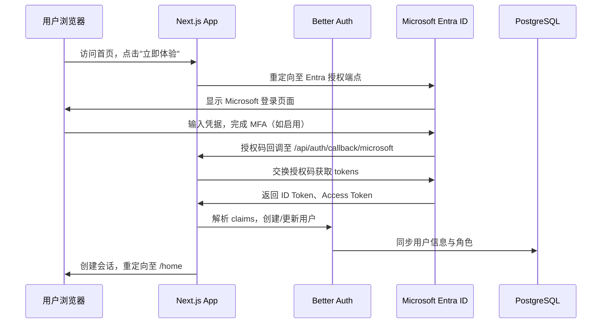
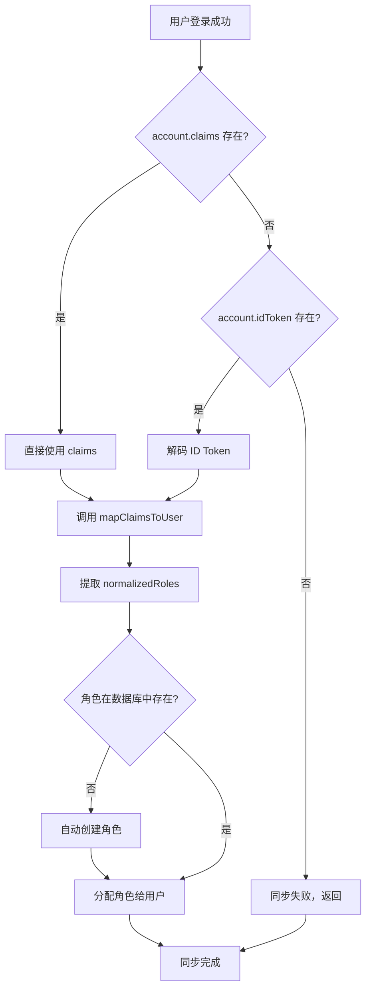
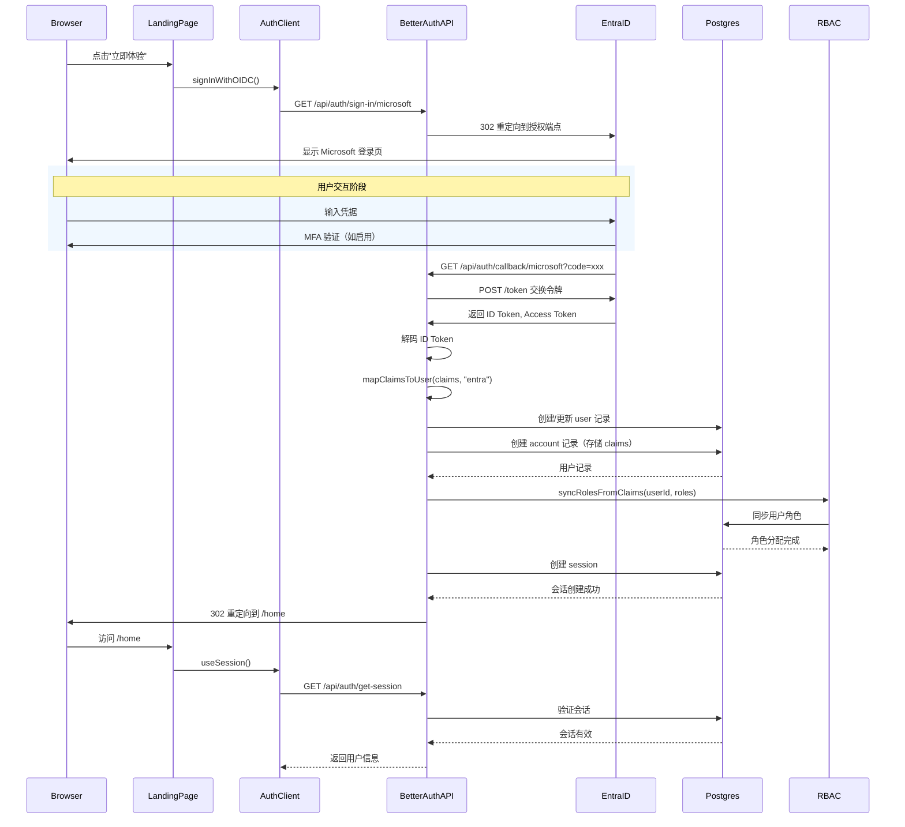

本文档描述工作台系统如何通过 Better Auth 框架与 Microsoft Entra ID（原 Azure Active Directory）实现企业级 OIDC 认证集成。该集成支持从 Entra ID claims 自动提取用户角色并同步至本地 RBAC 系统，实现基于角色的细粒度权限控制。

## 认证架构概览

系统采用 BFF（Backend for Frontend）模式，所有认证请求均通过 Next.js API 路由代理至 Better Auth 框架处理。在这种架构下，前端不直接与 Microsoft Entra ID 通信，而是通过安全的服务器端点完成身份验证流程。



### 核心组件职责

| 组件 | 文件路径 | 职责 |
|------|---------|------|
| 认证服务端 | `src/lib/auth.ts` | 配置 Better Auth，初始化 Entra ID provider |
| Claims 映射 | `src/lib/auth-utils.ts` | 将 Entra claims 转换为标准化用户属性 |
| 客户端 SDK | `src/lib/auth-client.ts` | 提供前端登录/登出方法 |
| 中间件 | `src/middleware.ts` | 验证会话令牌，保护受路由 |
| 登出处理 | `src/app/api/auth/logout/route.ts` | 处理单点登出与 Entra 端登出 |
| RBAC 初始化 | `src/lib/rbac-init.ts` | 初始化默认角色与权限 |

Sources: [auth.ts](src/lib/auth.ts#L1-L30)
Sources: [auth-client.ts](src/lib/auth-client.ts#L1-L20)

## 环境配置

Microsoft Entra ID 集成需要配置以下环境变量。这些变量控制应用如何连接至 Azure 租户并完成 OAuth 2.0 授权流程。

### 必需的环境变量

```bash
# ============================================
# OIDC 提供商配置
# ============================================
# 指定使用的 OIDC 提供商：entra（Microsoft Entra ID）或 adfs
OIDC_PROVIDER=entra
NEXT_PUBLIC_OIDC_PROVIDER=entra

# ============================================
# Azure Entra ID 应用注册
# ============================================
# 从 Azure Portal -> 应用注册 获取
ENTRA_CLIENT_ID=xxxxxxxx-xxxx-xxxx-xxxx-xxxxxxxxxxxx
ENTRA_CLIENT_SECRET=xxxxxxxxxxxxxxxxxxxxxxxxxxxxxxxxxxxxx

# Azure 租户 ID（可使用 common、organizations 或 specific tenant ID）
ENTRA_TENANT_ID=xxxxxxxx-xxxx-xxxx-xxxx-xxxxxxxxxxxx

# 可选：自定义授权服务器地址
# 默认为 https://login.microsoftonline.com
ENTRA_AUTHORITY=https://login.microsoftonline.com

# ============================================
# 角色映射配置（可选）
# ============================================
# 将 Entra ID 应用角色映射至本地角色
# 格式：{"EntraRoleName":"localRole"}
ENTRA_ROLE_MAPPINGS={"Global Admin":"admin","User":"user"}

# ============================================
# 会话配置
# ============================================
SESSION_MAX_AGE=28800  # 8小时，以秒为单位
```

### Azure Portal 应用注册步骤

在 Azure Portal 中配置应用注册时，需要注意以下关键设置：

1. **重定向 URI**：注册 `http://localhost:3000/api/auth/callback/microsoft` 作为本地开发重定向 URI，生产环境需替换为实际域名
2. **API 权限**：确保启用 `openid`、`profile`、`email` 和 `offline_access`  scopes
3. **客户端密钥**：在"证书和密码"中创建新的客户端密钥，记录其值和过期时间
4. **隐式授予**：不建议启用隐式授予，应使用标准的授权代码流程

Sources: [env.example](env.example#L16-L22)

## Claims 映射机制

Microsoft Entra ID 返回的 ID Token 包含丰富的用户声明（claims），系统通过 `mapClaimsToUser` 函数将这些声明转换为本地标准化的用户数据结构。

### Entra ID Claims 结构

```json
{
  "sub": "user-unique-id",
  "oid": "object-id",
  "tid": "tenant-id",
  "name": "Display Name",
  "preferred_username": "user@company.com",
  "email": "user@company.com",
  "roles": ["Admin", "User"],
  "groups": ["group-id-1", "group-id-2"]
}
```

### 映射转换逻辑

```typescript
function mapEntraClaims(claims: Record<string, unknown>): StandardUserClaims {
  return {
    // 优先使用 OID（对象 ID），其次使用 sub
    id: (claims.oid as string) || (claims.sub as string),
    
    // 用户显示名称
    name: (claims.name as string) || "",
    
    // 邮箱：优先 email，其次 preferred_username
    email:
      (claims.email as string) ||
      (claims.preferred_username as string) ||
      "",
    
    // 用户名：优先 preferred_username
    username:
      (claims.preferred_username as string) ||
      (claims.email as string) ||
      "",
    
    // 提供商标识
    provider: "entra",
    
    // 提供商侧用户 ID（与 id 相同逻辑）
    providerId: (claims.oid as string) || (claims.sub as string),
    
    // 提取并映射的角色
    roles: extractEntraRoles(claims),
  };
}
```

### 角色提取与映射

```typescript
function extractEntraRoles(claims: Record<string, unknown>): string[] {
  const roles = Array.isArray(claims.roles)
    ? (claims.roles as string[])
    : [];
  const groups = Array.isArray(claims.groups)
    ? (claims.groups as string[])
    : [];
  const mappings = getMapping(process.env.ENTRA_ROLE_MAPPINGS);

  return [...roles, ...groups]
    .map((role) => mappings[role] || role)  // 应用映射规则
    .map(normalizeRole)                       // 标准化角色名
    .filter(Boolean);
}
```

角色映射支持灵活的配置策略：如果设置了 `ENTRA_ROLE_MAPPINGS`，则将 Entra 返回的应用角色名称转换为本地角色名称；未映射的角色将保留原始名称。

Sources: [auth-utils.ts](src/lib/auth-utils.ts#L43-L62)
Sources: [auth-utils.ts](src/lib/auth-utils.ts#L88-L106)

## 认证流程详解

### 登录流程

用户从首页点击"立即体验"按钮后，系统通过 `signInWithOIDC` 函数发起授权请求。该函数内部调用 Better Auth 的 `signIn.social` 方法，Better Auth 自动处理 OAuth 回调并完成令牌交换。

```typescript
// src/lib/auth-client.ts
export async function signInWithOIDC(callbackURL = "/home") {
  await signIn.social({
    provider: "microsoft",
    callbackURL,
  });
}
```

Better Auth 的服务端处理器（`src/app/api/auth/[...all]/route.ts`）接收回调请求，调用 `getMicrosoftProviderConfig()` 获取配置，然后使用 Microsoft 官方 `microsoft` provider 完成身份验证。

```typescript
// src/lib/auth.ts
function getMicrosoftProviderConfig() {
  const clientId =
    process.env.ENTRA_CLIENT_ID || process.env.OAUTH_CLIENT_ID || "";
  const clientSecret =
    process.env.ENTRA_CLIENT_SECRET || process.env.OAUTH_CLIENT_SECRET || "";
  const tenantId =
    process.env.ENTRA_TENANT_ID || process.env.TENANT_ID || "common";

  return {
    clientId,
    clientSecret,
    tenantId,
    authority,
    scope: ["openid", "profile", "email", "offline_access", "User.Read"],
  };
}
```

系统自动配置了以下 scopes：
- `openid`：OIDC 身份验证必需
- `profile`：获取用户基本资料（name 等）
- `email`：获取用户邮箱
- `offline_access`：获取刷新令牌，支持长会话
- `User.Read`：调用 Microsoft Graph API 获取完整用户信息

Sources: [auth-client.ts](src/lib/auth-client.ts#L31-L35)
Sources: [auth.ts](src/lib/auth.ts#L70-L95)

### 登出流程

登出采用单点登出（Single Logout）机制，确保用户退出应用时同时清除本地会话和 Microsoft 会话。

```typescript
export async function signOutFromOIDC() {
  // 1. 调用服务端登出端点
  const response = await fetch("/api/auth/logout", { method: "POST" });
  const payload = await response.json();

  // 2. 清除本地 better-auth 会话
  await signOut();

  // 3. 重定向至 Microsoft 登出端点
  if (payload.providerLogoutUrl) {
    window.location.href = payload.providerLogoutUrl;
  }
}
```

服务端登出端点 `/api/auth/logout` 执行以下操作：

1. 验证请求是否携带有效会话令牌
2. 调用 Better Auth 的 `auth.api.signOut` 清除本地会话
3. 构建 Microsoft 登出 URL 并返回给客户端

```typescript
// 构建 Entra ID 登出 URL
const tenantId = process.env.ENTRA_TENANT_ID || "common";
return `https://login.microsoftonline.com/${tenantId}/oauth2/v2.0/logout?post_logout_redirect_uri=${encodeURIComponent(
  postLogoutRedirect
)}`;
```

Sources: [auth-client.ts](src/lib/auth-client.ts#L37-L67)
Sources: [logout/route.ts](src/app/api/auth/logout/route.ts#L1-L65)

## 角色同步机制

每次用户成功登录后，系统自动将 Entra ID 返回的角色声明同步至本地数据库，确保本地 RBAC 系统始终反映用户在企业身份提供商中的最新角色分配。

### 同步流程



### 同步实现

```typescript
async function syncRolesFromClaims(userId: string, claimRoles: string[]) {
  const normalizedRoles = mergeClaimRoles(claimRoles);
  if (!normalizedRoles.length) {
    return false;
  }

  // 1. 查询现有角色分配
  const existingAssignments = await db.query.userRoles.findMany({
    where: eq(schema.userRoles.userId, userId),
  });

  // 2. 查询数据库中已存在的角色
  const existingRoles = await db.query.roles.findMany({
    where: inArray(schema.roles.name, normalizedRoles),
  });

  // 3. 识别缺失的角色
  const existingRoleNames = new Set(existingRoles.map((role) => role.name));
  const missingRoleNames = normalizedRoles.filter(
    (roleName) => !existingRoleNames.has(roleName)
  );

  // 4. 自动创建缺失角色
  let createdRoles: { id: string; name: string }[] = [];
  if (missingRoleNames.length) {
    createdRoles = await db
      .insert(schema.roles)
      .values(
        missingRoleNames.map((name) => ({
          id: randomUUID(),
          name,
          displayName: name,
          description: `Auto-created from ${activeProvider} claims`,
          tenantId: "default",
        }))
      )
      .returning({ id: schema.roles.id, name: schema.roles.name });
  }

  // 5. 分配新角色给用户
  const rolesToAssign = [...existingRoles, ...createdRoles].filter(
    (role) => !existingAssignments.some(
      (assignment) => assignment.roleId === role.id
    )
  );

  if (rolesToAssign.length) {
    await db.insert(schema.userRoles).values(
      rolesToAssign.map((role) => ({
        id: randomUUID(),
        userId,
        roleId: role.id,
      }))
    );
    return true;
  }

  return false;
}
```

### 默认角色配置

系统预定义了四个默认角色，这些角色在应用启动时通过 `ensureCoreAuthData()` 自动初始化：

| 角色名 | 显示名称 | 描述 |
|--------|----------|------|
| `admin` | Administrator | 拥有所有权限的系统管理员 |
| `user` | Regular User | 标准用户权限 |
| `ppt_admin` | PPT Administrator | PPT 工具管理权限 |
| `viewer` | Viewer | 只读访问权限 |

Sources: [auth.ts](src/lib/auth.ts#L97-L154)
Sources: [rbac-init.ts](src/lib/rbac-init.ts#L16-L37)

## 会话管理

### 会话配置

Better Auth 框架使用 PostgreSQL 数据库存储会话数据，确保会话在服务器重启后仍然有效。

```typescript
export const auth = betterAuth({
  database: drizzleAdapter(db, {
    provider: "pg",
    schema: { ...schema },
  }),
  session: {
    // 会话有效期：8小时（28800秒）
    expiresIn: parseInt(process.env.SESSION_MAX_AGE || "28800", 10),
    // 会话刷新周期：1小时
    updateAge: 3600,
  },
});
```

### 中间件保护

所有非公开路由通过 Next.js 中间件进行会话验证：

```typescript
export function middleware(request: NextRequest) {
  const sessionToken =
    request.cookies.get("__Secure-better-auth.session_token") ??
    request.cookies.get("better-auth.session_token");

  const publicPaths = ["/", "/login", "/unauthorized", "/api/auth"];
  const isPublicPath = publicPaths.some(
    (path) => pathname === path || pathname.startsWith(path + "/")
  );

  if (!sessionToken && !isPublicPath) {
    // API 路由返回 401 JSON 错误
    if (isApiRoute) {
      return NextResponse.json(
        { error: "Unauthorized", message: "请先登录" },
        { status: 401 }
      );
    }

    // 网页路由重定向至首页
    const url = request.nextUrl.clone();
    url.pathname = "/";
    url.searchParams.set("callbackUrl", pathname);
    return NextResponse.redirect(url);
  }

  return NextResponse.next();
}
```

Sources: [auth.ts](src/lib/auth.ts#L228-L255)
Sources: [middleware.ts](src/middleware.ts#L1-L36)

## 数据库模式

### User 表扩展

| 字段 | 类型 | 说明 |
|------|------|------|
| `providerId` | TEXT | 身份提供商标识（entra/adfs/credential） |
| `providerUserId` | TEXT | 提供商侧用户 ID（Entra OID） |
| `username` | TEXT | 用户名（UPN 或 preferred_username） |
| `tenantId` | TEXT | 租户 ID，默认 `default` |
| `lastLoginAt` | TIMESTAMP | 最后登录时间 |

### Account 表扩展

| 字段 | 类型 | 说明 |
|------|------|------|
| `idToken` | TEXT | OIDC ID Token |
| `claims` | JSONB | 原始 claims 数据（用于调试和审计） |
| `accessTokenExpiresAt` | TIMESTAMP | Access Token 过期时间 |

Sources: [schema.ts](src/lib/schema.ts#L50-L93)

## 完整登录时序



## 故障排除

### 常见问题

| 问题 | 可能原因 | 解决方案 |
|------|----------|----------|
| 回调失败 400 | 重定向 URI 不匹配 | 检查 Azure Portal 中注册的重定向 URI |
| 回调失败 401 | 客户端密钥错误 | 验证 ENTRA_CLIENT_SECRET 配置 |
| 缺少 claims | 权限未申请 | 在 Entra ID 应用中添加所需 API 权限 |
| 角色不同步 | ENTRA_ROLE_MAPPINGS 配置错误 | 检查环境变量 JSON 格式 |
| 会话立即过期 | SESSION_MAX_AGE 过小 | 增大配置值（默认 28800 秒） |

### 调试模式

在开发环境中，Better Auth 会输出详细的认证日志：

```
╔════════════════════════════════════════════════════════════
║ 🎫 ID TOKEN DECODED CLAIMS
╠════════════════════════════════════════════════════════════
║ { ... }
╚════════════════════════════════════════════════════════════
```

Sources: [auth.ts](src/lib/auth.ts#L24-L56)
Sources: [auth.ts](src/lib/auth.ts#L256-L270)

## 进阶配置

### 多租户支持

系统预留了多租户扩展能力。通过配置 `ENTRA_TENANT_ID` 为 `common`，可支持个人 Microsoft 账户登录；配置为特定租户 ID（如 `xxxxxxxx-xxxx-xxxx-xxxx-xxxxxxxxxxxx`）则限制为该企业租户用户。

### 自定义授权端点

对于特殊场景（如使用 CIAM），可通过 `ENTRA_AUTHORITY` 环境变量覆盖默认的 Microsoft 登录服务器：

```bash
# 使用 CIAM (Customer Identity and Access Management)
ENTRA_AUTHORITY=https://your-tenant.ciamlogin.com
```

### 并行提供商支持

系统支持与 ADFS 的并行配置。设置 `OIDC_PROVIDER=adfs` 切换至 ADFS 提供商，同时保留 Entra ID 配置供将来切换：

```typescript
// src/lib/auth.ts
const activeProvider =
  (process.env.OIDC_PROVIDER === "adfs" ? "adfs" : "entra") as "entra" | "adfs";

const auth = betterAuth({
  socialProviders: {
    ...(activeProvider === "entra"
      ? { microsoft: { enabled: true, ...getMicrosoftProviderConfig() } }
      : {}),
  },
  plugins: [
    ...(activeProvider === "adfs"
      ? [genericOAuth({ /* ADFS 配置 */ })]
      : []),
  ],
});
```

Sources: [auth.ts](src/lib/auth.ts#L17-L20)
Sources: [auth.ts](src/lib/auth.ts#L240-L286)

## 相关文档

- [Better Auth 配置](7-better-auth-pei-zhi) — 了解 Better Auth 框架的完整配置
- [ADFS 集成](9-adfs-ji-cheng) — 了解 Active Directory Federation Services 集成
- [RBAC 权限模型](12-rbac-quan-xian-mo-xing) — 深入了解基于角色的访问控制
- [认证组件](19-ren-zheng-zu-jian) — 前端认证组件参考