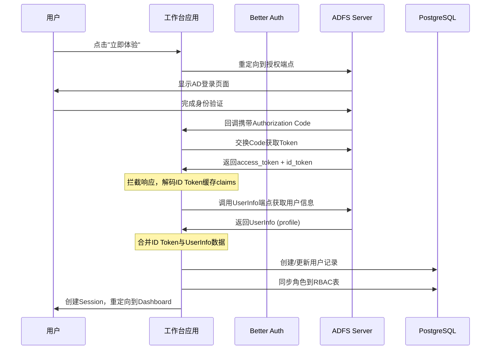
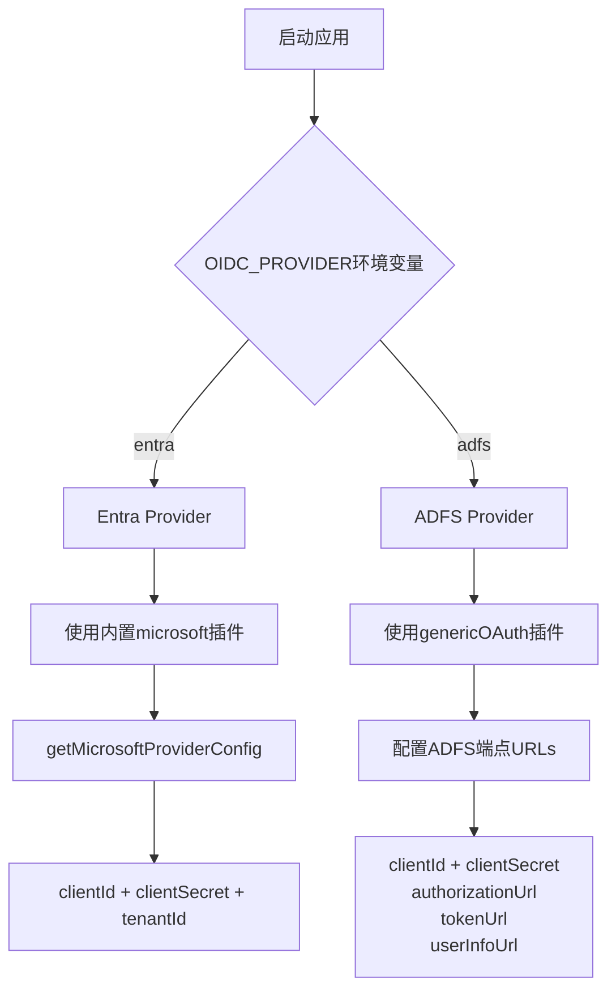
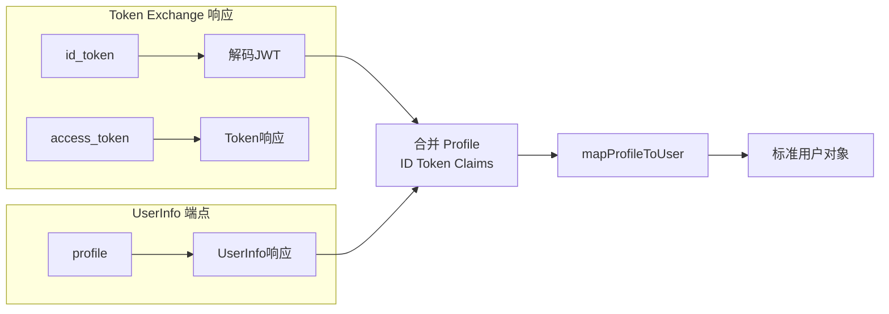
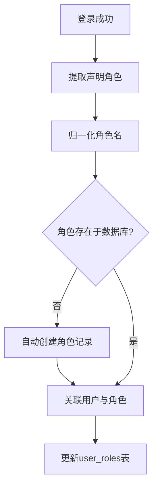
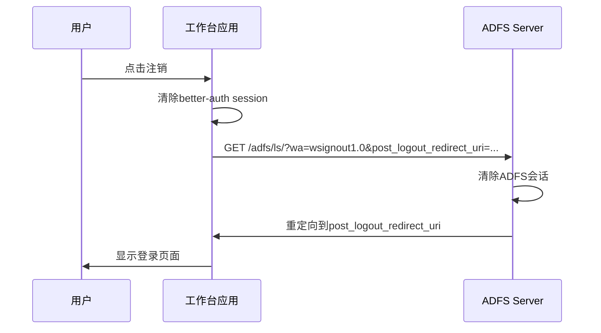

本文档详细介绍工作台系统如何通过 Better Auth 框架集成 Active Directory Federation Services (ADFS)，实现企业内网环境下的单点登录认证。ADFS 集成采用 genericOAuth 插件配合自定义声明映射，支持从 ID Token 缓存提取完整用户信息并自动同步角色权限。

Sources: [src/lib/auth.ts](src/lib/auth.ts#L1-L348)
Sources: [src/lib/auth-utils.ts](src/lib/auth-utils.ts#L1-L143)

---

## 架构设计

### 认证流程概览

系统采用双提供商架构，通过 `OIDC_PROVIDER` 环境变量切换身份验证源。当配置为 ADFS 时，认证流程涉及多个关键步骤：从 Authorization Code 交换获取令牌、拦截 Token 响应并解码 ID Token 声明、从声明中提取用户信息并映射为标准化用户对象、最后与 RBAC 系统同步角色权限。



Sources: [src/lib/auth.ts](src/lib/auth.ts#L259-L320)

### 双提供商切换机制

认证系统支持 Microsoft Entra ID 与 ADFS 的运行时切换。核心逻辑位于 `auth.ts` 第 8 行，通过检查 `OIDC_PROVIDER` 环境变量确定当前激活的提供商类型，进而加载对应的配置模块。



Sources: [CLAUDE.md](CLAUDE.md#L15-L25)

---

## 环境变量配置

### ADFS 专用配置项

| 变量名 | 必填 | 说明 | 示例值 |
|--------|------|------|--------|
| `OIDC_PROVIDER` | 是 | 身份提供商类型 | `adfs` |
| `ADFS_CLIENT_ID` | 是 | OAuth 2.0 客户端ID | `workbench-client` |
| `ADFS_CLIENT_SECRET` | 是 | OAuth 2.0 客户端密钥 | `xxxxxx` |
| `ADFS_AUTHORIZATION_URL` | 是 | 授权端点 | `https://adfs.company.com/adfs/oauth2/authorize` |
| `ADFS_TOKEN_URL` | 是 | 令牌端点 | `https://adfs.company.com/adfs/oauth2/token` |
| `ADFS_USERINFO_URL` | 是 | 用户信息端点 | `https://adfs.company.com/adfs/userinfo` |
| `ADFS_ISSUER` | 是 | 颁发者标识（用于注销） | `https://adfs.company.com/adfs` |
| `ADFS_ROLE_MAPPINGS` | 否 | AD组到角色的映射JSON | 见下方示例 |

Sources: [env.example](env.example#L22-L30)

### 角色映射配置

`ADFS_ROLE_MAPPINGS` 环境变量允许将 Active Directory 的组 DN（Distinguished Name）映射为应用内部的角色名称。映射采用 JSON 格式，键为 AD 组完整 DN，值为应用角色标识符。

```bash
# .env 文件示例
OIDC_PROVIDER=adfs
ADFS_CLIENT_ID=workbench-app
ADFS_CLIENT_SECRET=your-secret-here
ADFS_AUTHORIZATION_URL=https://adfs.company.com/adfs/oauth2/authorize
ADFS_TOKEN_URL=https://adfs.company.com/adfs/oauth2/token
ADFS_USERINFO_URL=https://adfs.company.com/adfs/userinfo
ADFS_ISSUER=https://adfs.company.com/adfs

# AD组到应用角色的映射
ADFS_ROLE_MAPPINGS={
  "CN=Domain Admins,OU=Security Groups,DC=company,DC=com":"admin",
  "CN=Finance Team,OU=Departments,DC=company,DC=com":"user",
  "CN=PPT Administrators,OU=Groups,DC=company,DC=com":"ppt_admin"
}
```

Sources: [env.example](env.example#L32-L33)
Sources: [src/lib/auth-utils.ts](src/lib/auth-utils.ts#L114-L125)

---

## 声明映射策略

### ID Token 与 UserInfo 数据合并

ADFS 的 UserInfo 端点返回的用户信息可能不完整，系统采用合并策略：将 ID Token 中的声明（包含完整用户属性）与 UserInfo 响应进行深度合并，优先使用 ID Token 的数据。这种设计确保即使 UserInfo 端点缺少某些声明，仍能从 ID Token 中获取关键信息。



Sources: [src/lib/auth.ts](src/lib/auth.ts#L273-L285)

### ADFS 声明提取优先级

系统在 `auth-utils.ts` 中定义了 ADFS 声明的提取优先级规则。用户名优先使用 `unique_name`（格式为 `DOMAIN\username`），其次为 `upn`（User Principal Name），最后回退到 email 地址。邮箱地址的提取优先级为：`upn` > `email` > `emailaddress`，这些字段可能同时存在于不同的 ADFS 声明映射配置中。

```typescript
// 声明映射核心逻辑
function mapAdfsClaims(claims: Record<string, unknown>): StandardUserClaims {
  // Email 提取优先级
  const extractEmail = (claims: Record<string, unknown>): string => {
    return (
      (claims.upn as string) ||
      (claims["http://schemas.xmlsoap.org/ws/2005/05/identity/claims/upn"] as string) ||
      (claims.email as string) ||
      (claims.emailaddress as string) ||
      (claims["http://schemas.xmlsoap.org/ws/2005/05/identity/claims/emailaddress"] as string) ||
      ""
    );
  };

  return {
    id: (claims.sub as string) || (claims.unique_name as string) || (claims.upn as string),
    name: (claims.name as string) || (claims.displayname as string) || (claims.unique_name as string),
    email: extractEmail(claims),
    username: (claims.unique_name as string) || (claims.upn as string) || email,
    provider: "adfs",
    providerId: (claims.sub as string) || (claims.unique_name as string) || (claims.upn as string),
    roles: extractAdfsRoles(claims),
  };
}
```

Sources: [src/lib/auth-utils.ts](src/lib/auth-utils.ts#L55-L87)

---

## ID Token 声明缓存机制

### 拦截 Token 响应

由于 genericOAuth 插件的 `mapProfileToUser` 回调函数无法直接访问 Token Exchange 响应中的 ID Token，系统在 ADFS 模式下覆盖全局 `fetch` 函数以拦截令牌请求。当检测到请求目标是 ADFS Token 端点时，在返回响应前解码 ID Token 并将其声明缓存到内存 Map 中。

```typescript
const idTokenClaimsCache = new Map<string, Record<string, unknown>>();

function createLoggingFetch(): typeof fetch {
  return async (input: RequestInfo | URL, init?: RequestInit) => {
    const url = typeof input === 'string' ? input : input instanceof URL ? input.href : input.url;
    const isTokenRequest = activeProvider === 'adfs' && url.includes(process.env.ADFS_TOKEN_URL || '');

    const response = await originalFetch(input, init);

    if (isTokenRequest) {
      const clonedResponse = response.clone();
      const data = await clonedResponse.json();

      if (data.id_token) {
        const idTokenClaims = decodeJwt(data.id_token) as Record<string, unknown>;
        const sub = idTokenClaims.sub as string;
        if (sub) {
          idTokenClaimsCache.set(sub, idTokenClaims);
        }
      }
    }

    return response;
  };
}

if (activeProvider === 'adfs') {
  globalThis.fetch = createLoggingFetch();
}
```

Sources: [src/lib/auth.ts](src/lib/auth.ts#L22-L57)

### 缓存键值设计

缓存使用用户的 `sub` 声明作为键值，该值在 ADFS 中对应用户的唯一标识符。当 `mapProfileToUser` 被调用时，通过 UserInfo 返回的 `sub` 或 `id` 字段检索对应的 ID Token 声明。在用户对象映射完成后，系统会自动清理缓存条目以避免内存泄漏。

```typescript
const sub = profile.sub as string || profile.id as string;
const idTokenClaims = sub ? idTokenClaimsCache.get(sub) : null;

const mergedProfile = {
  ...profile,
  ...(idTokenClaims || {}),
};

// 清理缓存
if (sub) {
  idTokenClaimsCache.delete(sub);
}
```

Sources: [src/lib/auth.ts](src/lib/auth.ts#L278-L295)

---

## 角色同步机制

### 声明驱动的角色分配

每次用户成功登录时，系统从 OIDC 声明中提取角色信息并与本地 RBAC 表同步。`syncRolesFromClaims` 函数负责将声明中的角色映射为数据库中的角色记录，若目标角色不存在则自动创建，最终在 `user_roles` 表中建立用户与角色的关联。



Sources: [src/lib/auth.ts](src/lib/auth.ts#L98-L140)

### 角色归一化处理

`mergeClaimRoles` 函数对声明中的角色进行清洗处理：移除 LDAP 前缀（如 `CN=`、`OU=`、`DC=`）、转换为小写、去除首尾空格，并使用 Set 去重确保每个角色只被处理一次。

```typescript
export function normalizeRole(role: string): string {
  if (!role) return "";
  const cleaned = role.replace(/^(CN|OU|DC)=/i, "");
  const first = cleaned.split(",")[0] ?? "";
  return first.toLowerCase().trim();
}

export function mergeClaimRoles(claimRoles: string[]): string[] {
  if (!claimRoles?.length) return [];
  const unique = new Set(
    claimRoles
      .map(normalizeRole)
      .filter((role) => role.length > 0)
  );
  return Array.from(unique);
}
```

Sources: [src/lib/auth-utils.ts](src/lib/auth-utils.ts#L18-L30)

---

## 注销与单点登出

### ADFS 单点登出流程

系统支持 ADFS 的 WS-Federation 单点登出协议。注销时首先清除本地会话，然后重定向用户到 ADFS 的注销端点，附带 `wa=wsignout1.0` 参数触发 ADFS 侧的会话清除。



Sources: [src/app/api/auth/logout/route.ts](src/app/api/auth/logout/route.ts#L1-L65)

### 注销端点实现

```typescript
function getProviderLogoutUrl() {
  const postLogoutRedirect = `${getBaseRedirectUrl()}/login`;
  
  if (process.env.OIDC_PROVIDER === "adfs") {
    const issuer = process.env.ADFS_ISSUER;
    if (!issuer) return undefined;
    
    return `${issuer}/ls/?wa=wsignout1.0&post_logout_redirect_uri=${encodeURIComponent(
      postLogoutRedirect
    )}`;
  }
  
  // Entra ID 注销逻辑
  const tenantId = process.env.ENTRA_TENANT_ID || "common";
  return `https://login.microsoftonline.com/${tenantId}/oauth2/v2.0/logout?post_logout_redirect_uri=${encodeURIComponent(
    postLogoutRedirect
  )}`;
}
```

Sources: [src/app/api/auth/logout/route.ts](src/app/api/auth/logout/route.ts#L22-L42)

---

## 客户端集成

### 登录按钮实现

前端使用 `signInWithOIDC` 函数触发身份验证流程，该函数根据 `NEXT_PUBLIC_OIDC_PROVIDER` 环境变量选择对应的提供商标识符，并自动处理 OAuth 重定向。

```typescript
// src/lib/auth-client.ts
const activeProvider =
  (process.env.NEXT_PUBLIC_OIDC_PROVIDER === "adfs" ? "adfs" : "microsoft") as
    | "adfs"
    | "microsoft";

export async function signInWithOIDC(callbackURL = "/home") {
  await signIn.social({
    provider: activeProvider,
    callbackURL,
  });
}
```

Sources: [src/lib/auth-client.ts](src/lib/auth-client.ts#L1-L18)

### 登录页面集成

主登录页面在 `src/app/page.tsx` 中实现，调用 `signInWithOIDC` 函数并传递回调 URL 参数。

```typescript
const handleLogin = async () => {
  try {
    setIsLoading(true);
    setError(null);
    await signInWithOIDC(callbackUrl || "/home");
  } catch (err) {
    console.error("OIDC login failed", err);
    setError("登录失败，请重试");
  }
};
```

Sources: [src/app/page.tsx](src/app/page.tsx#L22-L32)

---

## ADFS 服务器端配置

### 应用程序注册要求

在 ADFS 服务器上需要创建 OAuth 2.0 应用程序客户端，注册以下信息：

| 配置项 | 说明 |
|--------|------|
| 客户端标识符 | 对应 `ADFS_CLIENT_ID` |
| 客户端密钥 | 对应 `ADFS_CLIENT_SECRET` |
| 重定向 URI | `{APP_URL}/api/auth/callback/adfs` |
| 授权类型 | Authorization Code + PKCE |
| 作用域 | `openid profile email allatclaims` |
| 发布规则 | 配置声明映射，将 AD 属性映射为 OAuth 声明 |

### 声明发布规则建议

在 ADFS 中配置以下发布规则以确保应用获取所需的用户信息：

```
@RuleName = "UPN"
c:[Type == "http://schemas.xmlsoap.org/claims/UPN"]
=> issue(Type = "upn", Issuer = c.Issuer, OriginalIssuer = c.OriginalIssuer, Value = c.Value);

@RuleName = "Email"
c:[Type == "http://schemas.xmlsoap.org/claims/EmailAddress"]
=> issue(Type = "email", Issuer = c.Issuer, OriginalIssuer = c.OriginalIssuer, Value = c.Value);

@RuleName = "Name"
c:[Type == "http://schemas.xmlsoap.org.org/ws/2005/05/identity/claims/name"]
=> issue(Type = "name", Issuer = c.Issuer, OriginalIssuer = c.OriginalIssuer, Value = c.Value);

@RuleName = "Groups"
c:[Type == "http://schemas.microsoft.com/ws/2008/06/identity/claims/groupsessionid"]
=> issue(Type = "group", Issuer = c.Issuer, OriginalIssuer = c.OriginalIssuer, Value = c.Value);
```

---

## 故障排除

### 常见问题诊断

| 问题现象 | 可能原因 | 解决方案 |
|----------|----------|----------|
| 登录后无用户信息 | UserInfo 端点无响应 | 检查 `ADFS_USERINFO_URL` 配置 |
| 角色未同步 | 声明格式不匹配 | 检查 `ADFS_ROLE_MAPPINGS` 配置 |
| 邮箱为空 | 声明提取失败 | 查看服务器日志，确认 ID Token 包含邮箱声明 |
| 注销后仍需手动登出 | ADFS Issuer 未配置 | 设置 `ADFS_ISSUER` 环境变量 |
| 循环重定向 | 回调 URL 配置错误 | 确认 ADFS 客户端的 redirect_uri 与 APP_URL 匹配 |

### 日志调试

系统会在控制台输出关键调试信息，启用 ADFS 模式后搜索以下日志标识：

```bash
# ID Token 解码后的声明
╔════════════════════════════════════════════════════════════
║ 🎫 ID TOKEN DECODED CLAIMS
║ ...

# UserInfo 端点响应
╔════════════════════════════════════════════════════════════
║ 👤 USERINFO ENDPOINT RESPONSE
║ ...

# 最终映射的用户对象
╔════════════════════════════════════════════════════════════
║ ✅ FINAL MAPPED USER
║ ...
```

Sources: [src/lib/auth.ts](src/lib/auth.ts#L36-L50)

---

## 相关文档

- [Better Auth 配置](7-better-auth-pei-zhi) — 了解认证框架的完整配置体系
- [Microsoft Entra ID 集成](8-microsoft-entra-id-ji-cheng) — 了解 Entra ID 集成的差异配置
- [RBAC 权限模型](12-rbac-quan-xian-mo-xing) — 了解角色同步后的权限控制机制
- [BFF 认证模式](4-bff-ren-zheng-mo-shi) — 理解前后端分离架构下的认证设计